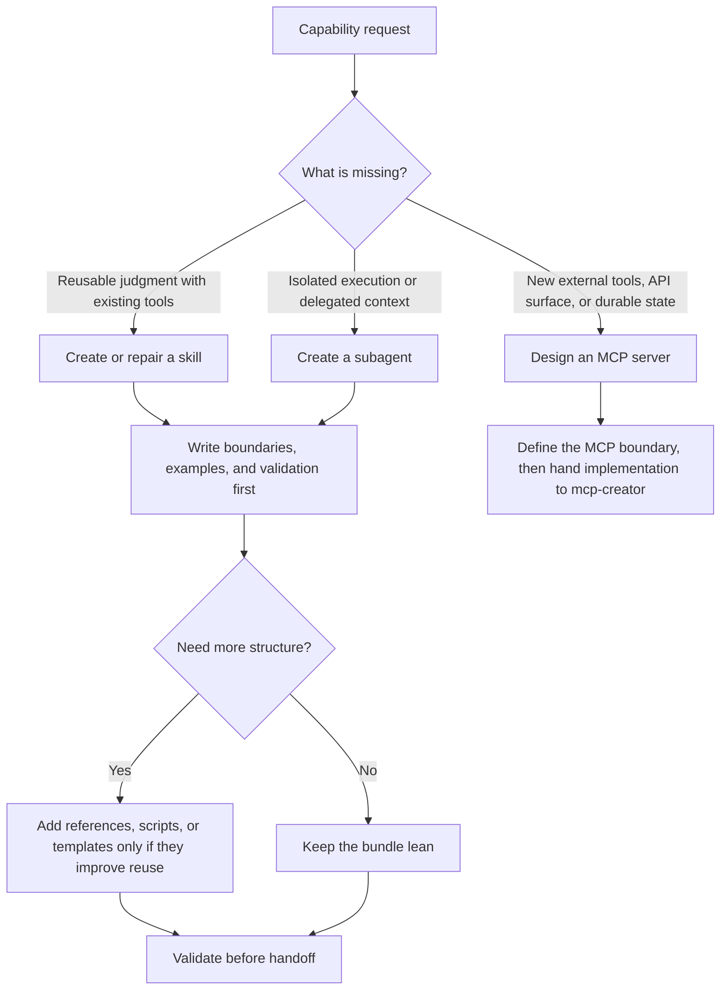

# Agent Creator

Meta-skill for choosing the right extension primitive and then authoring it cleanly.

## When to Use

- Creating a new skill, agent, or MCP-backed capability from a concrete product need.
- Deciding whether an existing capability should be repaired, wrapped, or replaced.
- Translating a domain brief into boundaries, examples, references, and validation steps.
- Scaffolding a first version that other skills can then critique or improve.

## NOT for Boundaries

- Simply using an existing skill or subagent; invoke it directly instead.
- Generic application coding with no agent, skill, or MCP design decision involved.
- Infra or deployment setup for servers or apps.
- Treating "make a new agent" as the default when an existing skill already covers the need.

## Decision Points

See `diagrams/01_flowchart_decision-points.md` for the companion routing diagram.

1. First decide whether the missing capability is a skill, a subagent, or an MCP server.
2. If the capability is mostly judgment and reusable prompting, start with a skill.
3. If it needs isolated execution, independent context, or delegated specialization, consider a subagent.
4. If it needs new external tools or stateful APIs, it is probably an MCP problem.
5. If multiple designs are plausible, use a forked planning pass before committing files.

## Primitive Selection

### Choose a skill when

- The capability is mostly encoded judgment, routing, or structured guidance.
- The runtime can rely on existing tools.
- Progressive disclosure and references matter more than standalone execution.

### Choose a subagent when

- The work benefits from isolated context or delegated reasoning.
- You want a specialist to execute independently and hand back a result.

### Choose MCP when

- The capability requires new external tools, durable state, or a transport surface beyond prompt design.

## Workflow

1. Capture the trigger set and negative triggers.
2. Define the smallest primitive that solves the problem.
3. Write the boundaries and output contract before drafting the body.
4. Add `references/`, `examples/`, or `scripts/` only when they improve determinism or reuse.
5. Use `Glob`, `Grep`, and `Read` to inspect adjacent patterns before inventing new structure.
6. Use `Write` and `Edit` for the actual bundle changes.
7. Use scoped Bash only when a real local scaffolder or validator exists in the active repo or installed skill library.
8. Use `WebSearch` and `WebFetch` only when the user explicitly needs current external docs or package guidance.

## Failure Modes and Common Anti-Patterns

- Creating a new primitive before checking whether an existing one already fits.
- Writing a generic persona with no boundary or distinctive operating model.
- Shipping a knowledge dump instead of a reusable runtime surface.
- Adding scripts, tools, or references that the body never uses.
- Treating MCP as a formatting choice instead of an external-capability decision.

## Worked Examples

### Example 1: Database optimization helper

- Capability is mostly judgment plus codebase inspection.
- Start with a skill or subagent, not MCP.
- Add references for indexing and query analysis only if the core body would become bloated.

### Example 2: Ticketing-system integration

- The requirement includes authenticated API access and live ticket actions.
- That is MCP-backed capability, not just a skill rewrite.
- Use this skill to define the boundary, then hand implementation to `mcp-creator`.

## Quality Gates

- The chosen primitive matches the capability, not the author's habit.
- The description states what it does, when to use it, and when not to use it.
- The bundle has concrete examples or references where ambiguity would otherwise remain.
- The skill or agent body names the tools it actually expects to use.
- Validation happens before handoff, not after the next person trips over the gap.

## References

- See `references/INDEX.md` for targeted loads.
- See `references/agent-templates.md` for starter shapes.
- See `references/creation-process.md` for the broader authoring sequence.
- See `references/mcp-integration.md` when the design boundary points toward MCP.
