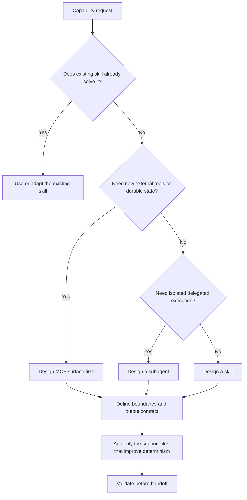

# Diagram 1: agent creation routing

```mermaid
flowchart TD
  A[Capability request] --> B{Does existing skill already solve it?}
  B -->|Yes| C[Use or adapt the existing skill]
  B -->|No| D{Need new external tools or durable state?}
  D -->|Yes| E[Design MCP surface first]
  D -->|No| F{Need isolated delegated execution?}
  F -->|Yes| G[Design a subagent]
  F -->|No| H[Design a skill]
  E --> I[Define boundaries and output contract]
  G --> I
  H --> I
  I --> J[Add only the support files that improve determinism]
  J --> K[Validate before handoff]
```
