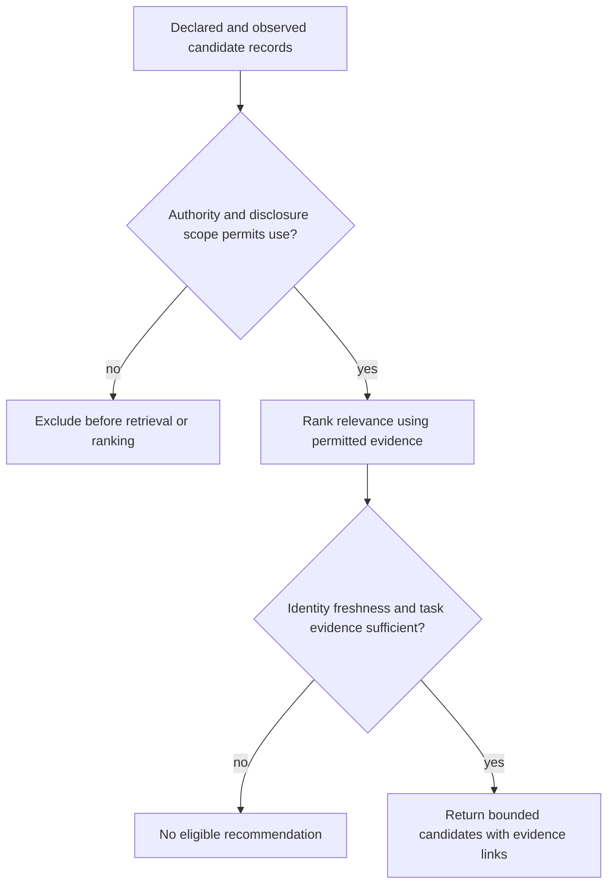

# Agent Discovery, Directories & Guilds at Scale

**Version:** 1.0
**Domain:** Multi-agent systems, distributed service discovery, mechanism design,
institutional economics.

## Core concept: discovery is the read-side of coordination

Coordination has two halves. The **write side** — claims, locks, messages, merges —
gets all the attention because it is where conflicts visibly happen. The **read side**
— *how does agent A find out that agent B exists, what B is good at, whether B is
trustworthy, and whether B is the right contact for this question* — is usually left
implicit. Small and large fleets can both need discovery; those counts are illustrative scenarios, not thresholds or capacity results.

Use **read-poverty** as a design diagnosis: the swarm produces far more legible state (sessions,
claims, notes, edits, skills, reputations) than any one participant can read. The cure
is not "more dashboards." It is *indexed, ranked, query-answerable directories* — the
same move databases made when table scans stopped scaling: build an index.

> The deep symmetry: a **directory** is to agents what an **index** is to rows. Both
> may trade write-time maintenance for a query path. Its cost depends on the chosen
> index, filters, ranking, freshness checks, and deployment; no lookup bound follows
> from calling a structure a directory.

## Discovery evidence dimensions (apply the policy-required checks first)

Existence, relevance and trust are separate evidence dimensions. Apply hard authority
and disclosure filters before retrieval/ranking; a relevance
score must carry freshness/provenance so a stale registry is not presented as current
behavior. A guild can provide membership control without a reputation score, but it
should not be described as a reliability proof merely because it is an ACL.

---

## Decision points

### DP1 — Push registry vs. pull index?

- **Push (declared registry):** an agent advertises a capability record. FIPA DF is a
  historical directory pattern and A2A Agent Cards are a current capability-document
  pattern; bind the record to a version and a publisher identity before relying on it.
  It is cheap to query but remains a claim that can be stale or incomplete.
- **Pull (observed index):** the substrate derives candidate evidence from attributable
  artifacts such as claims, edits, notes, or handoffs. Observation can also be stale,
  partial, and misleading; retain event time, source, and revocation/expiry rules.
  It is useful where a self-description is insufficient on its own.
- **Hybrid:** keep declared and observed evidence distinguishable, then apply a
  documented ranking policy. The `pd whois` wording in the inherited example is a
  constructed design sketch, not evidence of a current implementation.

### DP2 — Exact match, BM25, or embeddings for the relevance layer?

| Query type | Use | Why |
|---|---|---|
| Structured field (file path, skill id, port) | exact or normalized namespace match | compare canonicalized values under a declared namespace rule; broad substring matching can select an unintended owner |
| Free-text over a curated corpus | hybrid lexical + compatible dense retrieval | lexical anchors and semantic recall have different failure modes; fuse rankings and retain evidence |
| Free-text "who knows about X" semantic | compatible dense retrieval plus lexical candidate recall | catches synonyms while preserving exact evidence terms |
| Tie-break / rationale | bounded rerank over authority-filtered candidates | return candidate ids and a short evidence citation; validate any selected id |

**Anti-pattern:** a lexical-only retriever for an unstructured capability claim.
Exact matching remains appropriate for namespaces under your control (skill ids, enum
tags, file paths). For unstructured text, filter authority first, use a compatible
versioned dense space with lexical retrieval, fuse the bounded rankings, and expose the
underlying evidence rather than treating a generated rationale as proof.

### DP3 — Centralized directory vs. DHT vs. federated directories?

- **Centralized:** one accountable directory can simplify authority, audit, and query
  paths when its failure and recovery plan meet the deployment need. It is a design
  choice, not a claim that an unnamed daemon already has the required state.
- **DHT (Chord-style):** Chord's lookup bound is derived under its overlay assumptions.
  Consider a DHT only after specifying membership, adversary, churn, replication, and
  repair behavior; it is not automatically justified by fleet size.
- **Federated directories:** multiple authorities may exchange scoped records. The
  deployment contract must define trust, replication, conflict, revocation, and failure
  behavior. FIPA source access here does not establish a topology mandate.

### DP4 — When do you need guilds (not just a flat directory)?

A **guild** is a *named, trust-scoped sub-directory with membership and an enforcement
mechanism*. Reach for one when:

1. A scoped membership policy changes which candidates may be shown or selected.
2. Trust is non-uniform and cross-boundary routing needs a documented authorization
   and evidence check.
3. An organization needs shared enforcement and dispute procedures. The merchant-guild
   paper is historical institutional analysis, not a ready-made agent protocol.

Otherwise, compare the operational cost of membership management with a flat directory
and explicit authority filters; neither structure alone proves reliability.

---

## Failure modes (each with its named precedent and the mitigation)

1. **Read-poverty (the base disease).** State accumulates faster than it is read; the
   directory exists but nobody indexes it, so agents fall back to O(n) eyeball search
   and cold DMs. *Mitigation:* a query-answerable router (whois) wired into the
   moments agents are about to act blind (`pd begin`, `pd inbox send`).

2. **Directory staleness.** Self-reported capability cards diverge from behavior; the
   yellow pages list an agent that died an hour ago. *Mitigation:* recency-decay every
   pull signal according to a locally measured and documented decay policy; retain
   registration expiry/revival rules and show the user the last observed evidence.

3. **Sybil reset (the reputation killer).** An agent with a bad record re-registers
   under a fresh identity and may appear to have no history (a Sybil-risk pattern).
   Reputation or membership based solely on self-asserted identity is vulnerable.
   *Mitigation:* define a verifiable identity-binding and recovery/revocation process
   before using reputation as a permission or routing signal.

4. **Goodhart on the rank.** Once "appears in the top of whois" is a target, agents
   farm the signal — claim files they will not touch, write notes stuffed with the
   query terms. *Mitigation:* rank on signals that are costly to fake and tied to real
   work (actual diffs, merged PRs), not cheap-to-emit ones; sample-audit; keep weights
   operator-tunable so a gamed signal can be down-weighted.

5. **Cold-start / empty directory.** Fresh install, no history, no reputations — the
   router returns nothing and agents conclude discovery is broken. *Mitigation:*
   offer declared capability records with their source and freshness labels, or return
   an empty result with an explanation. Define any initial trust value as local policy.

6. **Over-flattening (the legibility trap).** The digest is so compressed it hides the
   thing that mattered — the directory says "scout owns auth" but not that scout's last
   3 auth PRs were reverted. *Mitigation:* every directory entry is a *lens*, not a
   verdict; provide a stable link to the underlying evidence where disclosure permits.
   The Scott reference is a conceptual caution, not a validation result for this design.

7. **Collusion in reputation.** A ring of agents can reinforce one another’s ratings.
   EigenTrust’s pre-trusted-peer mechanism is an anchoring assumption for its model; it
   does not by itself prevent collusion or Sybil identities. *Mitigation:* state who
   creates trust anchors, bind identities independently, limit a rater’s influence,
   audit outcomes, and retain a revocation path.

---

## Worked example: routing "who owns the skill index?" in a 60-agent swarm

**Naive (read-poor):** dump `pd sessions`, scroll 60 rows, guess, cold-DM the wrong
agent, duplicate their work. O(n) human attention, high error.

**With a directory + router (ADR-0030 shape):**

1. **Existence:** collect candidate records from declared and observed sources; retain
   publisher, event time, and source link for each record.
2. **Relevance:** for a query such as “who owns the skill index?”, filter by authority
   first, combine structured exact filters with compatible lexical and dense rankings,
   then cite the evidence that placed each candidate in the bounded set.
3. **Refuse-to-route:** a locally configured policy may return no recommendation when
   evidence, freshness, or authority is insufficient. Explain the missing evidence.
4. **Trust:** an independently verified identity and outcome history can be an input to
   the local policy, but a green pull request or a claim alone does not prove current
   capability.

Result: a reviewable candidate set rather than an asserted O(1) guarantee or a hidden
message action.

---

## Composition: discovery × suggestibility × reputation

Discovery is not a standalone feature; it is the read-primitive the other loops call.

- **Suggestions:** a UI may propose candidates from the same evidence-bound discovery
  query, but a suggestion should remain advisory and disclose its source.
- **Reputation:** can add evidence to a routing policy only after the identity binding,
  rating provenance, and appeal/recovery process are specified.
- **Guilds/federation:** can scope discovery to a trust boundary, but cross-operator
  commitments need their own authorization and enforcement contract.

A directory entry is a claim linked to observations. Continuity between an identity and
prior work is an additional claim that needs explicit evidence; it is not created by a
rank field.

---

## Quality gates (the bar before you ship a discovery feature)

- [ ] **Graceful empty.** A valid empty directory returns empty-with-explanation. Authentication, authorization and storage failures remain distinguishable from an empty result.
- [ ] **Evidence-timed.** Each observed signal carries an event time and locally chosen
  expiry/decay rule; the UI exposes staleness rather than asserting it away.
- [ ] **Can refuse to recommend.** A locally chosen evidence/authority policy can
  return no route and explains what evidence is missing.
- [ ] **Selection-guarded.** Any model-selected id is validated against the bounded
  authority-filtered candidate set.
- [ ] **Hybrid free-text retrieval.** Unstructured search combines compatible lexical
  and dense retrieval; structured namespaces may use exact filters.
- [ ] **Lens, not verdict.** Every entry zooms to the underlying claims/notes/PRs.
- [ ] **Sybil-risk bounded before reputation.** Bind identity, anchors, revocation, and
  appeal evidence before a reputation score influences a consequential decision; this
  reduces a stated risk rather than proving Sybil safety.
- [ ] **Operator-tunable weights.** A gamed signal can be down-weighted under a
  documented policy change.
- [ ] **Separate suggestion from admission.** A discovery recommendation may be advisory,
  while a later authorization/capability gate can reject a candidate for this request.

---

## Canonical prior art (read these before designing)

- **FIPA Directory Facilitator (FIPA00023):** a historical directory-facilitator
  reference. Its source body was not accessible in this campaign, so this skill does
  not infer mandatory roles, federation behavior, or deployment topology from it.
- **Contract Net Protocol (Smith 1980):** discovery-by-announcement — broadcast a
  task, collect bids, award. Discovery as a market, not a lookup.
- **[Chord (Stoica et al. 2001)](https://pdos.csail.mit.edu/papers/chord:sigcomm01/chord_sigcomm.pdf):** a decentralized lookup design whose stated bound is
  conditional on its overlay assumptions. It does not choose a trust or repair model
  for an agent deployment.
- **DNS-SD (RFC 6763):** PTR/SRV/TXT naming and metadata lookup. Consul is a separate
  product with [registered health checks and configurable critical-service deregistration](https://developer.hashicorp.com/consul/commands/services/register); neither is cited here
  as a generic capability-attestation mechanism.
- **[EigenTrust (Kamvar, Schlosser, Garcia-Molina 2003)](https://nlp.stanford.edu/pubs/eigentrust.pdf):** a transitive-trust model with
  pre-trusted peers. Its threat assumptions and anchoring mechanism must be evaluated
  for the deployment; they do not establish Sybil or collusion safety.
- **[Greif–Milgrom–Weingast (1994), "Coordination, Commitment, and Enforcement: The Case of the Merchant Guild"](https://web.stanford.edu/~avner/Greif_Papers/1994%20Greif%2C%20Milgrom%2C%20and%20Weingast%20JPE%201994.pdf):** historical institutional analysis. Use the comparison to formulate questions about collective commitments; it is not a verified agent protocol.
- **A2A Agent Cards and MCP:** current capability/interchange sources with different
  scopes. See the versioned, source-bounded trust-gate reference below; this skill
  makes no unverified “reinvention” or registry claim.
- **Scott, "Seeing Like a State" (1998):** legibility as power and as failure; the
  warning against over-flattening the directory.

## Evidence and diagrams

- [Discovery evidence and trust gates](references/discovery-evidence-and-trust-gates.md)
  distinguishes DNS-SD lookup metadata, capability documents, authorization, and
  outcome evidence.
- [Discovery trust-gate diagram](diagrams/01_discovery-trust-gates.md)
- [Discovery topology decision diagram](diagrams/02_discovery-topology-record.md)
