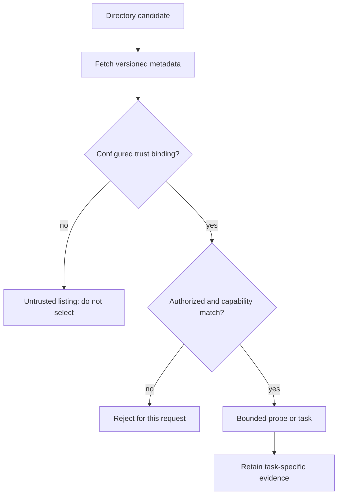

# Discovery trust gates

```mermaid
flowchart TD
  A[Directory candidate] --> B[Fetch versioned metadata]
  B --> C{Configured trust binding?}
  C -->|no| U[Untrusted listing: do not select]
  C -->|yes| D{Authorized and capability match?}
  D -->|no| X[Reject for this request]
  D -->|yes| E[Bounded probe or task]
  E --> F[Retain task-specific evidence]
```