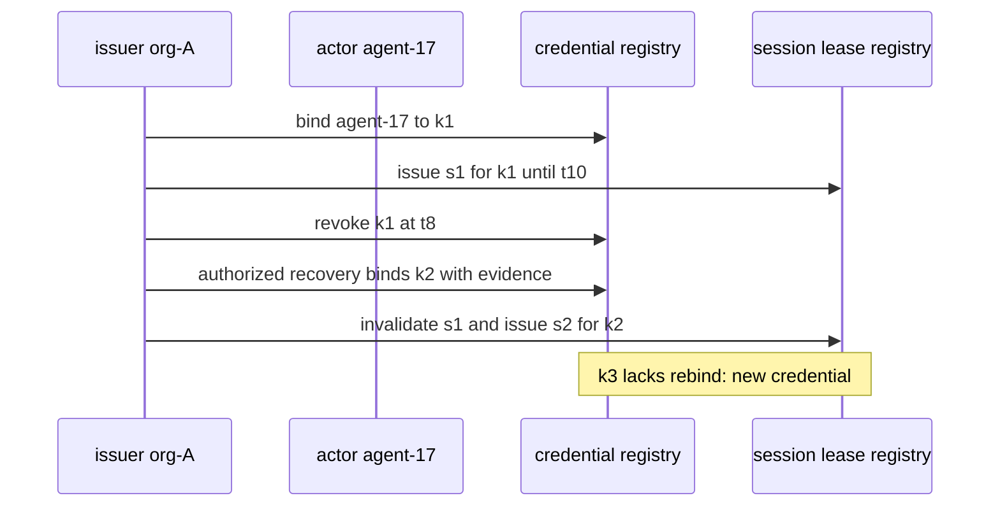
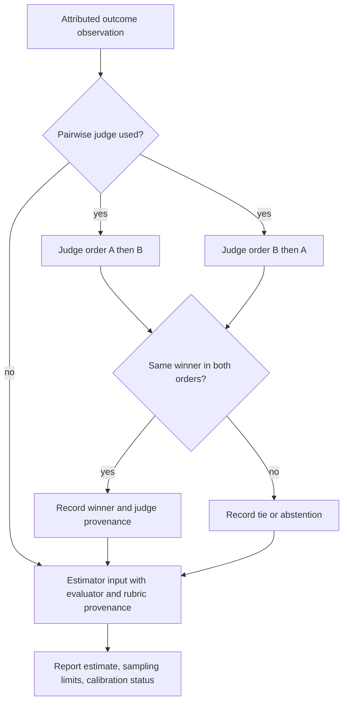

# Agent Identity, Continuity & Reputation

Work the following claims in order. They are related, but none establishes the next by itself.

| Claim | Minimum question | It does not establish |
| --- | --- | --- |
| Actor identity | Which issuer namespace names this actor? | a unique human or global entity |
| Credential authentication | Which key/account controlled this operation? | behavior continuity or authority to mint another identity |
| Session | Which bounded runtime lease received the credential? | ownership after expiry or revocation |
| Continuity | Which issuer-authorized links join credentials, sessions, memory and records? | honest successor execution |
| Outcome attribution | Which task, rubric, evaluator and receipt support this observation? | general competence or an observed delivery when only declared |
| Reputation | Which estimator and sampling model summarize attributed observations? | calibration, causality, or portability without evaluation |

NIST SP 800-63-4 supplies useful vocabulary: IAL concerns identity proofing and
enrollment, AAL authenticator-based authentication, and FAL federation. It is
written for people and government information systems; it is not a complete
agent identity protocol. See [evidence scope](references/evidence-scope.md).

## Method 1 — make the lifecycle hand-checkable

Declare five identifiers rather than collapsing them into one label:
issuerNamespace, actorId, credentialId, sessionId, and modelOrProviderId when
relevant. Record issuer, binding purpose, issue/revocation time, recovery
evidence, and outcome attribution fields.

Constructed lifecycle trace, using only issuer-policy continuity:

| time | event | hand check |
| --- | --- | --- |
| 1 | org-A binds agent-17 to k1 | actor and credential are distinct |
| 2 | lease s1 for agent-17/k1 expires at 10 | session is bounded |
| 8 | k1 is revoked; authorized recovery binds k2, naming actor, revocation and recovery evidence | keep agent-17; invalidate s1 |
| 9 | issue s2 for agent-17/k2 | use the new lease |
| 9 | present k3 without issuer-approved recovery | treat as a new or unattributed credential |

This trace does not prove one human/operator globally, an uncompromised issuer or
host, honest execution, or resistance to all duplicate registrations. Douceur's
Sybil analysis is the reason to state the issuer, enrollment and multi-mint
threat model instead of calling a keypair universally Sybil-resistant.

## Method 2 — attribute outcomes before estimating

For each observation, preserve actorId, credentialId, sessionId, task version,
outcome rubric, evaluator identity, source receipt, time and any appeal/correction.
A memory note, checkpoint, and outcome record answer different questions. A
restart may preserve memory or a checkpoint while the outcome record remains
unobserved. A supplied plan may declare an oracle or an audit policy; it does
not make this auditor observe a merge, CI run, monitor or signature.

Use the failure table in [failure modes](references/failure-modes-and-defenses.md)
to test revocation replay, unauthorized rebind, actor reset, stale lease,
unattributed fork/restore, self-graded outcome, selection bias, collusion and
judge disagreement. An audit/reopen policy can increase scrutiny, but it is not
the only possible control and its effectiveness needs a stated sampling,
authority and residual-risk model.

## Method 3 — choose the estimator by observation topology

| Evidence topology | Procedure | Report separately |
| --- | --- | --- |
| Same-task pairwise preference | Elo or Bradley-Terry baseline | rating, cohort, pairing policy and no confidence claim |
| Teams/draws with a game-outcome model | TrueSkill | posterior/model uncertainty and held-out calibration result |
| Context → selected action → observed reward | contextual bandit | context, action, reward, selection/propensity policy, feedback completeness |
| No adequate outcome data | none | what is missing; do not manufacture a score |

**Elo worked calculation.** With R_A=1600, R_B=1500,
E_A=1/(1+10^((R_B-R_A)/400))≈0.640. If A loses with K=20,
R'_A=1600+20(0-0.640)=1587.2. This is a relative paired score under the
declared curve, not a probability that A writes good code.

Calibration of Elo's expected pairwise outcome can be evaluated on held-out comparisons; record `held-out-evaluated` only with that evaluation. This does not turn the scalar rating into a posterior uncertainty interval. The supplied audit uses a local allocation-review profile: active scalar Elo/bandit estimates require a separate exploration declaration; TrueSkill declares its model posterior, and no estimator uses explicit not-applicable states. These are this profile's consistency rules, not universal requirements of the mathematical estimators.

**TrueSkill and bandit boundaries.** A TrueSkill posterior is conditional on its
prior and game/outcome model. Record calibration=not-estimated until a
representative held-out calibration method is evaluated. A bandit receives
feedback only for the selected action: retain context, chosen action, reward,
exploration or propensity record, and missing counterfactual boundary.

## Method 4 — make judge controls observable

For a pairwise judge, run the same rubric/version twice: A,B and B,A. If the
same answer wins in both orders, record that answer; otherwise record a tie or
abstention. This handles the cited position-bias check from Zheng et al.; it
does not remove verbosity or self-preference bias. Record judge family, rubric,
version, answer-length features and a human-labeled calibration set or
not-estimated.

## Method 5 — choose newcomer and sanction policy locally

Friedman and Resnick analyze entry fees, dues and unreplaceable pseudonyms under
their model. Probation/limited exposure, an entry price, or a pseudonym-issuance
rule is a local design choice. Specify objective, eligibility, economic or
authority consequences, expected newcomer exclusion, reset/whitewashing route
and collusion response. Do not attribute a full-work/reduced-payout policy to
that paper or present it as universal.

For sanctions, specify authority, appeal, observation source and the comparison
between honest non-completion and detected manipulation for the stated setting.
A declared graduated flag is not evidence that an incentive inequality holds.

## Use the supplied-plan audit correctly

1. Fill [the template](templates/output-template.md) and validate the JSON shape
   after installing Node 20+ and Ajv 8 in the bundle: node
   scripts/reputation_soundness_audit.mjs --input plan.json.
2. Treat a zero CLI exit and pass:true as supplied-declaration consistency. It is never evidence that
   a key was verified, an outcome observed, a delivery occurred, or enforcement ran.
3. For an operating claim, attach issuer/audit/evaluator receipts and run the
   lifecycle and estimator checks above.

## Bundle files

| File | Use |
| --- | --- |
| [references/evidence-scope.md](references/evidence-scope.md) | NIST, Sybil and source-access boundary |
| [references/failure-modes-and-defenses.md](references/failure-modes-and-defenses.md) | diagnosis and hand checks |
| [template](templates/output-template.md) | declared-plan intake |
| [sample](examples/sample-input.json) | constructed valid fixture |
| [auditor](scripts/reputation_soundness_audit.mjs) | JSON Schema plus consistency audit |
| [tests](tests/reputation_soundness_audit.test.mjs) | positive and rejection regressions |

## References

- [NIST SP 800-63-4, final July 2025](https://pages.nist.gov/800-63-4/sp800-63.html).
- [Douceur, The Sybil Attack (2002)](https://users.ece.cmu.edu/~adrian/731-sp04/readings/Douceur-sybil.pdf).
- [Friedman and Resnick, The Social Cost of Cheap Pseudonyms (2001)](https://gwern.net/doc/economics/mechanism-design/2001-friedman.pdf).
- [Elo, The Rating of Chessplayers (1978)](https://gwern.net/doc/statistics/order/comparison/1978-elo-theratingofchessplayerspastandpresent.pdf).
- [Herbrich, Minka and Graepel, TrueSkill (2006)](https://proceedings.neurips.cc/paper/2006/file/f44ee263952e65b3610b8ba51229d1f9-Paper.pdf).
- [Zheng et al., Judging LLM-as-a-Judge (2023)](https://arxiv.org/abs/2306.05685).

## Bundle navigation

[agents index](agents/INDEX.md), [examples index](examples/INDEX.md), [schemas index](schemas/INDEX.md).
