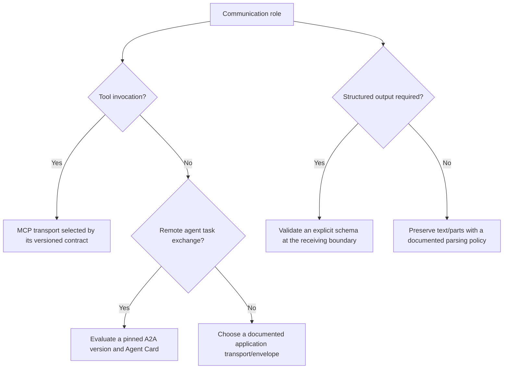
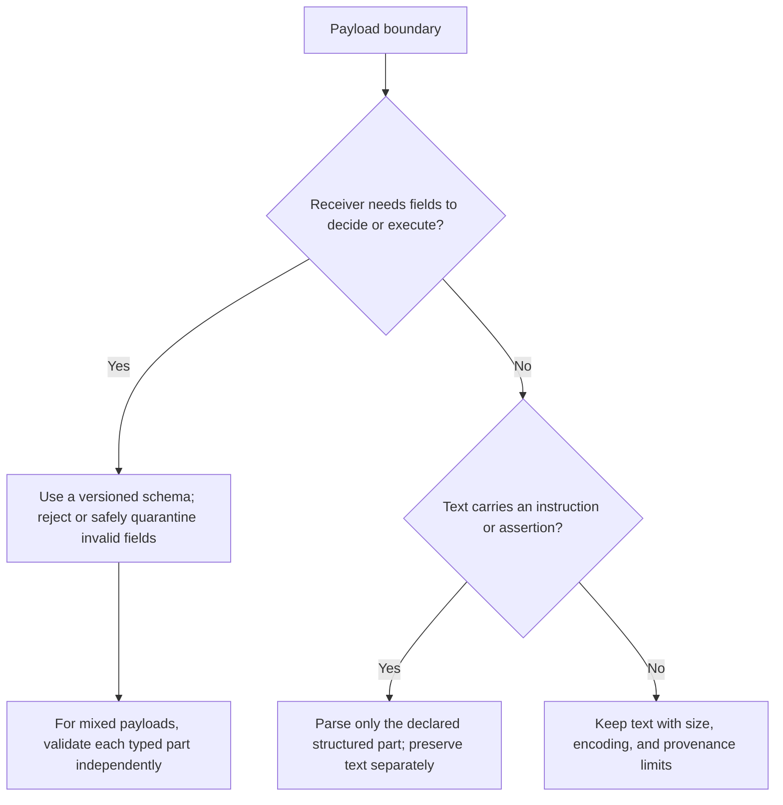
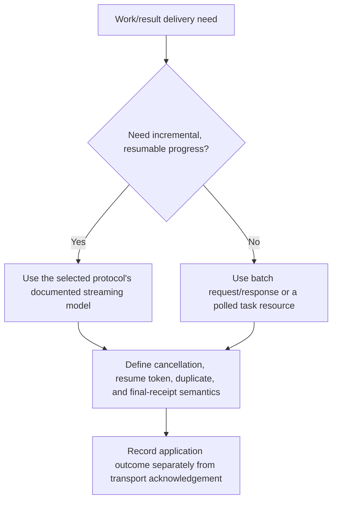

# Agent Interchange Formats

You are an expert in the data structures agents use to communicate. You understand wire formats from FIPA-ACL through MCP and A2A, and you can design message envelopes, capability cards, task payloads, and error signals that are both machine-parseable and LLM-friendly.

## DECISION POINTS

### Protocol Selection Tree



JSON-RPC defines a request/response envelope; it does not establish the caller’s
identity, authorization, or agent capability semantics. A bridge must map those
separately.

### Schema Strictness Decision



Schema-first is a boundary decision, not a claim that a schema prevents semantic or
authorization errors. A text field can be valuable while remaining non-executable.

### Streaming vs Batch Decision



Choose streaming from the actual protocol contract and deployment recovery model; task
duration, token use, and a “simple” integration are not universal selectors.

## FAILURE MODES

### Schema Drift
**Symptoms:** Runtime validation errors between agents that worked before, TypeScript compilation succeeds but runtime fails
**Diagnosis:** Version mismatch between schema definitions, one agent updated schema without coordinating
**Fix:** Version the contract where independent deployments need compatibility; state
which changes are accepted, rejected, or transformed, then test those cases at the
receiving parser. A registry is one coordination option, not a requirement.

### Message Loss
**Symptoms:** Conversations appear incomplete, agents retry indefinitely, duplicate processing occurs
**Diagnosis:** No deduplication mechanism, missing correlation IDs, network issues without recovery
**Fix:** Define an application idempotency key, a deduplication store/lifetime, and a
retry policy for the operation. A UUID transport/message id alone does not deduplicate
a side effect; a conversation id alone does not establish causal order.

### Context Window Overflow 
**Symptoms:** Agent tasks fail with "context too long", truncated conversations, incomplete tool results
**Diagnosis:** No token counting in handoffs, unlimited context accumulation, missing summarization
**Fix:** Estimate tokens per Part; implement context budgeting; add droppable priority system; compress with summaries

### Parsing Rigidity
**Symptoms:** Agent outputs malformed JSON, creative tasks produce generic responses, high retry rates
**Diagnosis:** Schema-first applied to exploratory content, overly strict validation, no graceful degradation
**Fix:** Use validate-after for creative content; implement extraction fallbacks; loosen constraints for exploratory tasks

### Protocol Tower of Babel
**Symptoms:** Each agent pair needs custom translation, integration complexity explodes, maintenance burden
**Diagnosis:** Every team invented their own wire format, no standardization, NIH syndrome
**Fix:** Choose a versioned protocol by role and contract; A2A, MCP, and JSON-RPC have distinct scopes and require an explicit adapter where bridged

## WORKED EXAMPLES

### Example 1: Task Handoff with Context Window Limits

**Scenario:** A sender hands off research to a receiver with a locally configured
context budget. The numeric values below are constructed fixture inputs, not model
limits or protocol defaults.

**Decision Process:**
1. Obtain the receiver's declared capacity, output reserve, and fixed overhead outside the measured handoff envelope.
2. Measure the complete candidate envelope in source order after every optional-part
   removal; an estimate is not the admission decision.
3. Drop optional parts by documented deterministic priority only. If the required
   envelope cannot fit, record an unresolved handoff rather than truncating it.

```typescript
import { selectContextParts } from "./scripts/context-budget.mjs";

// Local data model, not a provider or A2A wire object. The measurement callback must
// include the encoded envelope, headers, separators, and selected parts.
const selection = selectContextParts({
  capacityTokens: localReceiver.capacityTokens,
  reservedTokens: localReceiver.outputReserveTokens,
  overheadTokens: localReceiver.outsideEnvelopeOverheadTokens,
  parts: [
    { id: "summary", tokenEstimate: 500, required: true, priority: 0 },
    { id: "findings", tokenEstimate: 12_000, required: true, priority: 0 },
    { id: "notes", tokenEstimate: 30_000, required: false, priority: 1 }
  ],
  measureEnvelope: localTokenizer.measureCompleteEnvelope
});
if (selection.status !== "READY") {
  recordUnresolvedHandoff(selection.reason); // no silent truncation of required context
} else {
  sendLocallyAuthorizedHandoff(selection.parts, selection.measuredTokens);
}
```

**Novice miss:** Would pass raw research data without token estimates, causing downstream context overflow.
**Expert catch:** Measures each source-ordered complete envelope, drops only optional
parts under deterministic local policy, and records an unresolved result when mandatory
material cannot fit.

### Example 2: A2A vs MCP Protocol Choice

**Scenario:** Building a document processing system with OCR agent, analysis agent, and formatting agent.

**Decision Process:**
1. Separate service discovery, tool invocation, and remote task lifecycle; one does
   not automatically rule out the others.
2. If a version-pinned A2A contract fits remote task exchange, evaluate its task and
   streaming semantics alongside the deployment’s authorization model.
3. If a host needs tool access, retain MCP for that host–tool boundary; bridge it to
   A2A only through an explicit adapter with mapped identities and operation keys.

```typescript
// Illustrative application-domain pseudocode. This is not an A2A Agent Card wire
// representation; use fields from the pinned A2A specification when implementing one.
const localOcrDescriptor: LocalOcrDescriptor = {
  agentId: 'ocr-service-v2',
  name: 'OCR Document Reader', 
  url: 'https://ocr.company.com',
  skills: [{
    id: 'extract-text',
    inputSchema: { /* PDF/image schema */ },
    outputSchema: { /* structured text schema */ }
  }],
  capabilities: {
    streaming: true,  // Local deployment elects incremental status updates
    pushNotifications: true,  // Local delivery policy may notify on completion
    stateTransitionHistory: true  // Local audit policy retains pipeline progress
  }
};

// Task submission to OCR agent
const localOcrTaskDraft: LocalTaskDraft = {
  id: generateTaskId(),
  state: 'submitted',
  messages: [{
    id: generateId(),
    timestamp: new Date().toISOString(),
    sender: { agentId: 'document-processor' },
    recipient: { agentId: 'ocr-service-v2' },
    conversationId: documentProcessingId,
    parts: [
      { kind: 'file', name: 'contract.pdf', content: base64Content, mimeType: 'application/pdf' }
    ]
  }],
  artifacts: [],
  createdAt: new Date().toISOString(),
  updatedAt: new Date().toISOString()
};
```

**Novice miss:** Assigns discovery, tool invocation, task lifecycle, and authorization
to one unexamined protocol.
**Expert catch:** Pins each contract version and documents the adapter boundary, because
A2A and MCP address different roles rather than being interchangeable defaults.

### Example 3: Error Recovery with Retry Logic

**Scenario:** Analysis agent fails during processing due to rate limiting, needs intelligent retry.

**Decision Process:**
1. Decode a received error into a local classification; remote classification is not
   itself proof that no external effect occurred.
2. Apply a locally validated retry/attempt/deadline policy, and use a trusted
   `Retry-After` value only as a minimum delay.
3. Preserve the business operation key and plan only a next start that leaves positive
   wall-clock time; separately bound request execution and reconcile the key remotely.
4. Return a confirmed known rejection only under a trusted absence/reconciliation
   contract; otherwise retain an unresolved external outcome.

```typescript
import { planLocalRetry } from "./scripts/retry-policy.mjs";

// Local error record, not a protocol-defined exception class. The local policy, not
// remote `maxRetries`, binds attempt count and wall-clock budget.
const next = planLocalRetry({
  operationKey: persistedOperationKey,
  completedAttempts,
  nowMs: clock.now(),
  error: decodedRemoteError,
  policy: localRetryPolicy
});
if (next.kind === "RETRY") {
  persistRetryPlan(next); // reuse next.operationKey for the next local attempt
} else if (next.kind === "KNOWN_REJECTION") {
  recordKnownRejection(next);
} else {
  recordUnresolvedExternalOutcome(next); // no claim that a prior request had no effect
}
```

**Novice miss:** Would retry immediately without backoff, or give up after first failure.
**Expert catch:** Couples a locally bounded retry policy to a stable operation key,
next-start deadline, explicit classification, and an unresolved external outcome. A
stable key is a reconciliation prerequisite, not proof that a remote effect is idempotent
or absent; the helper plans a start and does not bound its execution. The pure helpers and their
boundary fixtures are [context-budget.mjs](scripts/context-budget.mjs),
[retry-policy.mjs](scripts/retry-policy.mjs), and
[test-local-helpers.mjs](scripts/test-local-helpers.mjs).

The measurement callback must resolve each part ID to its actual immutable content. Do not count its headers twice: `overheadTokens` covers only context outside the measured envelope. Token counts are exact only for the chosen tokenizer and serialization; reserve for any unmeasured provider framing. Local selectors receive a validated argument object and a trusted measurement function.

## QUALITY GATES

- [ ] The application contract identifies its operation/idempotency key, causal or
  conversation relationship, and time semantics where they are needed. A stable key is
  paired with a remote idempotency/reconciliation contract; it is not proof by itself.
- [ ] Each declared part has a parser and a bounded failure path; a discriminated union
  is one implementation option.
- [ ] Retrieve the versioned Agent Card through the selected discovery mechanism and
  verify its configured trust binding before use.
- [ ] Error/retry fields distinguish a transport response from a completed external effect.
- [ ] Context handoffs use safe local numeric inputs, measure the complete envelope in
  source order after every reduction, and never silently remove required parts.
- [ ] Compatibility fixtures exercise accepted, rejected, and unknown-field inputs.
- [ ] Binary data, URI references, metadata redaction, ordering, and streaming resume
  are selected from the actual protocol/deployment contract and tested accordingly.

## NOT-FOR Boundaries

**This skill should NOT be used for:**
- **Conversation semantics**: What agents say to each other → Use `agent-conversation-protocols` instead
- **Orchestration topology**: How agents are connected → Use `multi-agent-coordination` instead  
- **Infrastructure setup**: Deploying agent runtime → Use `agentic-infrastructure-2026` instead
- **Single-agent frameworks**: Building individual agents → Use `ai-engineer` instead
- **API design**: Designing REST/GraphQL APIs → Use `api-design-patterns` instead

**Delegate to:**
- Schema validation logic → Use `typescript-advanced-patterns` for Zod/branded types
- Network transport → Use `systems-architecture` for HTTP/WebSocket setup
- Authentication flows → Use `auth-patterns` for OAuth2/JWT implementation

## Evidence and diagrams

- [Versioned interchange boundary](references/versioned-interchange-boundary.md)
  maps MCP, A2A, and JSON-RPC roles without treating an envelope as identity proof.
- [MCP–A2A bridge sequence](diagrams/01_mcp-a2a-bridge.md)
- [Validation and provenance path](diagrams/02_validation-provenance.md)
