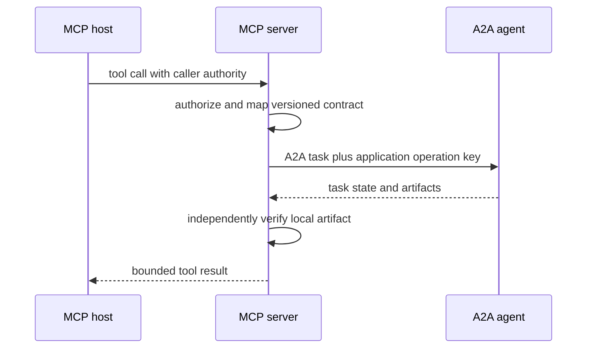

# MCP to A2A bridge

Successful-path illustration for a configured adapter. Denied authority, incompatible versions, invalid artifacts and unknown effects follow the separate [validation disposition diagram](02_validation-provenance.md). The sequence does not certify wire conformance.
