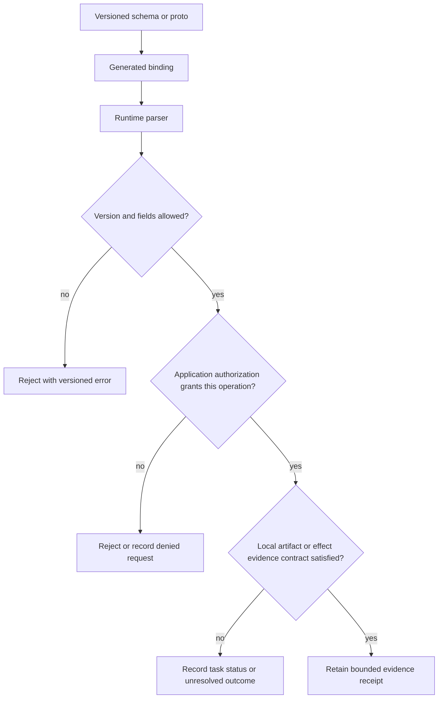

# Validation and provenance path

```mermaid
flowchart TD
  S[Versioned schema or proto] --> G[Generated binding]
  G --> P[Runtime parser]
  P --> Q{Version and fields allowed?}
  Q -->|no| X[Reject with versioned error]
  Q -->|yes| A{Application authorization grants this operation?}
  A -->|no| D[Reject or record denied request]
  A -->|yes| E{Local artifact or effect evidence contract satisfied?}
  E -->|no| U[Record task status or unresolved outcome]
  E -->|yes| R[Retain bounded evidence receipt]
```

A generated binding and a protocol-level security declaration do not replace an
application trust decision or evidence contract.
