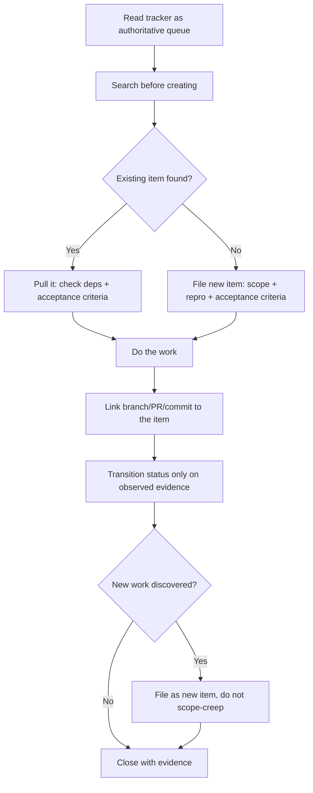

# Agent Issue Tracker Workflow

Work a tracker (Jira/Linear/GitHub Issues) the way a trusted human collaborator would: as a shared queue and a legible record, never a private notepad.

## Use This For

- Deciding whether to pull an existing tracker item, refine one, or file a new one — and proving a search happened first.
- Writing or refining an item so it is actionable: explicit scope, reproduction/context, and acceptance criteria a reviewer can check.
- Moving an item through `todo -> in-progress -> done` honestly, backed by observable work rather than optimism.
- Linking a change to its item — branch names, `Roadmap-Item:`/issue-key PR trailers, commit references — so the item traces to its diff.
- Capturing newly-discovered work as new tracker items instead of quietly expanding the current item's scope.

## Do Not Use This For

- Writing the PR body/diff itself once the item is scoped (`agent-pr-authoring`).
- Deciding roadmap priority, sequencing, or which epic an item belongs to (`legible-roadmap-with-sidequests`).
- Multi-agent file-locking, worktree isolation, or message-passing mechanics (`multi-agent-coordination`).

## Process

1. Read the tracker as the authoritative work queue: pull the next item by priority and unmet dependencies, don't invent work the tracker doesn't know about. GitHub Copilot's cloud agent and port-daddy's own roadmap (ADR-0086 migration toward Jira-style items with slugs) both assume the tracker, not the chat, is ground truth.
2. Before filing anything, search for an existing item covering the same work. Never keyword-grep titles as a substitute — read the top candidates and confirm by hand; a missed near-duplicate is worse than a slow search.
3. If filing new, write it so a stranger could pick it up: explicit scope, reproduction/context, and acceptance criteria stated as checkable conditions ("cargo test -p core bin_resolver:: exits 0"), not vibes ("make it work better").
4. Do the work, then link it to the item — a branch name, a PR trailer (this repo's convention: `Roadmap-Item: <slug>`), or a commit reference — before or as part of the same change, never as an afterthought days later.
5. Transition status only when the transition is backed by something a reviewer can open and check: `in-progress` means a linked branch/PR exists, `done` means validated evidence (a merged/passing PR, a captured artifact) exists — never move to `done` on the agent's own narration.
6. Communicate economically: batch meaningful updates instead of a comment per micro-step, and close with the evidence attached (the PR/receipt), not a paragraph restating the diff.
7. If new work surfaces mid-task, file it as a new item (or a `Roadmap-Spawns:` line on a planning doc) instead of expanding the current item's scope — then run `scripts/issue_hygiene.mjs` before calling the batch of items done.

## Output Contract

Produce a JSON object matching the audit result shape: `pass` (boolean), `legibilityScore` (0-1, fraction of active items traceable item -> diff), `findings[]` (each with `id`, `itemId`, `severity`, `message`), and `recommendations[]`.

Use `scripts/issue_hygiene.mjs` to run `auditIssueWorkflow(plan)` deterministically against a `schemas/issue-plan.schema.json`-shaped plan and get this report.

## Anti-Patterns

### Duplicate-Issue Spray

**Novice**: File a fresh issue for every bug/idea without checking whether one already exists, because searching feels slower than typing.
**Expert**: Search first, every time, even when confident nothing matches — the cost of a duplicate (split discussion, wasted parallel work, stale links) always exceeds the cost of a search.
**Detection**: `issue_hygiene.mjs` flags `no-dedupe-search` on any item with `dedupeSearched: false`; severity escalates to `high` once the item is no longer `todo`, because work has already started on a possible duplicate.

### Status Theater

**Novice**: Move an item to `in-progress` on pickup and to `done` on "I'm pretty sure this works," with no link and no captured evidence.
**Expert**: A status transition is a claim other agents and humans will trust without re-checking; `in-progress` requires a linked branch/PR, `done` requires validated evidence a reviewer can open.
**Detection**: `issue_hygiene.mjs` flags `status-theater` (critical) on any `done` item whose `evidenceOnDone` is missing or `validated !== true`, and `missing-acceptance-criteria` (critical when done) on items with no checkable acceptance criteria.

### Orphan Work

**Novice**: Push commits and open a PR with no reference back to the tracker item, or close an item with no diff/PR attached — the tracker and the code drift apart.
**Detection**: `issue_hygiene.mjs` flags `orphan-work` on any active (`in-progress`/`done`) item with an empty `linkedArtifacts[]`, and rolls this into `legibilityScore` — the fraction of active items that actually trace item -> diff. A score below the plan's `minLegibilityScore` fails the audit even with zero critical findings.
**Expert**: Every active item carries at least one of a branch name, PR reference, or commit sha before it leaves `todo`; this repo enforces it mechanically via the `roadmap-link` required check and the `Roadmap-Item: <slug>` PR trailer.

## References

| File | Load When |
| --- | --- |
| `references/tracker-discipline.md` | Need the core discipline: reading the queue, actionable-item structure, honest status semantics, economical communication, and capturing spawned work. |
| `references/tracker-integration-patterns.md` | Need per-tracker mechanics for GitHub Issues, Linear, and Jira: linking syntax, trailers, CLI commands, and this repo's `roadmap-link` gate. |
| `examples/expected-output.md` | Need to see a weak plan's audit (fails) next to the fixed plan (passes). |
| `templates/output-template.md` | Need a reusable tracker-item plan template to fill in before auditing. |
| `schemas/issue-plan.schema.json` | Need to validate a plan's structure programmatically. |
| `scripts/issue_hygiene.mjs` | Need deterministic auditing of tracker-working discipline and a legibility score. |
| `agents/openai.yaml` | Need a subagent descriptor for delegated tracker hygiene auditing. |

<!-- BEGIN BUNDLE INDEX (auto: index_references.py) -->

## Skill Bundle Index

*Every file in this skill, and when to open it. Auto-generated; run `scripts/index_references.py --fix`.*

**root**
- [`CHANGELOG.md`](CHANGELOG.md) — Agent Issue Tracker Workflow — Changelog — - Initial skill creation - Core process defined - Reference files and deterministic issue_hygiene script added
- [`README.md`](README.md) — Agent Issue Tracker Workflow — Discipline an AI agent needs to work a Jira/Linear/GitHub Issues tracker as the shared source of truth: pull the right item, search before c

**`agents/`**
- [`agents/openai.yaml`](agents/openai.yaml) — openai (data/schema)

**`examples/`**
- [`examples/expected-output.md`](examples/expected-output.md) — Example Output: Agent Issue Tracker Workflow — Scenario: an agent closes out two Jira-style items in one session — `PROJ-501` ("fix flaky upload retry") and `PROJ-502`, filed independentl
- [`examples/sample-input.json`](examples/sample-input.json) — sample input (data/schema)

**`references/`**
- [`references/tracker-discipline.md`](references/tracker-discipline.md) — Tracker Discipline — Use this when deciding whether to pull, refine, or file a tracker item, and when deciding whether a status transition is honest.
- [`references/tracker-integration-patterns.md`](references/tracker-integration-patterns.md) — Tracker Integration Patterns — Use this when you need the actual linking syntax, CLI commands, and gate mechanics for a specific tracker, rather than the general disciplin

**`schemas/`**
- [`schemas/issue-plan.schema.json`](schemas/issue-plan.schema.json) — issue plan.schema (data/schema)

**`scripts/`**
- [`scripts/issue_hygiene.mjs`](scripts/issue_hygiene.mjs)

**`templates/`**
- [`templates/output-template.md`](templates/output-template.md) — Tracker Item Plan Template — [One-sentence description of the batch of tracker work this plan covers.] Fill in one object per item you handled in this session.

<!-- END BUNDLE INDEX -->
