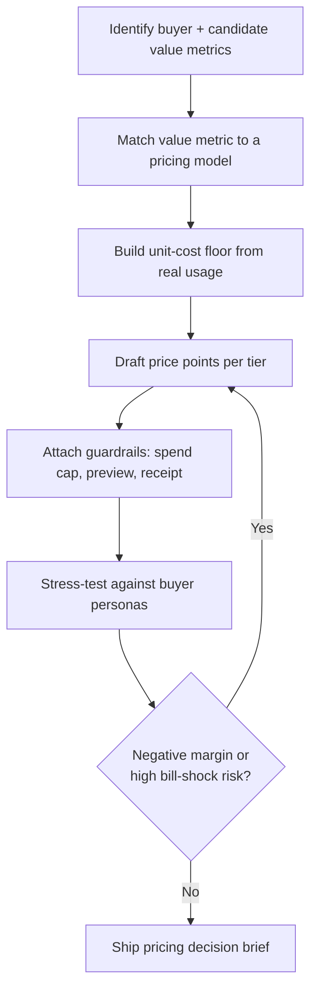

# Agent Labor Pricing Function

Design a pricing function for agent labor that never sells below cost and never surprises the buyer.

## Use This For

- Unblocking a stalled pricing lane for an agentic dev-tools product (e.g. Port Daddy Phase 2, idle 85+ days).
- Choosing between per-seat, metered, credits/premium-requests, hybrid, and outcome-based models for a new agent-labor feature.
- Designing a value metric that scales with delivered value but stays predictable to the buyer before they run anything.
- Building a cost floor from real unit economics (model token cost + tool/compute + overhead) before any price is set.
- Stress-testing a draft plan against buyer personas (solo founder, staff engineer, enterprise admin) for both bill-shock risk and margin erosion.

## Do Not Use This For

- Implementing the actual billing, invoicing, or payment-processor integration.
- Live per-request cost telemetry during a running DAG (that is accrual tracking, not pricing design).
- Runtime spend enforcement inside an execution loop (that is budget/cost optimization, not the pricing function itself).

## Pricing Design Loop

1. Name the buyer for each tier (solo founder, staff engineer, enterprise admin) and list candidate value metrics each buyer already tracks — seats, completed tasks, resolved tickets, merged PRs — before considering raw infra metrics like tokens or tool calls.
2. Match the value metric to a model using `references/pricing-model-decision-guide.md`: per-seat when usage is roughly uniform per buyer, metered/credits when usage varies widely, hybrid when a seat floor plus overage protects margin without full metering exposure, outcome-based only when the outcome is verifiable and atomic.
3. Build the unit-cost floor from `references/unit-economics-and-guardrails.md`: blended model token cost across every call in the task, tool/compute cost, and amortized overhead. This floor is a price you must clear, not a target.
4. Draft price points per tier: base price, included units, and (for anything but pure per-seat) an explicit overage rate. An included allotment with no overage rate is an unbounded cost commitment, not a feature.
5. Attach guardrails before launch, not after a bill-shock incident: a hard spend cap, a budget preview shown before the buyer commits, a per-task cost estimate, and transparent line-item metering after the fact.
6. Run `scripts/pricing_stress.mjs` against realistic persona usage profiles for every tier. Fix any negative-margin persona and any missing guardrail on a usage-exposed model before treating the plan as done.
7. Write the pricing decision brief using `templates/output-template.md`, citing the stress-test JSON as evidence, and route it back to the buyer-research findings that justified the value metric.

## Output Contract

Produce:

- `pricingModel`: the chosen model (per-seat, metered, credits, hybrid, outcome) and the reason it fits the value metric and buyer.
- `valueMetric`: name, unit, and whether the buyer can predict it before running work.
- `unitCostFloor`: modelTokenCost, toolCompute, overhead, and the summed floor per unit.
- `pricePoints`: tiers with base price, included units, and overage rate (or an explicit decision to leave overage unmetered, with the margin-erosion consequence stated).
- `guardrails`: spend cap, budget preview, per-task estimate, transparent metering — each marked present or planned.
- `personaStressTest`: the full JSON from the stress-test script — `pass`, `marginByPersona`, `billShockRisk`, `findings`, `recommendations`.

Use `scripts/pricing_stress.mjs` to compute per-persona margin from unit costs and usage, and to flag bill-shock risk from missing guardrails or an unpredictable value metric.

## Anti-Patterns

### Opaque Metering Without A Preview

**Novice**: "We'll bill exactly what it costs us, per token, and show the invoice at month end."
**Expert**: This is the Cursor lesson — usage-based pricing with no pre-run estimate and no spend cap produces bill-shock trust incidents even when the billing math is technically correct. Ship a per-task budget preview and a hard spend cap before the agent runs, not a reconciled invoice after.
**Detection**: The plan has `guardrails.budgetPreview: false` or `guardrails.spendCap: false` on any model other than flat per-seat.

### Vanity Value Metric

**Novice**: "Price per 1K tokens" or "price per API request" because that's what the infra bill shows.
**Expert**: Tokens and raw requests are the seller's cost metric, not the buyer's value metric — the buyer cannot predict either one before running a task. GitHub Copilot's "premium request" and Claude's rate-limit-window abstractions exist precisely to hide the infra metric behind a unit the buyer can count on their own terms.
**Detection**: `valueMetric.buyerCanPredict` is false, or the metric name is a raw infra term (tokens, requests, GPU-seconds) rather than a completed unit of work.

### Pricing Without A Cost Floor

**Novice**: "Competitors charge $X/seat, so we'll charge $X too."
**Expert**: A price set by competitor-matching without a unit-cost floor goes negative exactly on the heaviest users — the power users who adopt agent tools first and generate the most usage. Compute modelTokenCost + toolCompute + overhead per unit before setting any price point.
**Detection**: `scripts/pricing_stress.mjs` reports any persona with `status: "negative"`, or price points were set before `unitCosts` existed.

## References

| File | Load When |
| --- | --- |
| `references/pricing-model-decision-guide.md` | Choosing between per-seat, metered, credits, hybrid, and outcome-based models for a specific buyer and value metric. |
| `references/unit-economics-and-guardrails.md` | Building the cost floor and designing spend caps, budget previews, and transparent metering. |
| `examples/expected-output.md` | Need the shape of a finished pricing decision brief with a real stress-test result. |
| `templates/output-template.md` | Need a reusable pricing decision brief template. |
| `schemas/pricing-plan.schema.json` | Need to validate a draft pricing plan before running the stress test. |
| `scripts/pricing_stress.mjs` | Need deterministic per-persona margin and bill-shock scoring for a draft plan. |
| `agents/openai.yaml` | Need a subagent descriptor for delegated pricing-function design. |

<!-- BEGIN BUNDLE INDEX (auto: index_references.py) -->

## Skill Bundle Index

*Every file in this skill, and when to open it. Auto-generated; run `scripts/index_references.py --fix`.*

**root**
- [`CHANGELOG.md`](CHANGELOG.md) — Agent Labor Pricing Function — Changelog — - Initial skill creation - Core process defined - Reference files and deterministic pricing stress-test script added
- [`README.md`](README.md) — Agent Labor Pricing Function — Design a pricing/packaging function for variable-cost agent labor that clears a real cost floor and never surprises the buyer.

**`agents/`**
- [`agents/openai.yaml`](agents/openai.yaml) — openai (data/schema)

**`examples/`**
- [`examples/expected-output.md`](examples/expected-output.md) — Example Output: Agent Labor Pricing Function — Scenario: unblocking Port Daddy's stalled Phase 2 pricing lane for the background Fleet feature — pricing a hybrid seat-plus-overage plan fo
- [`examples/sample-input.json`](examples/sample-input.json) — sample input (data/schema)

**`references/`**
- [`references/pricing-model-decision-guide.md`](references/pricing-model-decision-guide.md) — Pricing Model Decision Guide — Use this when choosing a pricing model for a new agent-labor feature or tier, before writing any price.
- [`references/unit-economics-and-guardrails.md`](references/unit-economics-and-guardrails.md) — Unit Economics And Guardrails — Use this when building the cost floor for a pricing plan and when designing the guardrails that keep usage-sensitive pricing from becoming a

**`schemas/`**
- [`schemas/pricing-plan.schema.json`](schemas/pricing-plan.schema.json) — pricing plan.schema (data/schema)

**`scripts/`**
- [`scripts/pricing_stress.mjs`](scripts/pricing_stress.mjs)

**`templates/`**
- [`templates/output-template.md`](templates/output-template.md) — Agent Labor Pricing Decision Brief — [One sentence naming the product feature, buyer segment, and pricing decision being made.] - **Model**: [per-seat | metered | credits | hybr

<!-- END BUNDLE INDEX -->
