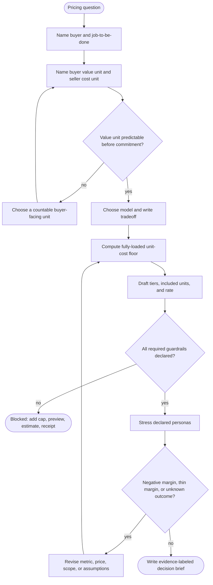

# Agent Labor Pricing Function

Use a buyer-facing value unit to set a product price, and use a separate fully-loaded cost unit to test whether the price can support the promised work. This skill writes an auditable plan; it does not charge anyone, launch a provider, or enforce a budget at runtime.

## Scope and evidence boundary

A plan is an offline design artifact. A passing report means only that the plan's declared arithmetic, personas, and guardrails cleared this static checker. It is not evidence of market demand, a provider quote, a deployed cap, a realized margin, or truthful-mechanism properties.

Provider rates and processor fees change. Record a dated official source and the exact assumptions used when inserting live rates. The worked ledger below deliberately uses **hypothetical rates**, so it is an arithmetic example rather than a current provider-price claim.

## Pricing design loop



1. State who buys, who consumes, and the buyer's decision horizon. Write one buyer-visible value unit (for example, `verified completed case`) and a separate cost unit (token, tool minute, review minute, payment fee). Do not call a raw cost meter “value” merely because it is easy to observe.
2. Pick one of the five models in `references/pricing-model-decision-guide.md`. Document the rejected alternatives and the condition that would cause reconsideration.
3. Collect a dated cost ledger: every model call, tool/compute cost, review or support allocation, and payment/collection cost. Mark estimated and measured values separately.
4. Draft tiers with a base price, included units, and an explicit treatment of excess use. A free excess-use promise is a product commitment that must be modeled, not an omitted field.
5. For metered, credits, hybrid, or outcome models, require all four guardrails before a plan can pass: buyer-configurable cap, pre-commitment budget preview, per-task estimate, and line-item receipt. The static checker enforces this condition.
6. Stress each declared persona plus a heavy-use and retry case. Preserve the input and report; a passing baseline is not enough if assumptions changed.
7. For outcome pricing, define a verifier, a billable terminal event, and an `unknown` result policy before quoting a price. The default safe planning policy is `do-not-bill` until a named verifier resolves it.

## Five model tradeoffs

| Model | Fits when | Main buyer benefit | Main seller exposure | Hand-check before choosing |
| --- | --- | --- | --- | --- |
| Per-seat | Work per buyer is close to uniform | Known monthly bill | heavy users subsidized by light users | model a high-use seat and the included service scope |
| Metered | Use varies and the unit maps to value | pay proportionally | surprise and volatile invoices | pre-run estimate, cap, and overage math |
| Credits | A named request unit can hide infrastructure variability | countable prepaid budget | expensive requests consume too little credit | worst-case backing mix and expiry/refund policy |
| Hybrid | There is a stable core plus bursts | stable base with disclosed tail | underpriced overage or free excess use | base covers included work; overage clears floor |
| Outcome | A result is atomic and independently checkable | pay for a result | verification, rework, and disputes | verifier, reversals, unknown/appeal policy |

These are product-fit heuristics. They are not empirical prevalence claims or a theorem about agent markets.

## Worked hypothetical accounting ledger

This constructed task sells for **$5.00**. The rates below are hypothetical, so this is an arithmetic check rather than a current provider-price claim. The first request has 20,000 fresh input tokens at $0.05/M and 1,000 generated-output tokens at $0.25/M. The second request has 3,000 fresh input tokens at $0.05/M and 1,000 generated-output tokens at $0.25/M.

| Call | Calculation | Cost |
| --- | --- | ---: |
| First input | 20,000 × $0.05 / 1,000,000 | $0.00100 |
| First output | 1,000 × $0.25 / 1,000,000 | $0.00025 |
| **First total** | sum of first-call rows | **$0.00125** |
| Second input | 3,000 × $0.05 / 1,000,000 | $0.00015 |
| Second output | 1,000 × $0.25 / 1,000,000 | $0.00025 |
| **Second total** | sum of second-call rows | **$0.00040** |
| **Model total** | $0.00125 + $0.00040 | **$0.00165** |

Add a constructed $0.06 tool attempt, $0.03 allocated support/infra, and $2.00 human review. The fully-loaded pre-processor cost is $2.09165. An assumed processor fee is **$5.00 × 0.029 + $0.30 = $0.445**. Variable cost is $2.53665 and contribution is $2.46335 (49.267% of the $5 sale). State which terms are actual quotations, historical observations, or planning assumptions; do not silently promote the ledger to measured margin.

## Product pricing and mechanism-design boundary

Before using an economic theorem, define the market: named agents, each agent's private information, the allocation/price rule, feasibility constraints, objective, and outside option. For example, Xia and Muthukrishnan study assignments of workers with skill vectors to single-skill tasks under feasibility and stability conditions; their approximation and truthfulness results do not prove a SaaS tier is profitable or that a generic agent-labor subscription is incentive compatible. Myerson's single-item private-value setting is likewise not a shortcut to multi-task procurement.

Use `references/market-formulation-and-mechanism-boundaries.md` to write that bridge explicitly. If those elements are absent, call the result a product-pricing decision rather than a mechanism-design claim.

## Stress-test contract

`schemas/pricing-plan.schema.json` is Draft 7 structural validation: allowed properties, required fields, primitive types, non-whitespace named strings, and local numeric bounds. `scripts/pricing_stress.mjs` repeats those shape checks for direct use, then adds cross-record checks (unique tiers and persona names, known tier references, finite derived arithmetic) and returns policy status. A well-formed usage-exposed plan is `blocked` when guardrails are false; any declared persona is negative or thin; a modeled excess-use case has no explicit rate; or an outcome plan lacks a verifier and supported unknown-result policy. Run the portable regressions with `node --test tests/pricing_stress.test.mjs`; independently validate structure with a Draft 7 engine when integrating the checker.

Run:

```sh
node scripts/pricing_stress.mjs --input examples/sample-input.json --status
node scripts/pricing_stress.mjs --input examples/sample-input.json --strict
```

`pricing_stress.mjs --input …` is report-only: a well-formed report exits 0 whether it says `pass` or `blocked`. `--status` prints only `pass` or `blocked` with the same report-only exit behavior. Add `--strict` when a review gate must exit 2 for `blocked`; malformed input always exits 1. That is a static contract check, not a billing control.

## Buyer stress cases

Use at least these distinct cases, with declared numbers rather than invented benchmark results:

- A solo buyer who wants a known ceiling and may abandon a task after the preview.
- A staff buyer with burst use above the included allowance.
- An admin who needs an allocation and receipt for a dispute.
- A retry or tool-failure case: include the extra cost and state whether it is billable.
- An unknown outcome: the task ends without a verifier result; demonstrate the plan's `do-not-bill`, `hold-for-review`, or other explicit policy.

## References and artifacts

| Artifact | Use it for |
| --- | --- |
| `references/pricing-model-decision-guide.md` | Five-model selection, buyer personas, and source boundaries. |
| `references/unit-economics-and-guardrails.md` | Cost ledger, guardrail procedure, and retry/unknown handling. |
| `references/market-formulation-and-mechanism-boundaries.md` | Theorem scope before any mechanism claim. |
| `schemas/pricing-plan.schema.json` | Structural input shape; the checker supplies policy status. |
| `scripts/pricing_stress.mjs` | Deterministic arithmetic and blocking status. |
| `examples/expected-output.md` | Constructed revise/pass and unknown-outcome walkthrough. |
| `diagrams/` | Separate pricing loop and commitment/outcome state diagrams. |

## Bundle navigation

[agents index](agents/INDEX.md), [templates index](templates/INDEX.md).
