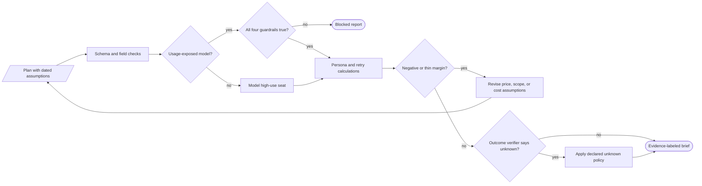

# Pricing-loop evidence

Use this complement to the entry diagram when reviewing a draft. The blocked path deliberately has no “ship” edge.

```mermaid
flowchart LR
  P[/Plan with dated assumptions/] --> S[Schema and field checks]
  S --> G{Usage-exposed model?}
  G -->|no| M[Model high-use seat]
  G -->|yes| R{All four guardrails true?}
  R -->|no| B([Blocked report])
  R -->|yes| T[Persona and retry calculations]
  M --> T
  T --> F{Negative or thin margin?}
  F -->|yes| V[Revise price, scope, or cost assumptions]
  V --> P
  F -->|no| U{Outcome verifier says unknown?}
  U -->|yes| H[Apply declared unknown policy]
  U -->|no| D([Evidence-labeled brief])
  H --> D
```
