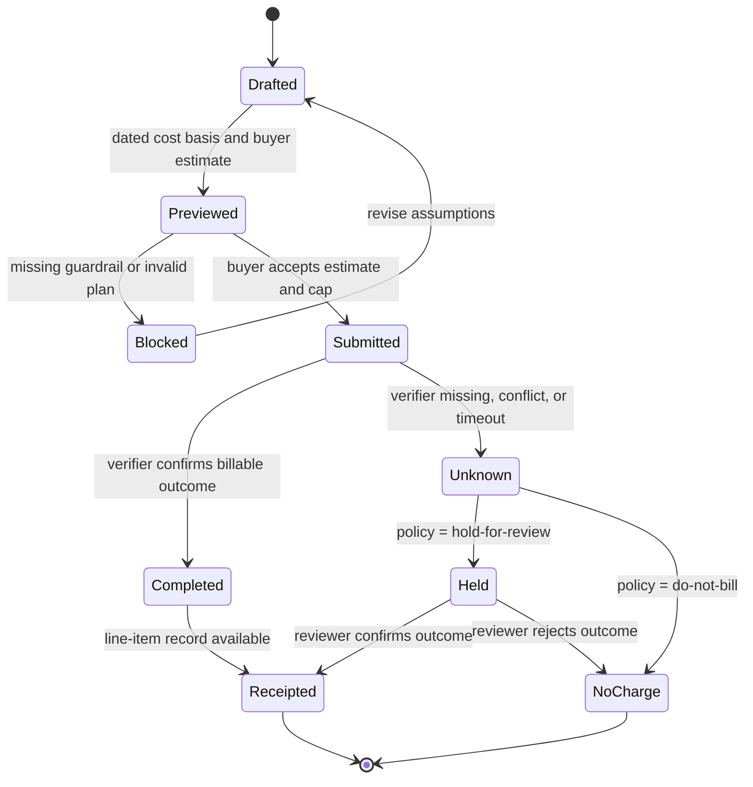

# Commitment and outcome state boundary

This is a product-policy abstraction. The checker validates declared fields; it does not perform any of these actions.

```mermaid
stateDiagram-v2
  [*] --> Drafted
  Drafted --> Previewed: dated cost basis and buyer estimate
  Previewed --> Blocked: missing guardrail or invalid plan
  Previewed --> Submitted: buyer accepts estimate and cap
  Submitted --> Completed: verifier confirms billable outcome
  Submitted --> Unknown: verifier missing, conflict, or timeout
  Completed --> Receipted: line-item record available
  Unknown --> Held: policy = hold-for-review
  Unknown --> NoCharge: policy = do-not-bill
  Held --> Receipted: reviewer confirms outcome
  Held --> NoCharge: reviewer rejects outcome
  Blocked --> Drafted: revise assumptions
  Receipted --> [*]
  NoCharge --> [*]
```
