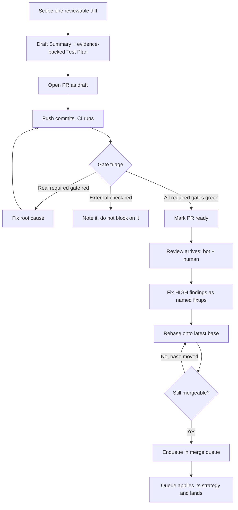

# Agent PR Authoring

Get an agent-authored change through review and landed, without a giant diff, an evidence-free Test Plan, or a gate-confusion incident.

## Use This For

- Scoping a coding agent's change into one reviewable PR before opening it.
- Writing a `## Summary` and `## Test Plan` with real commands and observed output, not a claim.
- Triaging red CI: separating a real required gate (lint, tests, roadmap-link, `pr-requirements-guard`) from an external, non-blocking check (a Cloudflare Pages preview build).
- Running draft-while-iterating, marking ready only when the real gates are green, and processing bot/human review as named fixup commits.
- Landing through a merge queue: enqueue, let the queue pick the strategy, rebase and recheck when the base moves — never force-push, never `--admin` past a real gate.

## Do Not Use This For

- This repo's specific release ceremony, internal actor embodiments, or skill-mirror sync mechanics (`port-daddy-internal-dev`).
- Tracking a backlog item's lifecycle across a board or issue tracker (`agent-issue-tracker-workflow`).
- Deciding what to build next or sequencing a roadmap of side-quests (`legible-roadmap-with-sidequests`).

## Process

1. **Scope the diff before opening it.** One PR = one reviewable change. If the work mixes a refactor, a feature, and a dependency bump, split it into separate PRs even if that means three PRs instead of one.
2. **Write the Summary and Test Plan together.** Summary states what changed and why (and what it deliberately does not do). Test Plan lists the exact commands run and the observed output — a reviewer should be able to reproduce the claim without asking. "Tests pass" with no command or output is not a Test Plan.
3. **Open as a draft while iterating.** Draft signals "not yet reviewable"; push commits and let CI run until the real required gates are green before asking for review.
4. **Triage every check before reacting to red.** Classify each as required-and-repo-owned or external-and-advisory (see `references/gate-taxonomy.md` for the decision ladder and the Cloudflare Pages specifics). Fix the root cause of a real required gate. Never wait on, and never treat as a blocker, an external check.
5. **Mark ready only when real gates are green**, then process review: pull bot and human comments, fix the real findings as separate named fixup commits (`fixup: address <bot> finding on <file> — <what>`), reply to the rest with fixed/deferred/contested-because. See `references/review-and-merge-mechanics.md`.
6. **Rebase onto the latest base and recheck mergeability** before landing — `MERGEABLE` can flip to `CONFLICTING` the moment another PR lands on the base.
7. **Land through the merge queue.** Enqueue the PR and let the queue's configured strategy pick squash/merge/rebase and branch deletion; do not force a strategy by hand, do not force-push, and do not use an admin override to bypass a real required gate.

## Output Contract

A landing-ready PR carries:

- `summary`: what changed, why, and what it deliberately does not do.
- `testPlan`: exact commands plus observed output, exit codes, or artifact paths — never a bare claim.
- `gateClassification`: every check labeled required-and-blocking or external-and-advisory, with the real ones green.
- `fixups`: named commits addressing every HIGH/critical review finding (or a contested-because reply on the thread).
- `mergeReadiness`: rebased on the latest base, no admin bypass, no force-push, merge method left to the queue.

Use `scripts/pr_readiness.mjs` to audit a PR JSON description and return `{ pass, score, findings, recommendations }`.

## Anti-Patterns

### The Giant Unreviewable PR

**Novice**: Ship 40+ files mixing a refactor, a new feature, and a dependency bump because it was all "part of the same task."
**Expert**: One PR is one reviewable change. Split by concern before opening — a reviewer who can't hold the diff in their head will rubber-stamp it or let it rot unreviewed.
**Detection**: `pr_readiness.mjs` returns an `oversized-diff` finding when `filesChanged`/`linesChanged` exceed the documented thresholds, or a `mixed-concerns` finding when `diff.mixedConcerns` is true.

### Evidence-Free Test Plan

**Novice**: "✅ All tests pass" with no command and no output — or no Test Plan section at all.
**Expert**: The Test Plan lists the exact commands run and the observed result (pasted output, exit code, screenshot/artifact path). If it isn't reproducible from the PR body alone, it isn't evidence.
**Detection**: `pr_readiness.mjs` returns `missing-test-plan` (critical) when `body.hasTestPlan` is false, or `test-plan-not-evidence-backed` (critical) when it's true but `testPlanHasEvidence` is false.

### Gate Confusion

**Novice**: Blocks a merge waiting for an external preview build (e.g. Cloudflare Pages) to go green, OR runs `gh pr merge --admin` to skip a failing lint/test/roadmap-link check.
**Expert**: Classify every check as required-and-repo-owned or external-and-advisory before reacting to red. Never bypass a real required gate with an admin override or force-push; never wait on, or treat as a blocker, a check that isn't repo CI.
**Detection**: `pr_readiness.mjs` flags `required-check-failing` (critical) for a red real gate, `external-check-marked-required` / `external-gate-treated-as-blocker` for gate-confused configuration, `admin-bypass-skips-required-gate` (critical) when `--admin` skips a *failing required* check, `admin-bypass-used` (medium) when it only skips the BEHIND gate or an external non-blocking check, and `force-pushed` (critical) for a force-push.

## References

| File | Load When |
| --- | --- |
| `references/gate-taxonomy.md` | Need to classify a specific CI check as required-and-blocking versus external-and-advisory, or need the Cloudflare Pages / roadmap-link specifics. |
| `references/review-and-merge-mechanics.md` | Need the mechanics of pulling bot/human review, writing named fixups, rebasing on conflict, or enqueueing through a merge queue. |
| `examples/expected-output.md` | Need to see a bad PR audited, then the same PR fixed and passing. |
| `templates/output-template.md` | Need a reusable PR description template (Summary + Test Plan) to fill in. |
| `schemas/pr-plan.schema.json` | Need to validate a PR-plan JSON payload's structure before auditing it. |
| `scripts/pr_readiness.mjs` | Need deterministic scoring of a PR's readiness to land. |
| `agents/openai.yaml` | Need a subagent descriptor for delegated PR authoring/triage. |

<!-- BEGIN BUNDLE INDEX (auto: index_references.py) -->

## Skill Bundle Index

*Every file in this skill, and when to open it. Auto-generated; run `scripts/index_references.py --fix`.*

**root**
- [`CHANGELOG.md`](CHANGELOG.md) — Agent PR Authoring — Changelog — - Initial skill creation - Core process defined - Reference files and deterministic pr_readiness script added
- [`README.md`](README.md) — Agent PR Authoring — Author a pull request an AI coding agent can actually get merged: a scoped diff, an evidence-backed narrative, correct real-vs-external gate

**`agents/`**
- [`agents/openai.yaml`](agents/openai.yaml) — openai (data/schema)

**`examples/`**
- [`examples/expected-output.md`](examples/expected-output.md) — Example Output: Agent PR Authoring — Scenario: an agent finishes a daemon fix and a batch of unrelated skill-doc edits in one session, opens one PR for everything, force-pushes 
- [`examples/sample-input.json`](examples/sample-input.json) — sample input (data/schema)

**`references/`**
- [`references/gate-taxonomy.md`](references/gate-taxonomy.md) — Gate Taxonomy: Required vs External — Use this when you need to decide whether a red or pending check should block a merge, or whether it's noise you should note and move past.
- [`references/review-and-merge-mechanics.md`](references/review-and-merge-mechanics.md) — Review And Merge Mechanics — Use this when you need the mechanics of pulling review comments, turning findings into fixups, rebasing on conflict, or landing through a me

**`schemas/`**
- [`schemas/pr-plan.schema.json`](schemas/pr-plan.schema.json) — pr plan.schema (data/schema)

**`scripts/`**
- [`scripts/pr_readiness.mjs`](scripts/pr_readiness.mjs)

**`templates/`**
- [`templates/output-template.md`](templates/output-template.md) — PR Description Template — Fill in every section before opening the PR.

<!-- END BUNDLE INDEX -->
