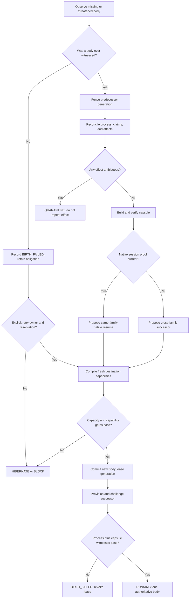

# Agent Resurrection and Body Continuity

A durable agent is not its PID, VM, provider session, model, or transcript. This
skill preserves one living `AgentNode` across temporary bodies while refusing to
duplicate authority, replay uncertain effects, invent missing context, or turn an
operator's retired identity back on.

## Halt Gate

Designing a recovery protocol does not authorize running the subject, provider,
daemon, or agent. Honor operator and incident halts. During a halt, use inert
source, schemas, fixtures, and fake adapters only.

## Skill Boundary

This is the normative, non-authorizing continuity contract. It decides whether
the evidence is sufficient to *propose* a next body. It does not own process
liveness, lifecycle transitions, provider allowance observations, reservations,
or launch authority.

- `context-economics-for-agent-swarms` produces versioned capacity evidence; it
  never chooses or launches the body.
- `sandboxed-adversarial-test-harness` tries to falsify this protocol at one
  exact isolation/capability tier; it does not define production identity.
- the external lifecycle writer owns generations, fencing, leases, admission,
  and the one retry decision;
- the capability/effect broker issues fresh grants and closes semantic effect
  slots. This skill never copies or redeems credentials.

## Freeze the Vocabulary

| Term | Meaning | Historical record may survive? | Carries live authority after loss? |
|---|---|---:|---:|
| `AgentNode` | durable worker/person | yes | identity only; never body authority |
| `Actor` | office, role, or mailbox | yes | no |
| `WorkEpisode` | bounded assignment and contamination boundary | yes, until settled | no |
| `Session` | bounded coordination record | yes | no |
| `AgentRun` | one execution attempt | yes, as history | no |
| `BodyLease` | one admitted embodiment generation | yes, as history | no after expiry/fence |
| provider session | harness-owned conversation state | maybe within one adapter family | no without a current exclusive lease |
| process witness | externally observed VM/PID/start-time identity | yes, as evidence | no |

Do not use “resume” until the exact operation is named:

- **takeover:** successor work record plus eligible claim transfer;
- **session reactivation:** reopen one durable work record without restoring claims;
- **identity resurrection:** operator revives an intentionally retired person;
- **rebodiment:** one living person receives a new temporary body.

This skill handles **rebodiment** and the body-loss side of takeover. Identity
resurrection is a different constitutional operation.

## Continuity Decision Flow



## Procedure

### 1. Classify the incident

Distinguish before-first-witness birth failure, observed process death, lost
heartbeat with unknown process state, provider stream loss, session-record loss,
context pressure, host reboot, and deliberate pause. Heartbeat loss is not proof
of death. A provider error is not proof that an effect or allowance debit failed.

### 2. Resolve the durable subject

Require exact principal, work intent, work plan revision, `AgentNode`, episode,
predecessor run, and latest body generation. If sources disagree, stop at
`IDENTITY_UNKNOWN`. Never infer identity from branch names, directories,
personality text, static actor labels, or copied context files.

### 3. Fence before replacement

The external lifecycle writer increments a compare-and-swap generation and
revokes the predecessor's effect and capability leases. Every later claim,
transcript append, or effect includes that generation. An old process that wakes
receives a durable denial.

### 4. Reconcile work and effects

Read authoritative source/worktree state, process witnesses, claim rows, output
quarantine, transcript cursor, and broker ledger. Track non-idempotent effects as:

```text
INTENDED -> DISPATCHED -> OBSERVED -> COMMITTED
```

`DISPATCHED` without an authoritative result becomes `AMBIGUOUS`. Do not retry it
until observed or replaced by an operator-authorized compensating action.

### 5. Seal the resurrection capsule

Build from artifacts, not the predecessor's last prose. Include exact repository
remote/base/head/tree/diff, objective and non-goals, plan frontier, verified facts,
unsupported claims, decisions, complete tool pairs, tests, effects, transcript
cursor and bounded tail, capability requirements, capacity state, memory
disposition, omissions, and signatures. Use the schema in
`schemas/resurrection-plan.schema.json`.

Validate the schema and the cross-field safety rules. The JSON Schema rejects
structurally unsafe ready verdicts; `scripts/validate-resurrection-plan.mjs`
also checks generation, typed-fact coverage, semantic effect uniqueness,
capacity, and native-resume lease invariants. A schema-valid object is not
necessarily semantically safe, and neither result authorizes execution.

### 6. Choose native resume or successor handoff

Native resume is an optimization, not authority. Use it only when the adapter can
prove the provider session, project/workspace binding, retained transcript, and
expected tail. Otherwise compile a sanitized successor prompt from the capsule.
Never claim that one provider's session format transfers to another.

### 7. Translate and attenuate capabilities

Classify every skill, tool, MCP, hook, permission, and model setting as `EXACT`,
`EQUIVALENT`, `NARROWED`, `EMULATED`, `OMITTED`, `BLOCKED`, or `UNKNOWN`.
`UNKNOWN` is blocking when the node requires the capability. Issue fresh grants
for the new generation; never transfer a bearer. See
`references/capability-translation.md`.

### 8. Reserve the new attempt

Consume a schema-valid, content-addressed `capacity-evidence` artifact and bind
its `executionClass` to the proposed body. Fake/replay evidence may authorize
only a fake/replay proposal; it can never be reinterpreted as evidence for a
real-provider call. Require fresh native-unit capacity plus a new reservation
for body, time, context, subscription windows, cash/credits, effects, and
concurrency. A zero marginal dollar estimate does not make subscription-backed
work free. Only the named external retry owner may authorize another attempt,
under durable breakers.

### 9. Challenge the successor

Provision with no effects initially. The successor must echo a challenge binding
person, episode, generation, capsule digest, worktree provenance, plan revision,
capability set, capacity reservation, and transcript sink. Mark `RUNNING` only
after external process and heartbeat witnesses agree.

### 10. Settle and expose discontinuity

Record what survived exactly, what was summarized, narrowed, omitted, unknown, or
lost. Settle the predecessor reservation and uncertainty reserve. Leave the old
generation fenced permanently. A successful new body does not erase the failed
attempt.

## Failure Rules

- VM never starts: `BIRTH_FAILED`, zero body witness, retained obligation, no
  recursive retry.
- Process exits before challenge: revoke provisional lease; do not call it a
  running body.
- Heartbeat missing but process unknown: revoke effects and quarantine before
  assuming death.
- Provider session missing: cross-family-style capsule handoff, even to the same
  provider product.
- Capsule omits a required fact or splits a tool pair: quarantine capsule.
- Destination widens a permission or cannot represent a required skill: block.
- Capacity is stale or unknown: hibernate, or use an explicitly selected fake
  or replay simulation. Real-provider launch remains blocked until fresh
  capacity evidence becomes admissible.
- Old body wakes: deny by generation and capture the stale-body receipt.

## Anti-Patterns

| Pattern | Novice move | Expert rule | Failure timeline | Detection | Fix |
|---|---|---|---|---|---|
| Credential transplant | Copy a context directory, account token, or MCP bearer | Compile a fresh attenuated capability set for the new generation | New body starts powerful before identity/work binding | Grant has predecessor audience, generation, or secret provenance | Revoke, quarantine, and issue fresh scoped grants through the broker |
| Transcript-as-soul | Replay the whole conversation as trusted identity | Treat transcript as cited, trust-separated evidence input | Stale instruction or hostile tool output becomes governing context | Capsule claim has no artifact citation or trust class | Rebuild from artifacts; mark unsupported claims and omissions |
| PID optimism | Adopt a matching PID | Require host, boot, start identity, VM, nonce, executable, and lease tuple | PID is reused after host/controller failure | Any process-witness field is missing or differs | Keep `start-unknown`, revoke effects, reconcile externally |
| Resume then reconcile | Start first and inspect effects later | Fence and reconcile every semantic effect slot before a body proposal | Both generations can repeat a push, payment, or message | `DISPATCHED`/ambiguous slot or old generation still redeemable | Quarantine; observe or compensate the effect before continuing |
| Retry ownership by every layer | Let SDK, adapter, queue, and daemon retry | One external retry owner; every other layer returns typed advice | One failure fans out into a birth storm | More than one scheduler or reservation per logical attempt | Force breaker open and disable nested retries |
| Personality hoarding | Promote every one-off preference into character | Keep scratch and episode context disposable by default | Silly ad hoc work changes future durable behavior | Identity revision cites only one episode or self-report | Propose a reviewed cross-episode promotion or discard it |

## Verdict

Return one of:

- `REBODIMENT_READY` — predecessor fenced, effects reconciled, capsule verified,
  translation non-widening, and capacity reserved;
- `NATIVE_RESUME_ELIGIBLE` — all above plus current adapter/session proof;
- `HIBERNATE` — safe capsule exists but no admissible body;
- `QUARANTINED` — identity, effect, process, capsule, or source truth is ambiguous;
- `BLOCKED` — required capability, authority, or capacity is unavailable;
- `INVALID` — the request attempts retirement reversal, credential transfer,
  self-supervision, or another forbidden operation.

Use `templates/output-template.md`. A verdict is a design or proof result; it is
not itself permission to launch.

## Quality Gates

- One durable person and at most one effect-capable generation.
- Exact source/worktree provenance and external process witness.
- Compare-and-swap fence survives controller restart.
- No ambiguous non-idempotent effect is repeated.
- Capsule citations, whole tool pairs, omissions, and memory disposition verify.
- Destination capabilities are freshly granted and never wider.
- Native-unit capacity and worst-case uncertainty are reserved.
- Crash-loop simulation proves bounded births and persistent breakers.
- Operator can inspect every discontinuity and stop outside the body.

## Bundle Index

- `README.md` — purpose, operating boundary, and bundle map.
- `CHANGELOG.md` — changes to the continuity contract.
- `agents/openai.yaml` — optional specialist descriptor.
- `references/resurrection-protocol.md` — state, data, fencing, and adversarial protocol.
- `references/capability-translation.md` — cross-harness session and capability matrix.
- `schemas/resurrection-plan.schema.json` — machine-readable plan contract.
- `scripts/validate-resurrection-plan.mjs` — deterministic cross-field safety
  verifier; load whenever a ready/native verdict is proposed.
- `templates/output-template.md` — required operator-facing review.
- `examples/sample-input.json` — synthetic body-loss incident.
- `examples/expected-output.md` — expected fail-closed disposition.
- `examples/resurrection-plan.ready.json` — schema-valid, semantically safe
  fixture.
- `examples/resurrection-plan.unsafe-ready.json` — negative fixture that must be
  rejected by both schema and semantic validation.
- `tests/activation.md` — positive and negative activation cases.
