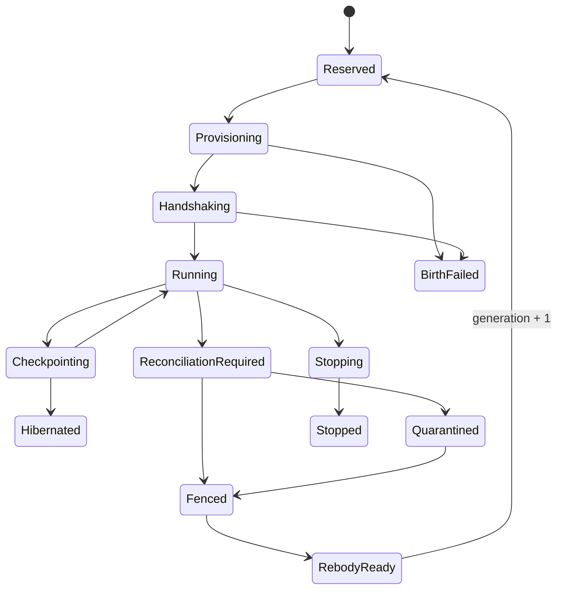

# Resurrection Protocol Reference

Load this reference when defining lifecycle tables, controller transitions,
process witnesses, generation fencing, crash behavior, or proof tests.

## Canonical records

```text
AgentNode          durable person and identity revision
WorkIntent         accepted operator purpose
WorkPlan           versioned hypertree
WorkEpisode        bounded assignment and memory boundary
AgentRun           one attempt with terminal outcome
BodyLease          one generation, adapter, reservation, and effect lease
ProcessWitness     host + boot + VM + PID + start time + challenge
Capsule            sealed continuation state
CapabilitySet      fresh body-scoped authority
CapacityReservation native-unit resource hold
EffectIntent       intended/dispatched/observed/committed outcome
```

The current projection may be cached, but append-only events are the recovery
source. One external writer serializes lifecycle state. Every mutation uses an
expected revision and body generation.

## Body lease states



`Running` requires a current process witness and a passed capsule/capability
challenge. `BirthFailed` never implies a retry. `Hibernated` retains no process.

## Compare-and-swap fencing

1. Read current `agentNodeId`, `episodeId`, generation, lease, revision, and effect
   lease.
2. In one durable transaction, require the expected revision and generation.
3. Revoke the current effect/capability leases and mark the body fenced.
4. Append the fence event and increment projection revision.
5. Issue generation + 1 only in a later admission transaction after proof.

Every effect and transcript append checks generation at use, not only when the
body starts. A stale body cannot recover authority through a cached ticket.

## Process witness

A PID alone is insufficient. Bind:

```text
host identity + host boot identity + VM identity + process tree identity
+ PID + process start time + executable digest + body lease + generation
+ one-time challenge + observation time + controller signature
```

Heartbeat is liveness evidence, not death proof. If the channel goes quiet,
revoke effects first, inspect the host witness, and use `UNKNOWN` until the
process tree is observed dead or fenced.

## Cold birth

Provision under an absolute deadline and zero effect authority. If VM creation,
process exec, backend session creation, transcript sink, or challenge fails:

- append one terminal `BIRTH_FAILED` attempt;
- revoke provisional leases and reservation remainder;
- retain the person's work obligation and verified capsule;
- increment scoped breaker counters; and
- schedule nothing unless the one retry owner has an explicit remaining attempt.

## Effect reconciliation

For each effect, the broker persists intent before dispatch. A response becomes
authoritative only after an external observation and commit receipt. Connection
loss after dispatch is `AMBIGUOUS`; consult destination state with a read-only
reconciliation operation. Never infer failure from transport failure.

## Crash-storm properties

Model and test:

- controller crashes before and after every durable write;
- adapter reports success but process never exists;
- PID is reused after host reboot;
- 1,000 duplicate death notifications arrive;
- predecessor wakes after successor runs;
- provider, adapter, and controller each try to retry;
- capacity reset happens during reconciliation;
- effect is committed remotely but response is lost;
- body dies during capsule construction;
- two controllers race to issue generation + 1.

Required invariants: at most one active generation, no effect replay, finite
attempt count, reservations conserved, durable breaker survives restart, and all
terminal states reconstruct from the event log.
