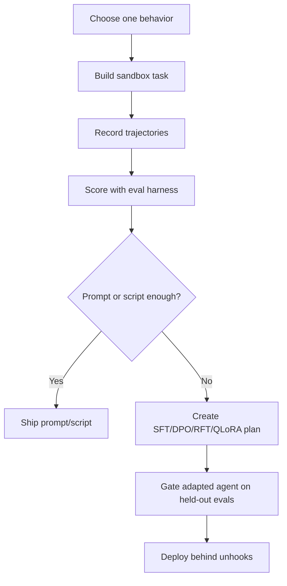

# Agent RL Sandbox Trainer

Design safe, measurable agent-learning loops for specific coding behaviors.

## Use This For

- Building a simulation sandbox where an agent practices narrow actions such as claim-before-edit, failing-test repair, reviewer reply drafting, or safe dependency updates.
- Turning successful and failed trajectories into supervised, preference, RFT, or QLoRA/LoRA training data.
- Designing eval gates, reward functions, unhooks, and rollback paths before any adapted agent reaches real repos.
- Reviewing whether a behavior should be trained, scripted, prompted, or left to human review.

## Do Not Use This For

- Training a model because a prompt is inconvenient.
- Rewarding "looks plausible" without ground-truth state checks.
- Letting an adapted agent bypass the same sandbox, claims, budget, and review gates as a base agent.

## Training Loop

1. Choose one observable behavior. Good examples: "claim files before edit," "run focused tests before PR," "stop when credentials are missing."
2. Build a sandbox with disposable repo state, deterministic fixtures, fake credentials, and a reset command.
3. Define reward from artifacts, not prose: file claims exist, tests pass, dangerous command refused, PR reply contains evidence.
4. Record traces as state, action, observation, reward, and unhook. Keep failed traces; they teach the boundary.
5. Run `scripts/trajectory_eval_harness.mjs` before any training export.
6. Pick the lightest intervention that passes: rule, script, skill, small adapter, then RFT. QLoRA is for repeated behavior gaps on local/open models, not every product bug.
7. Deploy adapted behavior only behind eval gates, kill switches, budget caps, and rollback unhooks.

## QLoRA / RL Practical Guidance

- LoRA freezes the base model and trains low-rank adapter matrices; QLoRA adds 4-bit quantization so larger models can be adapted with less memory.
- For coding agents, the valuable data is often not final code but trajectories: commands, observations, tool choices, refusals, tests, and reviewer feedback.
- Use behavior cloning or SFT for "do this consistently." Use preference/RFT when the reward is measurable but the path can vary.
- Never train directly on production secrets, private customer code, or hidden policy bypasses. Redact, synthesize, or replay in fixtures.

## Anti-Patterns

### Training Around A Missing Button

**Novice**: "Fine-tune the agent to remember this workflow."
**Expert**: If the behavior is deterministic, build a script, command, hook, or UI affordance first. Train only when the agent must generalize across varied states.
**Detection**: The desired behavior can be expressed as a simple if/then rule.

### Rewarding The Transcript, Not The World

**Novice**: "The agent said tests passed, so reward it."
**Expert**: Reward the verified state: test output, file diff, claim row, command exit code, review thread reply, or sandbox reset.
**Detection**: Eval harness accepts self-reported success.

### Adapter Without Unhooks

**Novice**: "The adapter improved the benchmark, ship it."
**Expert**: Adapted agents need disable switches, model fallback, per-behavior rollout, held-out evals, and audit logs.
**Detection**: No rollback path or comparison against base-agent behavior.

## References

| File | Load When |
| --- | --- |
| `references/rl-sandbox-architecture.md` | Need sandbox, trajectory, reward, QLoRA, and unhook architecture. |
| `references/eval-examples.md` | Need concrete behavior curricula and eval rows. |
| `examples/expected-output.md` | Need a finished training-plan example. |
| `templates/output-template.md` | Need a reusable training-plan template. |
| `schemas/reward-spec.schema.json` | Need to validate reward options such as action ordering and deployment gates. |
| `schemas/trajectory-suite.schema.json` | Need to validate trajectory/eval inputs. |
| `scripts/trajectory_eval_harness.mjs` | Need deterministic trajectory scoring. |
| `scripts/preflight.sh` | Need safe local environment inspection before running examples. |
| `agents/openai.yaml` | Need a subagent descriptor for delegated RL sandbox design. |

<!-- BEGIN BUNDLE INDEX (auto: index_references.py) -->

## Skill Bundle Index

*Every file in this skill, and when to open it. Auto-generated by the repo skill-architect indexer.*

**root**
- [`CHANGELOG.md`](CHANGELOG.md) — Agent Rl Sandbox Trainer — Changelog — - Initial skill creation - Core process defined - Reference files added
- [`README.md`](README.md) — Agent RL Sandbox Trainer — Procedural guidance for building deterministic simulation sandboxes, trajectory eval harnesses, adapter-training plans, and unhooks for spec

**`agents/`**
- [`agents/openai.yaml`](agents/openai.yaml) — openai (data/schema)

**`examples/`**
- [`examples/expected-output.md`](examples/expected-output.md) — Example Output: Agent RL Sandbox Trainer — Train or tune a reviewer-fix agent to respond to PR review comments with code changes, focused tests, and a substantive reply, without broad

**`references/`**
- [`references/eval-examples.md`](references/eval-examples.md) — Eval Examples — Use this when writing behavior curricula.
- [`references/rl-sandbox-architecture.md`](references/rl-sandbox-architecture.md) — RL Sandbox Architecture For Coding Agents — Use this when designing a training or eval loop.

**`schemas/`**
- [`schemas/reward-spec.schema.json`](schemas/reward-spec.schema.json) — reward spec.schema (data/schema)
- [`schemas/trajectory-suite.schema.json`](schemas/trajectory-suite.schema.json) — trajectory suite.schema (data/schema)

**`scripts/`**
- [`scripts/preflight.sh`](scripts/preflight.sh) — !/usr/bin/env bash
- [`scripts/trajectory_eval_harness.mjs`](scripts/trajectory_eval_harness.mjs)

**`templates/`**
- [`templates/output-template.md`](templates/output-template.md) — Agent RL Sandbox Training Spec — [Specific behavior the base agent cannot perform reliably enough.] - Repo/app state: [fixture] - Allowed tools: [tool list] - Forbidden tool

<!-- END BUNDLE INDEX -->
