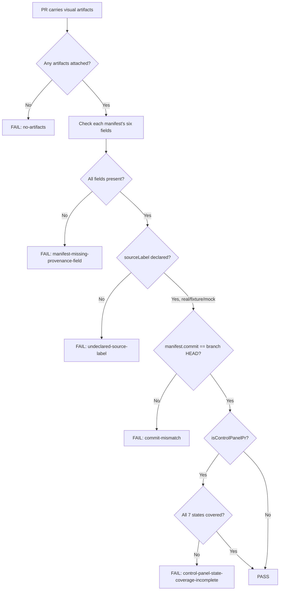

# Agent Visual Evidence Manifest

Prove a PR's screenshots, GIFs, and recordings are bound to a real, branch-current, daemon-backed run — not a reused mock wearing a "LIVE" label.

## Use This For

- Gating a PR's visual-evidence artifacts before merge: does every screenshot/GIF/recording carry a complete provenance manifest?
- Catching a stale or reused artifact whose manifest commit no longer matches the PR's branch HEAD.
- Catching an artifact whose manifest never says whether its data is real, fixture, or mock.
- Verifying an operator-control-panel PR's proof set actually covers the required state inventory, not just the happy path.
- Deciding whether a `fixture`/`mock`-labeled artifact is acceptable (it is, if honestly declared) versus an undeclared one (it never is).

## Do Not Use This For

- How to capture a screenshot without interrupting the operator's desktop — headless Playwright, `screencapture -x -l`, capture harnesses (`port-daddy-agent-skill`'s visual-evidence doctrine).
- Designing the shape of the Work Receipt an artifact ultimately attaches to (`agent-work-receipt-designer`).
- The broad product-level question of whether a multi-agent authoring surface clears a dogfood/Potemkin bar (`multi-agent-authoring-product-bar`).

## The Proof-Manifest Gate



1. **Collect every artifact's manifest.** For each screenshot, GIF, or recording attached to the PR, gather `daemonPort`, `runId`, `transcriptHeadHash`, `agentNodeId`, `commit`, and `sourceLabel`. An empty artifact set is never safe — it fails closed, not open.
2. **Check field completeness per artifact.** Any of the six fields missing, null, or empty-string means the artifact cannot yet count as proof; see `references/manifest-field-semantics.md` for what each field proves and why partial credit isn't a thing.
3. **Check the source label specifically.** `real`, `fixture`, and `mock` are all acceptable answers — an absent one is not. This gets its own check because it is the single field that separates honest illustration from disguised fakery.
4. **Check every manifest's commit against the PR's branch HEAD.** A manifest bound to an earlier commit is stale proof, even if every other field is filled in — the surface it depicts may no longer exist.
5. **If the PR touches the operator control-panel surface, check state coverage.** Union every artifact's demonstrated state against the required set (`active`, `historical`, `blocked`, `stale`, `gate`, `interrupt`, `receipt`); see `references/control-panel-state-coverage.md` for what each state must show and why partial coverage hides the bugs that matter most.
6. **Score and gate.** Any critical finding blocks pass regardless of score; score below 75 also blocks even with zero criticals (defense in depth for medium/high accumulation).
7. **Route capture-technique and receipt-schema questions elsewhere.** This gate only judges the manifest's structure and consistency — it does not (and cannot, on its own) prove a `real`-labeled artifact wasn't staged; that needs the adversarial canary described in `sandboxed-adversarial-test-harness`.

## Output Contract

A passing proof-manifest audit reads a spec with:

- `branchCommit`: the PR branch's current HEAD commit, checked against every artifact.
- `isControlPanelPr`: whether full state coverage applies.
- `statesCovered`: the union of states this PR's artifacts demonstrate.
- `artifacts[]`: each `{ file, manifest: { daemonPort, runId, transcriptHeadHash, agentNodeId, commit, sourceLabel } }`.

Use `scripts/proof_manifest_audit.mjs` to audit a proof-manifest-spec JSON and return `{ pass, score, findings, recommendations }`.

## Anti-Patterns

### Zero Or Incomplete Provenance

**Novice**: Open the PR with "see attached" screenshots and no manifest at all, or a manifest that only bothers to name the file path.
**Expert**: Every artifact carries all six provenance fields before the PR is marked ready — an empty artifact set or a half-filled manifest is treated as a hole in the proof, not a formality to backfill later.
**Detection**: `proof_manifest_audit.mjs` fires `no-artifacts` (critical) when the artifact list is empty, and `manifest-missing-provenance-field` (critical) per artifact missing any of daemonPort/runId/transcriptHeadHash/agentNodeId/commit/sourceLabel.

### The Undeclared Mock

**Novice**: Ship a polished screenshot of a stubbed UI state without saying so — it reads as "LIVE" because nothing says otherwise.
**Expert**: Label every artifact `real`, `fixture`, or `mock` honestly. A `mock`-labeled illustration is legitimate; a `real`-shaped manifest with the label silently missing is not — that omission is the exact failure mode a red-team review calls "a mock or visual artifact fak[ing] the hardest part."
**Detection**: `proof_manifest_audit.mjs` fires `undeclared-source-label` (critical) whenever an artifact's `sourceLabel` is missing, independent of whether its other five fields are complete.

### Stale Commit Or Partial State Coverage

**Novice**: Reuse last week's "it's live" GIF because recapturing feels slower than shipping, or attach five polished happy-path screenshots and call a control-panel PR done.
**Expert**: Every manifest's `commit` matches the PR's current branch HEAD, and a control-panel PR's artifact set is checked against the full required-state list — active, historical, blocked, stale, gate, interrupt, receipt — not just the states that happened to screenshot well.
**Detection**: `proof_manifest_audit.mjs` fires `commit-mismatch` (critical) when `manifest.commit !== branchCommit`, and `control-panel-state-coverage-incomplete` (critical) when `isControlPanelPr` is true but `statesCovered` is missing any required state.

## References

| File | Load When |
| --- | --- |
| `references/manifest-field-semantics.md` | Need to know what each of the six manifest fields proves, or whether a `fixture`/`mock` label is acceptable versus an absent one. |
| `references/control-panel-state-coverage.md` | Need to decide whether a PR is control-panel-scoped, or which of the seven required states it still hasn't demonstrated. |
| `examples/expected-output.md` | Need to see a bad manifest set audited, then the same set fixed and passing. |
| `templates/output-template.md` | Need a reusable per-artifact manifest template to fill in while assembling a PR body. |
| `schemas/proof-manifest-spec.schema.json` | Need to validate a proof-manifest-spec JSON payload's structure before auditing it. |
| `scripts/proof_manifest_audit.mjs` | Need deterministic scoring of a PR's visual-evidence proof-manifest completeness and coverage. |
| `agents/openai.yaml` | Need a subagent descriptor for delegated proof-manifest auditing. |

## Layout QA gate (mechanical — run before shipping)

Before calling any rendered page, artifact, dashboard, deck, or component done,
run the mechanical overflow/collision checker. It renders the page headlessly and
flags text-vs-text collisions, clipped/ellipsis-truncated elements, text escaping
its container, and horizontal page scroll — the visual defects a screenshot hides
and that only appear at a specific width or in one theme.

Resolve `layout-overflow-guard` from the active skill catalog before running it.
The command below shows the standard Claude install path; use the path reported
by your harness. If the skill is absent, install or sync it instead of skipping
this gate.

```bash
python3 ~/.claude/skills/layout-overflow-guard/scripts/check_layout.py <file-or-url> \
  --widths 1280,1100,860,720,390 --themes light,dark
```

You do **not** need to read `check_layout.py` — invoke it with the Bash tool and
act on its report and exit code (non-zero = a defect). The script's source never
enters your context; only its findings do. Drive it to zero violations across
every width and both themes before you ship. Full detail: the
`layout-overflow-guard` skill.

<!-- BEGIN BUNDLE INDEX (auto: index_references.py) -->

## Skill Bundle Index

*Every file in this skill, and when to open it. Auto-generated; run `scripts/index_references.py --fix`.*

**root**
- [`CHANGELOG.md`](CHANGELOG.md) — Agent Visual Evidence Manifest — Changelog — - Initial skill creation - Core proof-manifest-gate process defined - Reference files and deterministic proof_manifest_audit script added
- [`README.md`](README.md) — Agent Visual Evidence Manifest — Verify that every visual-evidence artifact (screenshot/GIF/recording) attached to a PR carries a provenance manifest binding it to real daem

**`agents/`**
- [`agents/openai.yaml`](agents/openai.yaml) — openai (data/schema)

**`examples/`**
- [`examples/expected-output.md`](examples/expected-output.md) — Example Output: Agent Visual Evidence Manifest — Scenario: an agent finishes a control-panel change, attaches two screenshots to the PR, and reuses a GIF from last week's branch for the "li
- [`examples/sample-input.json`](examples/sample-input.json) — sample input (data/schema)

**`references/`**
- [`references/control-panel-state-coverage.md`](references/control-panel-state-coverage.md) — Control-Panel State Coverage — Use this when you need to know which states a control-panel PR's proof-artifact set must cover, and why partial coverage (e.g.
- [`references/manifest-field-semantics.md`](references/manifest-field-semantics.md) — Manifest Field Semantics — Use this when you need to know what each provenance field actually proves, why all six are required, and why an honest `mock`/`fixture` labe

**`schemas/`**
- [`schemas/proof-manifest-spec.schema.json`](schemas/proof-manifest-spec.schema.json) — proof manifest spec.schema (data/schema)

**`scripts/`**
- [`scripts/proof_manifest_audit.mjs`](scripts/proof_manifest_audit.mjs)

**`templates/`**
- [`templates/output-template.md`](templates/output-template.md) — Proof Manifest Template — Fill in one block per artifact before opening or marking ready a PR that carries visual evidence.

<!-- END BUNDLE INDEX -->
