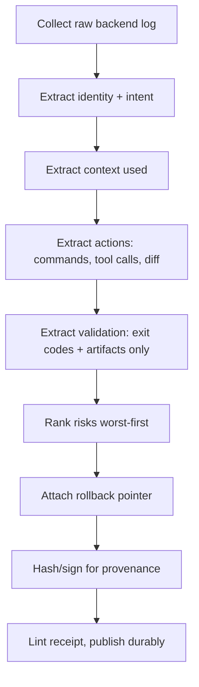

# Agent Work Receipt Designer

Design the receipt schema and discipline that lets any AI coding agent's work be reviewed, trusted, and reversed without re-reading the chat.

## Use This For

- Defining a cross-tool receipt schema so Claude Code, Codex, Cursor, Aider, and CI runs all land in one evidence shape.
- Turning a raw agent transcript into a typed record: identity, intent, context used, actions, validation, spend, risks, rollback, provenance.
- Gating PR merges so a maintainer can reject a low-proof agent PR in seconds and merge a high-proof one with confidence.
- Auditing whether "tests pass" claims are backed by a captured exit code or artifact, or are just the agent's word.
- Designing durable, replayable handoffs that survive the originating session or worktree being deleted.

## Do Not Use This For

- Validating one DAG node's output against its declared JSON schema mid-pipeline (`output-contract-enforcer`).
- Continuously auditing a live coordination daemon against formal invariants (`runtime-verification-for-agents`).
- General Port Daddy session/claims/salvage mechanics unrelated to producing a receipt (`port-daddy-agent-skill`).

## Process



1. Collect the raw log for the backend that ran (transcript JSONL, exec events, chat history, CI step logs). See `references/backend-normalization.md` for the per-backend extraction map.
2. Extract `identity` (agent/model/backend/sessionId/operator) and `intent` (goal/scope/stopCondition) — a vague stop condition is the earliest sign the resulting receipt will be weak.
3. Extract `contextUsed`: files actually read, governing rules consulted (CLAUDE.md/AGENTS.md/ADRs), attachments.
4. Extract `actions`: every command with its real exit code, tool-call tallies, and a `diffSummary` a reviewer can triage from before opening the diff.
5. Extract `validation` from tool-result payloads or captured logs only — never from the agent's own narration. A `passed: true` test with no `exitCode` and no `artifactPath` is a self-report, not proof; mark it `passed: false` instead.
6. Rank `risks[]` most-severe-first and flag the one thing a reviewer should check first (`checkFirst: true`). See the reviewer-first ordering rule in `references/field-model.md`.
7. Attach `rollback.checkpoint`, then hash (and sign, if attributability must survive the session) for `provenance`, and run `scripts/receipt_lint.mjs` before treating the receipt as done.

## Output Contract

Produce a single JSON object matching `schemas/work-receipt.schema.json` with all nine required sections: `identity`, `intent`, `contextUsed`, `actions`, `validation`, `spend`, `risks`, `rollback`, `provenance`. `validation.artifactBacked` must only be `true` when every `passed: true` test carries a real `exitCode` or `artifactPath`.

Use `scripts/receipt_lint.mjs` to score a receipt deterministically and return `{ pass, score, missingFields, findings, recommendations }`.

## Anti-Patterns

### Receipt As Chat Transcript

**Novice**: Paste the full conversation log and call it the receipt.
**Expert**: A receipt is a typed, queryable record with a diff summary and artifact-backed validation — a reviewer should never have to scroll a transcript to find what changed.
**Detection**: The "receipt" has no `risks[]`, no `diffSummary`, and no distinguishable JSON shape; it's prose with timestamps.

### Self-Reported Success

**Novice**: "I ran the tests and they pass" is recorded as the validation, full stop.
**Expert**: Every `passed: true` test entry must carry a real `exitCode` or `artifactPath` pointing at captured output; an agent's own claim is not evidence.
**Detection**: `receipt_lint.mjs` returns a `self-reported-validation` or `artifact-backed-flag-lying` finding at `critical` severity, and `pass` is forced to `false`.

### Reviewer Homework Dump

**Novice**: Dump every file touched, every tool call, and an empty or unordered `risks[]`, leaving the reviewer to triage from scratch.
**Expert**: Rank risks worst-first, mark the one to check first, and lead with a diff summary — the receipt should remove reviewer labor, not relocate it.
**Detection**: `risks[]` is empty on a nontrivial change, or not sorted `critical > high > medium > low`; `receipt_lint.mjs` flags `empty-risks` or `risks-not-reviewer-first`.

## References

| File | Load When |
| --- | --- |
| `references/field-model.md` | Need the canonical field-by-field meaning, a filled example, and the reviewer-first ordering rule. |
| `references/backend-normalization.md` | Need to derive a receipt from a specific backend's raw logs, or need signing/attributability guidance. |
| `examples/expected-output.md` | Need the shape of a finished, high-proof receipt. |
| `templates/output-template.md` | Need a reusable receipt template to fill in. |
| `schemas/work-receipt.schema.json` | Need to validate a receipt's structure programmatically. |
| `scripts/receipt_lint.mjs` | Need deterministic scoring of a receipt's completeness and proof quality. |
| `agents/openai.yaml` | Need a subagent descriptor for delegated receipt generation. |

## Layout QA gate (mechanical — run before shipping)

Before calling any rendered page, artifact, dashboard, deck, or component done,
run the mechanical overflow/collision checker. It renders the page headlessly and
flags text-vs-text collisions, clipped/ellipsis-truncated elements, text escaping
its container, and horizontal page scroll — the visual defects a screenshot hides
and that only appear at a specific width or in one theme.

```bash
python3 ~/.claude/skills/layout-overflow-guard/scripts/check_layout.py <file-or-url> \
  --widths 1280,1100,860,720,390 --themes light,dark
```

You do **not** need to read `check_layout.py` — invoke it with the Bash tool and
act on its report and exit code (non-zero = a defect). The script's source never
enters your context; only its findings do. Drive it to zero violations across
every width and both themes before you ship. Full detail: the
`layout-overflow-guard` skill.

<!-- BEGIN BUNDLE INDEX (auto: index_references.py) -->

## Skill Bundle Index

*Every file in this skill, and when to open it. Auto-generated; run `scripts/index_references.py --fix`.*

**root**
- [`CHANGELOG.md`](CHANGELOG.md) — Agent Work Receipt Designer — Changelog — - Initial skill creation - Core process defined - Reference files and deterministic receipt_lint script added
- [`README.md`](README.md) — Agent Work Receipt Designer — Design the normalized, machine-readable receipt that answers "what changed, why, by whom, with what validation" for any AI-coding-agent task

**`agents/`**
- [`agents/openai.yaml`](agents/openai.yaml) — openai (data/schema)

**`examples/`**
- [`examples/expected-output.md`](examples/expected-output.md) — Example Output: Agent Work Receipt — Scenario: Claude Code implementer agent fixes a launchd PATH gap so `pd install` can find `claude`/`codex`/`aider` absolute paths (mirrors t
- [`examples/sample-input.json`](examples/sample-input.json) — sample input (data/schema)

**`references/`**
- [`references/backend-normalization.md`](references/backend-normalization.md) — Backend Normalization And Provenance — Use this when you need to derive a normalized receipt from a specific agent backend's raw logs, or when deciding how to sign/attribute a rec
- [`references/field-model.md`](references/field-model.md) — Receipt Field Model — Use this when you need the canonical field-by-field meaning of a work receipt, a filled example to copy from, or the reviewer-first ordering

**`schemas/`**
- [`schemas/work-receipt.schema.json`](schemas/work-receipt.schema.json) — work receipt.schema (data/schema)

**`scripts/`**
- [`scripts/receipt_lint.mjs`](scripts/receipt_lint.mjs)

**`templates/`**
- [`templates/output-template.md`](templates/output-template.md) — Agent Work Receipt Template — [One-sentence description of the task the receipt covers.] Validate with `node scripts/receipt_lint.mjs --input <this-file-as-json>.json` be

<!-- END BUNDLE INDEX -->
