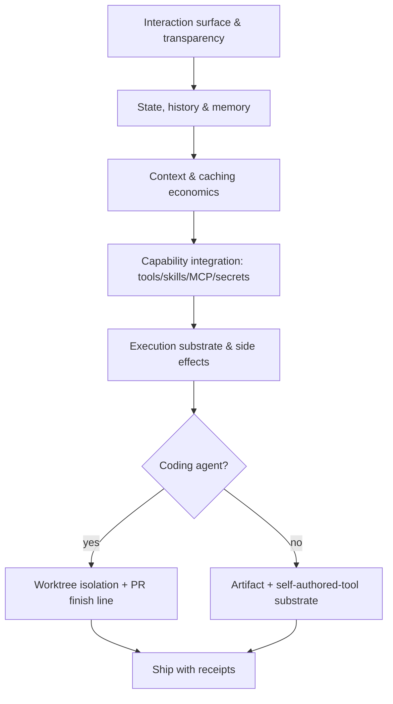

# Agentic App Architecture

Decide the shape of an agentic app — what it shows, what it remembers, what it costs, what powers it has, and where its actions land — before writing implementation code.

## Use This For

- Architecting a new coding-agent console (Claude-Code-like), operator surface, or `pd-console`-style fleet UI from scratch.
- Architecting a non-coding agent that produces documents, images, data artifacts, or self-authored tools at runtime.
- Deciding memory model, context/caching strategy, and MCP/tool/secret wiring before implementation locks them in.
- Auditing an existing agentic app for a hidden-reasoning, transcript-only-state, unbounded-context, or ungated-side-effect design flaw.
- Reconciling a coding agent's git/worktree substrate against a non-coding agent's artifact-and-receipt substrate in the same product.

## Do Not Use This For

- Picking a UI framework, desktop shell, or deployment stack once the architecture axes are decided (`rust-tauri-development`).
- Choosing which model or router serves a request (`llm-router`) or wordsmithing the system prompt (`prompt-engineer`).
- Designing the moment-to-moment protocol between cooperating agents once the app-level shape already exists (`multi-agent-coordination`, `swarm-invocation-designer`).

## Five-Axis Decision Flow

1. **Choose the interaction model.** Decide what surfaces the agent's thinking and tool calls (inline, streaming, collapsible workbench), whether a plan is shown before acting, and how a human interrupts mid-run. A hidden-hands agent is untrustable by construction — see `references/interaction-surface-and-transparency.md`.
2. **Choose the state/memory model.** Decide whether history is durable, whether threads can fork, and whether salient facts get promoted to episodic memory with TTLs. The transcript is not the whole state — see `references/state-memory-and-context.md`.
3. **Choose the context/caching strategy.** Decide the caching approach (the Anthropic prompt cache has a ~5-minute TTL, so poll/sleep cadence and context stability matter), the eviction/summarization policy, and what gets promoted out of the window into memory.
4. **Wire capabilities with custody.** Decide tool schemas (lazy-load if the toolset is large), skill packs, an MCP topology (small always-on global core, per-project specialists — see `references/capabilities-and-execution-substrate.md`), and how secrets reach tool calls without landing in argv, logs, or the transcript.
5. **Choose the execution substrate and side-effect gates.** For coding agents: one worktree per writer, advisory claims, a PR finish line with artifact-backed validation, never force-push or touch main. For non-coding agents: durable artifacts (documents/images/data/rendered web artifacts) or even agent-authored tools, each gated by a human checkpoint for irreversible/outward-facing actions.
6. **Ship with receipts.** Every side-effecting run leaves a durable, artifact-backed receipt — not a chat message claiming success.
7. **Audit before you build, and again before you ship.** Run `scripts/agentic_app_audit.mjs` against the spec at design time, and again against the shipped reality.

## Output Contract

Produce an architecture decision covering all five axes plus a machine-checkable audit:

- `transparency`: `thinkingVisible`, `toolUseVisible`, `planBeforeAct`, `interruptible`.
- `stateModel`: `durableHistory`, `forking`, `rename`, `episodicMemory`.
- `contextStrategy`: `caching`, `eviction`, `memoryPromotion`.
- `capabilities`: `tools`, `skills`, `mcp.{coreSize,perProjectSpecialists}`, `secretCustody.mode`.
- `execution`: `agentType` (`coding`/`non-coding`), `isolation`, `sideEffectHumanGate`, `artifactReceipts`.

Use `scripts/agentic_app_audit.mjs` to score a spec matching `schemas/agentic-app-spec.schema.json` and return `{ pass, coverageByAxis, findings, recommendations }`.

## Anti-Patterns

### Chat Box With Secret Hands

**Novice**: "Put an AI chat next to the work surface and let it act; the transcript is enough of a UI."
**Expert**: Hidden thinking and hidden tool calls make an agent both untrustable and un-steerable. Reasoning and tool use must be surfaced inline or in an inspectable pane, with a plan shown before consequential action.
**Detection**: `agentic_app_audit.mjs` fires `hidden-thinking-or-tool-use` (critical) whenever `thinkingVisible` or `toolUseVisible` is false.

### Transcript Is The Whole State

**Novice**: "The conversation history is the app's memory; there's nothing else to design."
**Expert**: Durable history, thread forking to explore alternates, and episodic memory (TTL'd, relevance-recallable, promoted out of the raw transcript) are separate, necessary pieces of state design — not features of a good chat UI.
**Detection**: `agentic_app_audit.mjs` fires `transcript-only-state` (critical) whenever both `forking` and `episodicMemory` are false.

### Side Effects With No Gate, No Isolation, No Receipt

**Novice**: "The agent can write files, call APIs, and merge its own work; we'll review if something looks wrong."
**Expert**: Every side-effecting action needs isolation (a worktree for coding agents, a sandbox for non-coding agents), a human checkpoint before anything irreversible or outward-facing, and a durable artifact-backed receipt afterward — especially for coding agents writing to a shared checkout.
**Detection**: `agentic_app_audit.mjs` fires `no-execution-isolation`, `no-human-gate-on-side-effects`, or `no-artifact-receipt` (critical for `agentType: coding`, high otherwise) whenever `isolation`, `sideEffectHumanGate`, or `artifactReceipts` is false.

## References

| File | Load When |
| --- | --- |
| `references/interaction-surface-and-transparency.md` | Designing the transparency axis: thinking/tool-use display, plan-before-act, forking/rename/history UI, steering. |
| `references/state-memory-and-context.md` | Designing durable history, episodic memory (TTL/blob-promotion), and context budgeting/caching economics. |
| `references/capabilities-and-execution-substrate.md` | Wiring tools/skills/MCP with secret custody, and choosing the coding vs. non-coding execution substrate. |
| `examples/expected-output.md` | Need a worked example architecting a concrete agentic app, weak-then-fixed. |
| `examples/sample-input.json` | Need a complete spec that already passes the audit, as a starting fixture. |
| `templates/output-template.md` | Need a fill-in-the-blank architecture decision template. |
| `schemas/agentic-app-spec.schema.json` | Need to validate a spec's structure before running the audit. |
| `scripts/agentic_app_audit.mjs` | Need deterministic per-axis scoring of a proposed or shipped architecture. |
| `agents/openai.yaml` | Need a subagent descriptor for delegated architecture review. |

<!-- BEGIN BUNDLE INDEX (auto: index_references.py) -->

## Skill Bundle Index

*Every file in this skill, and when to open it. Auto-generated; run `scripts/index_references.py --fix`.*

**root**
- [`CHANGELOG.md`](CHANGELOG.md) — Agentic App Architecture — Changelog — - Initial skill creation - Core process defined - Reference files and deterministic agentic_app_audit script added
- [`README.md`](README.md) — Agentic App Architecture — Decide the shape of an agentic LLM application — interaction transparency, state/history/memory, context & caching economics, capability int

**`agents/`**
- [`agents/openai.yaml`](agents/openai.yaml) — openai (data/schema)

**`examples/`**
- [`examples/expected-output.md`](examples/expected-output.md) — Example Output: Agentic App Architecture — Scenario: "Harbor Scout" — a non-coding Port Daddy fleet agent that researches a competitor's release notes, writes a summary report artifac
- [`examples/sample-input.json`](examples/sample-input.json) — sample input (data/schema)

**`references/`**
- [`references/capabilities-and-execution-substrate.md`](references/capabilities-and-execution-substrate.md) — Capabilities & Execution Substrate — Use this when wiring an agent's powers (tools, skills, MCP servers, secrets) and when deciding where its actions actually land.
- [`references/interaction-surface-and-transparency.md`](references/interaction-surface-and-transparency.md) — Interaction Surface & Transparency — Use this when deciding what an agentic app shows the human — thinking, tool use, plans, and steering — before it renders a single screen.
- [`references/state-memory-and-context.md`](references/state-memory-and-context.md) — State, Memory & Context — Use this when deciding what persists beyond the current turn, what gets promoted to durable memory, and how the context window and prompt ca

**`schemas/`**
- [`schemas/agentic-app-spec.schema.json`](schemas/agentic-app-spec.schema.json) — agentic app spec.schema (data/schema)

**`scripts/`**
- [`scripts/agentic_app_audit.mjs`](scripts/agentic_app_audit.mjs)

**`templates/`**
- [`templates/output-template.md`](templates/output-template.md) — Agentic App Architecture Decision — [One-sentence description of the app being architected, and whether it is a coding agent or non-coding agent.] - **Transparency**: [what the

<!-- END BUNDLE INDEX -->
