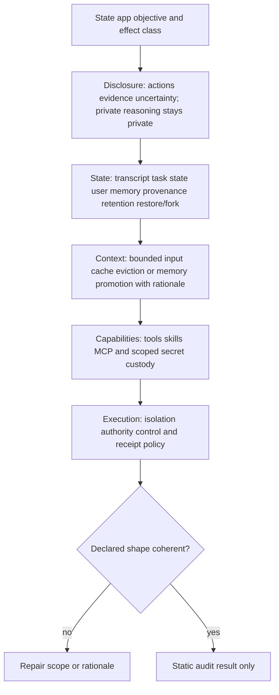
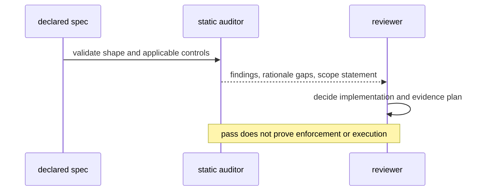

# Agentic App Architecture

Make five design choices explicit before implementation: what a reviewer sees, which state exists and survives restore, how context is bounded, which powers and secret paths apply, and which controls govern effects. A declaration and its audit are static design evidence only; they do not establish shipped enforcement, provider behavior, account state, or a completed effect.

## Five-axis procedure

1. **Disclosure.** Choose an action, evidence, and uncertainty disclosure level for the stated scope. Show useful summaries, proposed actions, evidence, and uncertainty where a reviewer needs them. Do not request or expose private chain-of-thought. Set an interrupt mode and explain when it applies.
2. **State.** Declare separately whether conversation transcript, durable task state, user memory, and provenance evidence are used. For each app, state retention/deletion and restore/fork lineage. A feature marked `not-applicable` needs a scope rationale; it is not silently absent.
3. **Context.** Choose one or more of bounded input, a versioned provider cache, eviction/summary, and memory promotion. A provider-cache declaration includes provider, model/family, primary documentation URL, and checked date. It is an input to cost evaluation, not a cross-provider rule.
4. **Capabilities.** State whether tools, skills, and MCP are used. MCP is a protocol/topology choice, not a framework. For required secrets, declare the actual scope and custody path. `argv` and `inline` are exposure risks; a secret-store reference, scoped environment, or stdin may be appropriate only after reviewing process and logging boundaries.
5. **Effects.** Classify effects as none, reversible local, or external/irreversible. Declare isolation, the authorization/control type, approval authority where relevant, receipt policy, and replay/compensation boundary. Low-risk or inapplicable controls require rationale; external/irreversible effects cannot declare control inapplicable.

## Static-audit contract

Use [the schema](schemas/agentic-app-spec.schema.json), [template](templates/output-template.md), and [auditor](scripts/agentic_app_audit.mjs). The CLI returns nonzero for an invalid declaration or an unresolved applicable high/critical finding. It never performs an effect or reads an account.

## Worked scope check

A read-only local summarizer can declare `effectClass: none`, `control.kind: not-applicable`, no secrets, no MCP, and `interruptMode: before-dispatch`, each with a written rationale. It must still declare bounded input or another context strategy, state retention, and what action/evidence/uncertainty summary the reviewer receives.

A service that posts externally declares `effectClass: external-or-irreversible`, an isolation boundary, authority, a non-inapplicable control, provenance evidence, and a receipt/replay policy. The auditor checks that these claims cohere; an inert fixture can test unauthorized, stale, duplicate, or receipt-failure branches without sending anything.

## Diagnostics

| Finding | Meaning | Repair |
|---|---|---|
| invalid declaration | Required field, type, enum, non-finite MCP count, or cross-field shape is invalid. | Repair JSON before interpreting scores. |
| missing action/evidence/uncertainty disclosure | A tool or consequential effect lacks reviewer-facing disclosure. | Select a proportionate disclosure level and rationale. |
| secret exposure path | Required secret is argv, inline, or inapplicable. | Change custody or narrow the stated scope. |
| missing consequential control | External/irreversible effect declares no applicable control. | Declare authority and automated policy or human approval. |
| missing restore/provenance state | Effectful work cannot state restore/replay evidence. | Add durable task state/provenance or revise the effect claim. |

## References

- [Interaction and disclosure](references/interaction-surface-and-transparency.md)
- [State, retention, restore, and provider cache scope](references/state-memory-and-context.md)
- [Capabilities, custody, and effects](references/capabilities-and-execution-substrate.md)
- [Evidence scope](references/evidence-scope.md)
- [Example declaration](examples/expected-output.md)
