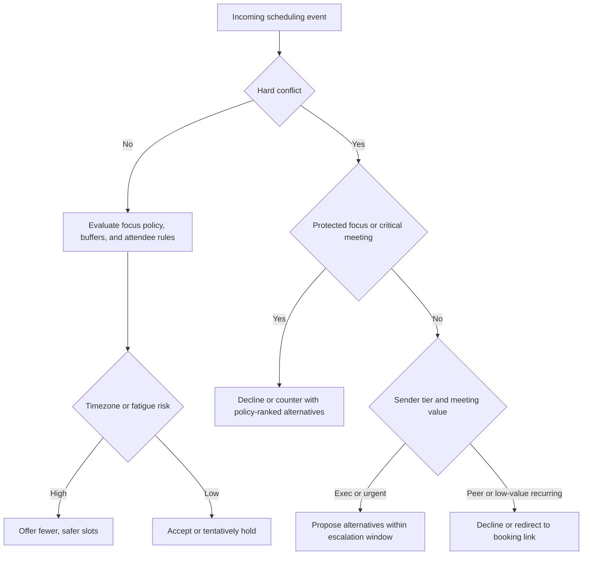

# Agentic Calendar Coordination

Design scheduling agents that act conservatively with user time, aggressively against ambiguity, and safely around privacy.

## NOT for

- Calendar UI components, forms, or visual scheduling widgets. Use `form-validation-architect` or a frontend skill.
- Generic project planning, milestone tracking, or Gantt logic. Use `project-management-guru-adhd`.
- Broad agent architecture that is not specifically about calendar data, scheduling rules, or meeting negotiation. Use `agentic-infrastructure-2026` or `multi-agent-coordination`.

## Decision Points

- Treat recurring events as individual instances for conflict checking. Do not trust the parent rule alone, especially across DST boundaries.
- Rank slots by policy first, convenience second: focus protection, buffers, timezone fairness, then preference.
- Share free-busy data by default. Share event titles, attendees, or notes only when the policy explicitly allows it.
- Use automated declines only when the rule is easy to explain to a human later.

## Failure Modes

### DST Drift on Recurring Meetings

Cue: a recurring cross-timezone meeting works part of the year and breaks after daylight saving transitions.

Cause: the scheduler reasons over recurrence rules without expanding instances into timezone-aware timestamps.

Fix: expand instances, convert to UTC for conflict checks, and re-evaluate the next several occurrences after every DST boundary.

### Recursive Negotiation Loop

Cue: two scheduling agents keep counter-proposing without convergence.

Cause: neither side has a bounded policy for when to accept a merely adequate slot or escalate to a human.

Fix: cap negotiation rounds, require each counter to shrink the slot set, and escalate after the configured threshold.

### Focus-Block Erosion

Cue: "temporary exceptions" slowly consume all protected deep-work blocks.

Cause: high-status senders or recurring meetings bypass the same focus policy repeatedly.

Fix: treat exceptions as budgeted, auditable events and require stronger justification once the budget is exhausted.

### Privacy Spill Through External Scheduling

Cue: event descriptions or attendee metadata leak into third-party booking systems or LLM calls.

Cause: the scheduler sends full event objects when free-busy or a sanitized summary would suffice.

Fix: introduce a data-minimization layer that strips titles, notes, and attendee emails unless explicitly required.

### Energy-Model Overreach

Cue: the agent confidently auto-schedules around an energy model that is based on almost no user data.

Cause: the system treats a cold-start heuristic as learned preference.

Fix: separate default policy from learned preference, and gate auto-scheduling until the model has enough observed behavior.

## Shibboleths

- If recurring events are checked from the parent rule without expanding timezone-aware instances, the scheduler is not DST-safe.
- If every conflict can be overridden by sender importance, focus protection is theater rather than policy.
- If external scheduling surfaces receive full event objects by default, privacy boundaries are decorative.

## Worked Examples

### Cross-Timezone Technical Review

Problem: schedule a 30-minute API review between Chicago and Tokyo without silently forcing one side into a cognitively bad slot.

Recommended approach:

1. Expand both calendars into local working-hour windows plus hard constraints.
2. Compute overlap windows in UTC.
3. Discard slots that violate focus blocks or known fatigue constraints.
4. Offer two or three ranked alternatives, not a giant slot dump.

Why this works: the negotiation is fair, explainable, and resistant to timezone arithmetic errors.

### Exec Override During Deep Work

Problem: an executive request lands on a protected deep-work block.

Recommended policy:

1. Keep the focus block protected by default.
2. Offer the nearest acceptable alternative window inside the exec escalation rule.
3. If the sender insists, log the exception and consume it from a limited override budget.

Why this works: the agent respects hierarchy without making focus protection meaningless.

## Fork Guidance

- Use `context: fork` when modeling multiple participant policies independently, such as sender, recipient, and assistant-agent preferences.
- Keep each fork tied to one participant or policy role so timezone and privacy constraints do not blur together.
- Avoid forks for simple free-busy merges; the extra divergence rarely adds value.

## Reference Files

- `diagrams/01_flowchart_decision-points.md` — Mermaid flowchart for routing scheduling requests through skill scope, input assessment, and pattern selection. **Read when** designing the agent's initial decision tree or validating a request against skill boundaries.

- `references/recurrence-privacy-and-escalation.md` — Policy details for expanding recurring instances across DST boundaries, privacy-minimized free-busy surfaces, and escalation rules. **Read when** implementing conflict detection, configuring privacy filters, or handling cross-timezone recurring meetings.

## Quality Gates

- [ ] All timestamps are stored and compared in UTC, with IANA timezone names preserved at the edges.
- [ ] Recurring meetings are expanded into instances before conflict checks.
- [ ] External scheduling surfaces receive free-busy or sanitized summaries by default.
- [ ] Focus blocks have explicit priority and exception budgets.
- [ ] Buffer rules are visible and do not thrash by repeatedly rescheduling the same meeting.
- [ ] Negotiation loops have round limits and human escalation paths.
- [ ] Learned energy preferences are not treated as truth before sufficient observation.
- [ ] Every calendar mutation is auditable and reversible.

## Boundary Hand-offs

- Need broader multi-agent bargaining or coordination patterns: switch to `multi-agent-coordination`.
- Need a persistent watcher or daemonized calendar monitor: switch to `daemon-development`.
- Need personal planning heuristics instead of calendar automation logic: switch to `adhd-daily-planner`.

## Reference Routing

- Read `references/recurrence-privacy-and-escalation.md` when the hard part is DST-safe recurrence expansion, override budgets, or data minimization.
