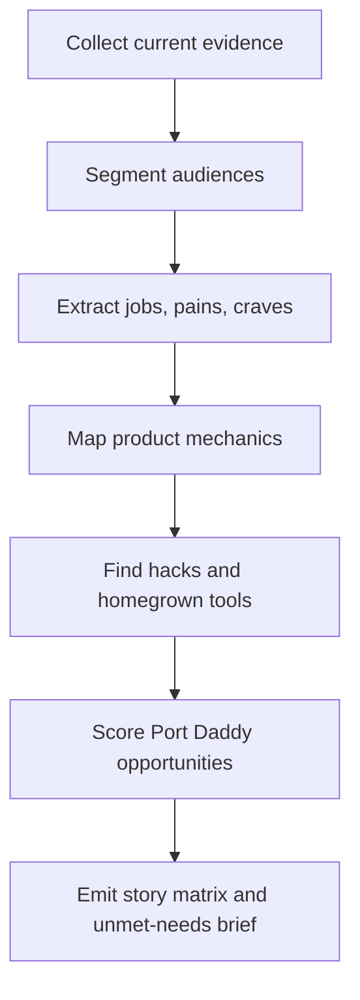

# Agentic Coding Product Research

Build evidence-backed product intelligence for AI coding assistant and software-agent products.

## Use This For

- Mapping audiences, jobs, anxieties, and "I keep coming back" moments for agentic coding tools.
- Comparing Cursor, Claude Code, Codex, Warp Code, Devin, Windsurf/Cascade, Copilot, Cline, Aider, OpenHands, and homegrown stacks.
- Finding unmet needs Port Daddy can own: coordination, durable transcripts, review proof, spend control, sandboxing, swarm visibility, and operator trust.
- Turning tech press, official docs, research papers, GitHub traces, Reddit/HN discourse, and failed local dogfood into user stories.

## Do Not Use This For

- Implementing a terminal/editor/runtime agent loop directly.
- UI composition without first turning findings into workflow evidence.
- Treating benchmarks as product truth without user stories and review failure modes.

## Process

1. Collect sources across four lanes: official docs, tech press, academic/benchmark work, and social/homegrown workflows.
2. Segment audiences by workflow pressure, not job title alone: solo founder, staff engineer, enterprise admin, maintainer, agent power user, non-developer builder.
3. Extract user stories in the format `As <audience>, I want <agentic capability>, so I can <workflow outcome without hidden risk>`.
4. Identify product mechanics users praise or crave: context attachment, plan/apply/review, checkpoints, worktrees, visual diff, background agents, model choice, and mobile/cloud handoff.
5. Identify negative demand: surprise spend, invisible state, stale context, agent collisions, weak rollback, AI support hallucinations, unsafe tool execution, and review burden.
6. Translate evidence into Port Daddy opportunities with a proof requirement for each opportunity.

## Output Contract

Produce:

- `audiences`: array of audience profiles with jobs, pains, craves, trust thresholds, and comeback triggers.
- `user_stories`: array of stories with evidence sources and Port Daddy implications.
- `opportunities`: ranked Port Daddy product opportunities with proof artifacts required.
- `risks`: skeptical caveats, source limits, and claims needing live verification.

Use `scripts/story_matrix.mjs` to validate and derive a JSON story matrix from a source manifest.

## Anti-Patterns

### Benchmark Theater

**Novice**: "The product with the highest SWE-bench number wins."
**Expert**: Benchmarks predict only part of adoption. Users come back when the tool reduces start friction, preserves context, proves its work, and makes mistakes recoverable.
**Detection**: Research omits user stories, review workflows, or rollback mechanics.

### Vibe Without Receipts

**Novice**: "People love it on social, so ship the same chat box."
**Expert**: Social praise usually compresses a full loop: prompt, context, agent action, visible progress, diff review, tests, PR, and undo. Capture the loop, not the applause.
**Detection**: No source links, no artifact requirement, no failure case.

### Tool-Only Framing

**Novice**: "Port Daddy should be another coding assistant."
**Expert**: Port Daddy's wedge is the coordination control plane around assistants: identity, claims, transcripts, spend, sandboxing, review proof, and multi-agent orchestration.
**Detection**: Proposed feature competes on code generation alone rather than operator control and durable evidence.

## References

| File | Load When |
| --- | --- |
| `references/source-map.md` | Need current product/source landscape and research citations. |
| `references/audience-stories.md` | Need audience segmentation, user stories, and Port Daddy opportunities. |
| `examples/expected-output.md` | Need the shape of a finished research brief. |
| `templates/output-template.md` | Need a reusable brief template. |
| `schemas/source-manifest.schema.json` | Need to validate research inputs. |
| `scripts/story_matrix.mjs` | Need deterministic user-story matrix generation. |
| `agents/openai.yaml` | Need a subagent descriptor for delegated product research. |

<!-- BEGIN BUNDLE INDEX (auto: index_references.py) -->

## Skill Bundle Index

*Every file in this skill, and when to open it. Auto-generated by the repo skill-architect indexer.*

**root**
- [`CHANGELOG.md`](CHANGELOG.md) — Agentic Coding Product Research — Changelog — - Initial skill creation - Core process defined - Reference files added
- [`README.md`](README.md) — Agentic Coding Product Research — Evidence-backed product research for AI coding assistant and software-agent tools.

**`agents/`**
- [`agents/openai.yaml`](agents/openai.yaml) — openai (data/schema)

**`examples/`**
- [`examples/expected-output.md`](examples/expected-output.md) — Example Output: Agentic Coding Product Research — Research question: what should Port Daddy build around AI coding assistants after reviewing Cursor, Claude Code, Codex, Warp Code, Devin, Wi

**`references/`**
- [`references/audience-stories.md`](references/audience-stories.md) — Audience Stories And Port Daddy Opportunities — Use this when turning research into product requirements.
- [`references/source-map.md`](references/source-map.md) — Source Map: AI Coding Assistant Product Landscape — Use this when grounding product claims in current market evidence.

**`schemas/`**
- [`schemas/source-manifest.schema.json`](schemas/source-manifest.schema.json) — source manifest.schema (data/schema)

**`scripts/`**
- [`scripts/story_matrix.mjs`](scripts/story_matrix.mjs)

**`templates/`**
- [`templates/output-template.md`](templates/output-template.md) — Agentic Coding Product Research Brief — [One sentence naming the product decision, audience, or Port Daddy opportunity.] | Source | Kind | Current As Of | Claim Used | | --- | --- 

<!-- END BUNDLE INDEX -->
