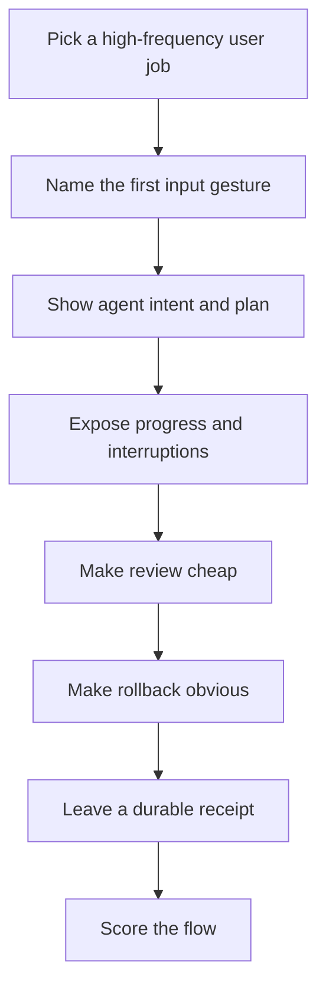

# Agentic Coding UX Designer

Design developer-agent interfaces that feel fast, trustworthy, interruptible, and worth returning to.

## Use This For

- Prompt-to-plan-to-diff flows for AI coding assistants.
- Agent consoles where multiple tasks run in parallel.
- Trust and recovery surfaces: checkpoints, revert, named snapshots, staged diffs, approvals, and proof logs.
- "Magic" context flows: selected text, terminal output, browser screenshot, issue/PR mention, or failed test automatically becomes agent input.
- Port Daddy Agent Harbor, FleetBar, Fleet Control Center, `pd-console`, and swarm invocation surfaces.

## Do Not Use This For

- Marketing homepages without the working product as the first viewport.
- Pure visual styling without workflow mechanics.
- Replacing human review with hidden automation.

## Design Loop



1. Start from one user job and one first gesture. Good first gestures are already in the user's hand: selected code, failed test, terminal block, issue link, PR review, screenshot, or voice note.
2. Show agent intent before action: model, repo/worktree, files, tools, budget, permissions, and stop condition.
3. Keep progress legible: current step, queued messages, running commands, changed files, test state, and blockers.
4. Make review local to the work: inline diffs, grouped hunks, comments, accept/reject, and "why this changed."
5. Make rollback a visible primitive, not a hidden Git trick: checkpoints, snapshots, worktree isolation, and named receipts.
6. End with a receipt: transcript, commands, tests, diff summary, unresolved risks, and next action.

## Output Contract

Return:

- `flow`: entrypoint, context captured, agent actions, review point, rollback point, and receipt.
- `scorecard`: friction, context, trust, rollback, progress visibility, and comeback trigger scores.
- `risks`: places where the flow hides state, encourages over-trust, or creates spend/security surprises.
- `artifacts`: wireframe paths, screenshots, GIFs, or review notes when applicable.

Use `scripts/magic_progression_score.mjs` to score a proposed flow.

## Anti-Patterns

### Chat Box With Secret Hands

**Novice**: "Put an AI chat next to the code and let it do things."
**Expert**: Agentic UX must show what context it sees, what it intends to change, what it already did, and how to undo it.
**Detection**: The UI has no plan, command log, diff, checkpoint, or stop affordance.

### Infinite Spinner Trust Fall

**Novice**: "Background agents can be invisible until they finish."
**Expert**: Background work needs a heartbeat, current step, spend meter, cancel button, and inspectable transcript. Silence reads as failure.
**Detection**: A user cannot tell whether the agent is blocked, expensive, stale, or unsafe.

### Review After The Damage

**Novice**: "Let the agent modify everything, then ask for review at the end."
**Expert**: Review belongs at decision points: before broad file writes, before dependency installs, before PR creation, and before merge.
**Detection**: The first human checkpoint is after a large diff has already landed.

## References

| File | Load When |
| --- | --- |
| `references/magic-progressions.md` | Need concrete low-friction patterns and comeback loops. |
| `references/design-rules.md` | Need product rules and anti-patterns for agentic developer tools. |
| `examples/expected-output.md` | Need a finished flow critique example. |
| `templates/output-template.md` | Need a reusable UX flow template. |
| `schemas/magic-flow.schema.json` | Need to validate a flow score input. |
| `scripts/magic_progression_score.mjs` | Need deterministic scoring for a proposed flow. |
| `agents/openai.yaml` | Need a subagent descriptor for delegated UX design review. |

## Layout QA gate (mechanical — run before shipping)

Before calling any rendered page, artifact, dashboard, deck, or component done,
run the mechanical overflow/collision checker. It renders the page headlessly and
flags text-vs-text collisions, clipped/ellipsis-truncated elements, text escaping
its container, and horizontal page scroll — the visual defects a screenshot hides
and that only appear at a specific width or in one theme.

Resolve `layout-overflow-guard` from the active skill catalog before running it.
The command below shows the standard Claude install path; use the path reported
by your harness. If the skill is absent, install or sync it instead of skipping
this gate.

```bash
python3 ~/.claude/skills/layout-overflow-guard/scripts/check_layout.py <file-or-url> \
  --widths 1280,1100,860,720,390 --themes light,dark
```

You do **not** need to read `check_layout.py` — invoke it with the Bash tool and
act on its report and exit code (non-zero = a defect). The script's source never
enters your context; only its findings do. Drive it to zero violations across
every width and both themes before you ship. Full detail: the
`layout-overflow-guard` skill.

<!-- BEGIN BUNDLE INDEX (auto: index_references.py) -->

## Skill Bundle Index

*Every file in this skill, and when to open it. Auto-generated by the repo skill-architect indexer.*

**root**
- [`CHANGELOG.md`](CHANGELOG.md) — Agentic Coding Ux Designer — Changelog — - Initial skill creation - Core process defined - Reference files added
- [`README.md`](README.md) — Agentic Coding UX Designer — Design guidance for low-friction, inspectable, recoverable AI coding assistant flows.

**`agents/`**
- [`agents/openai.yaml`](agents/openai.yaml) — openai (data/schema)

**`examples/`**
- [`examples/expected-output.md`](examples/expected-output.md) — Example Output: Agentic Coding UX Designer — Name: summon skeptical reviewer 1.

**`references/`**
- [`references/design-rules.md`](references/design-rules.md) — Design Rules For AI Coding Apps — Use this when critiquing or specifying a screen.
- [`references/magic-progressions.md`](references/magic-progressions.md) — Magic Progressions For Agentic Coding UX — Use this when designing the flow that makes users return.

**`schemas/`**
- [`schemas/magic-flow.schema.json`](schemas/magic-flow.schema.json) — magic flow.schema (data/schema)

**`scripts/`**
- [`scripts/magic_progression_score.mjs`](scripts/magic_progression_score.mjs)

**`templates/`**
- [`templates/output-template.md`](templates/output-template.md) — Agentic Coding UX Flow Spec — [The operator intent this flow should satisfy.] - Audience: [who is using it] - Starting surface: [editor / terminal / FleetBar / dashboard

<!-- END BUNDLE INDEX -->
