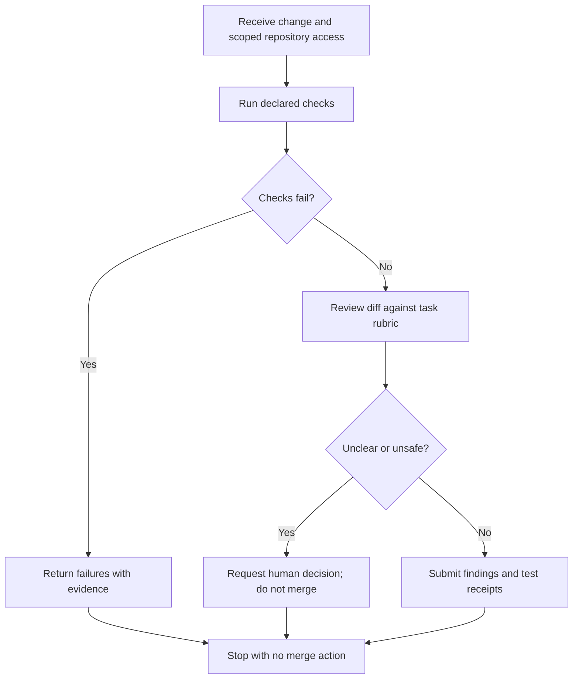

# Conditional code-review task

This converts the original ASCII example into a task path with explicit stopping points.

This is a constructed example, not a claim that a reviewer agent can establish correctness or authorize a merge.
