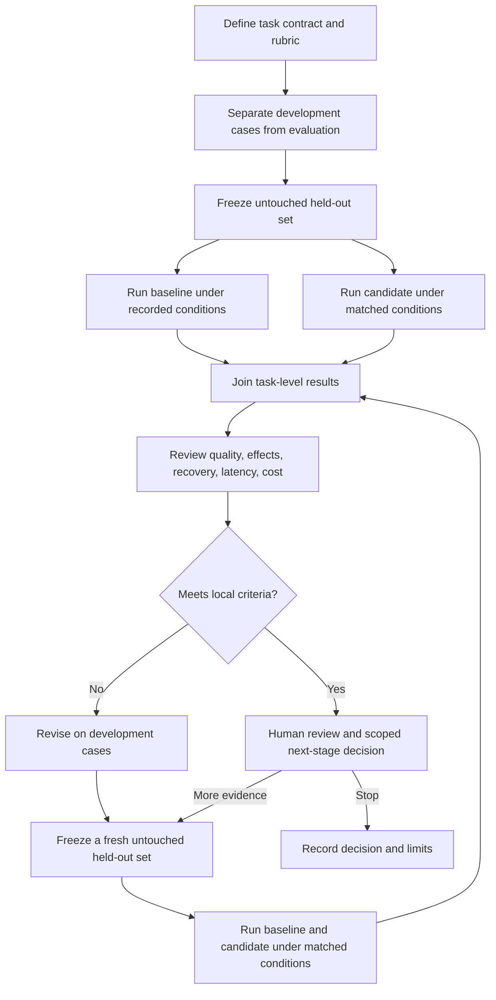

# Controlled evaluation cycle

Once evaluation results influence prompts or code, those exposed cases are no longer held out for the next decision. Revise on development cases and use a fresh untouched evaluation set. Passing local criteria does not establish production readiness or generalize beyond the tested tasks and conditions.
