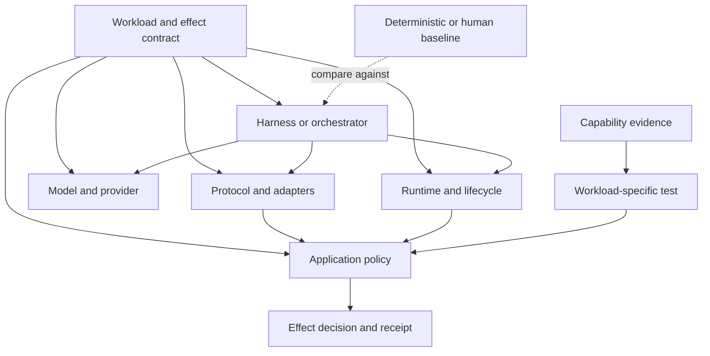
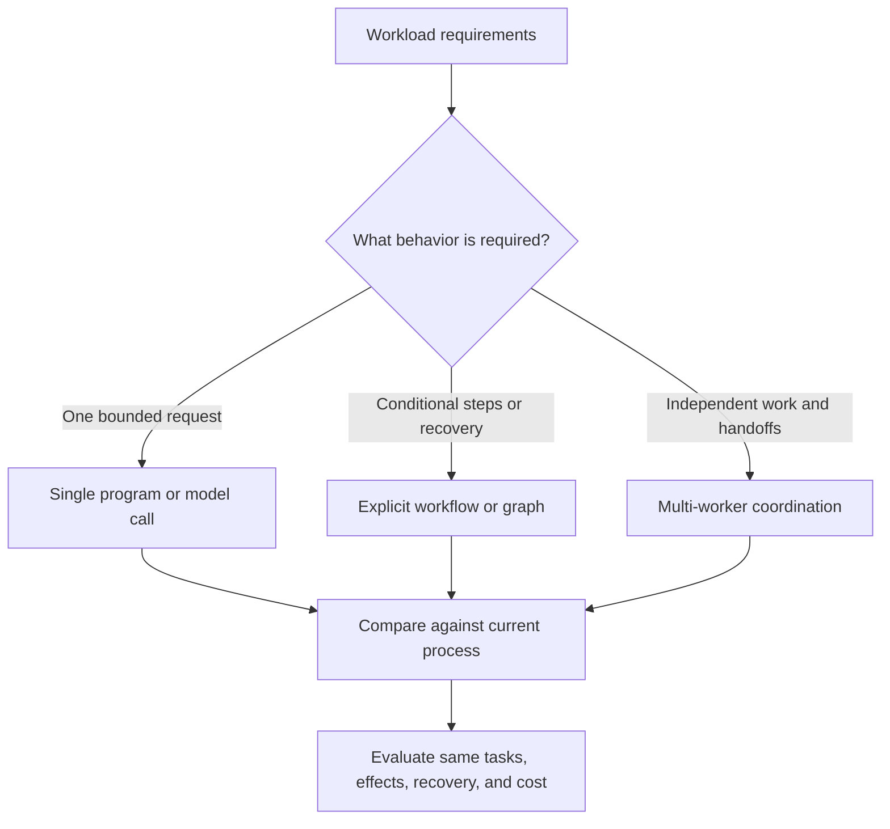

# Layered system options

A workload can be handled by a deterministic process, one model call, a framework, or a multi-agent design. Product boundaries vary; record the implementation owner for each capability.

The arrows show responsibilities to examine, not a required topology or proof of enforcement. A protocol such as MCP does not itself supply the application policy or safe effect boundary.

## Workload complexity candidates

This converts the three original composition sketches into topology choices expressed by task need rather than vendor labels.

The branches are candidates, not maturity levels: choose the least complex option that meets observed requirements.
