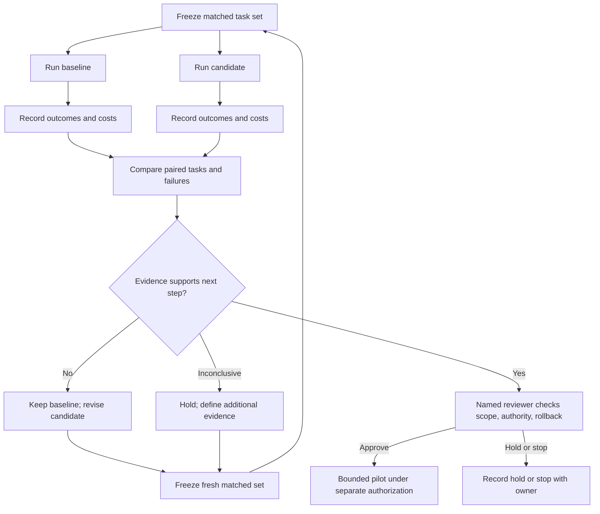

# Controlled migration comparison

The diagram separates evaluation from rollout: a positive task comparison does not itself admit a live pilot. A named reviewer must approve its scope, authority, owner, and rollback path; a hold or stop remains valid. If results drive candidate changes or more evidence is needed, define a fresh matched task set rather than reusing exposed holdout tasks as fresh evaluation. A positive result is scoped to the task set, versions, and conditions recorded.
