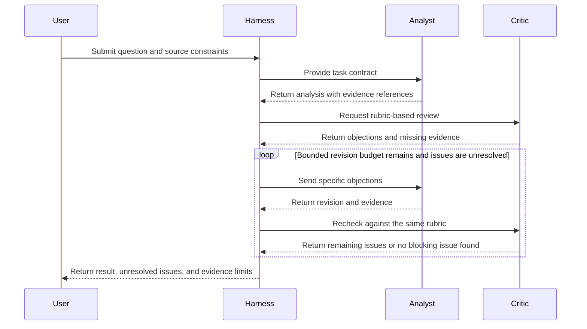
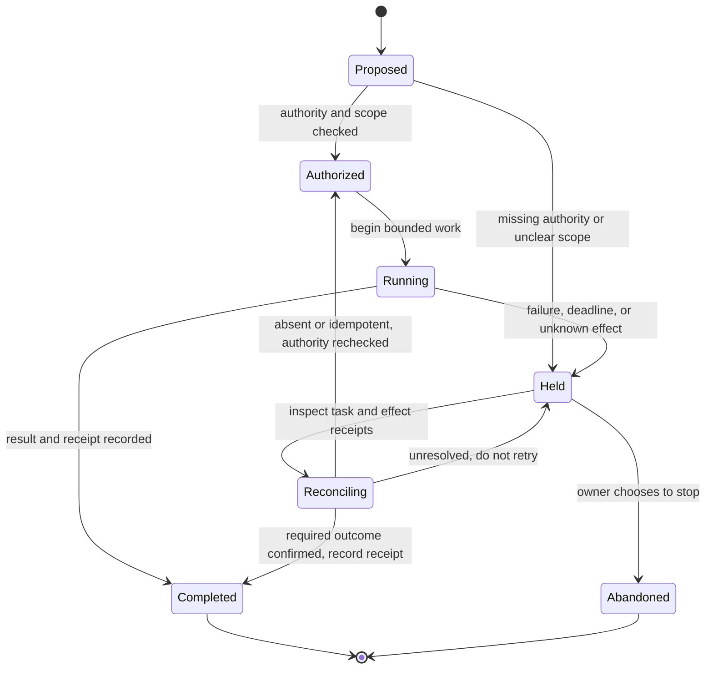

# Research message and state-control patterns

## Role-message example

This converts the original analyst/critic dialogue as a bounded workflow. It does not claim that discussion reaches truth or consensus.

The harness owns the stopping rule, and unresolved objections remain visible rather than being silently treated as consensus.

## State-control example

These are constructed control patterns. A state in `Held` cannot resume merely because authorization was rechecked: unknown effects must first be reconciled, or the retry must use a verified idempotency rule. Unresolved state stays held. The diagrams illustrate decision ownership and stop routes; they do not assert enforcement in a particular framework.

A confirmed charge or other partial effect alone does not complete the task. Completion requires the declared outcome and its evidence; retain held status when those are unresolved.
