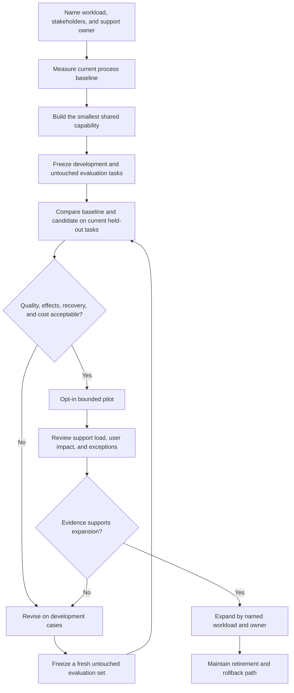
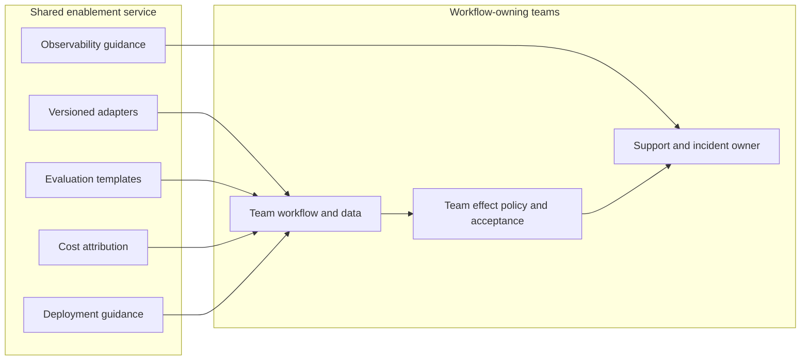

# Shared-platform adoption

No calendar or team-count threshold is implied. If a revision or expansion decision uses results from the current held-out set to change a candidate, freeze a new untouched evaluation set before the next comparison; do not send the repair loop back through the exposed set. Each gate is chosen for the workload and the consequences of failure.

## Shared-service boundary

This converts the original platform “provides/consumes” sketch. The exact service interface remains a local design choice.

The shared service can supply reusable components and advice; each team retains authority over its data, effects, and acceptance.
