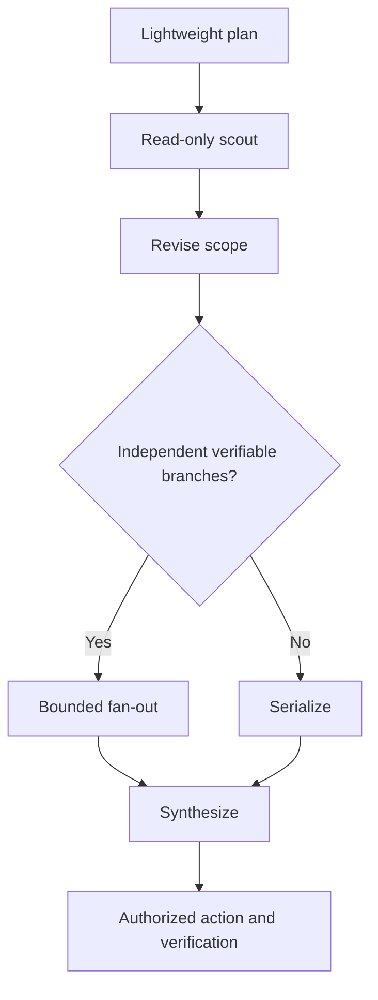
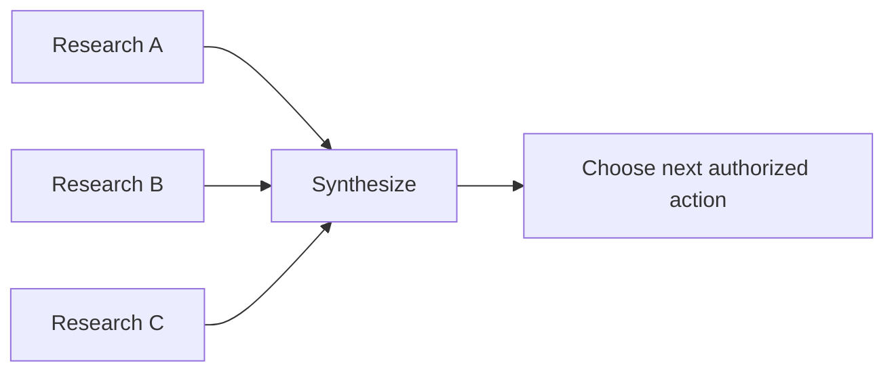
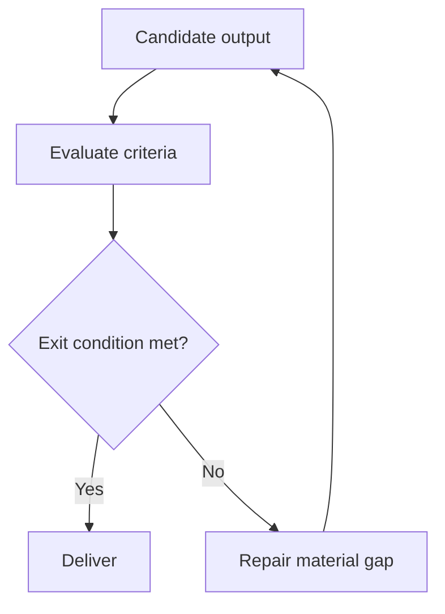
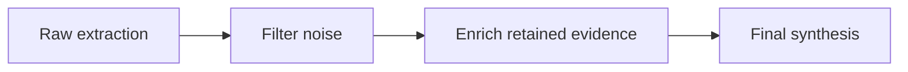
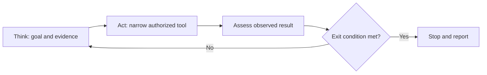

# Converted Process Patterns

These diagrams retain the active relationships from imported process sketches; labels are options, not universal thresholds.

See [evidence-and-control-loop.md](evidence-and-control-loop.md) for unknown-effect reconciliation.
