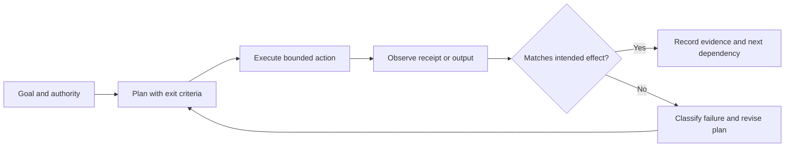
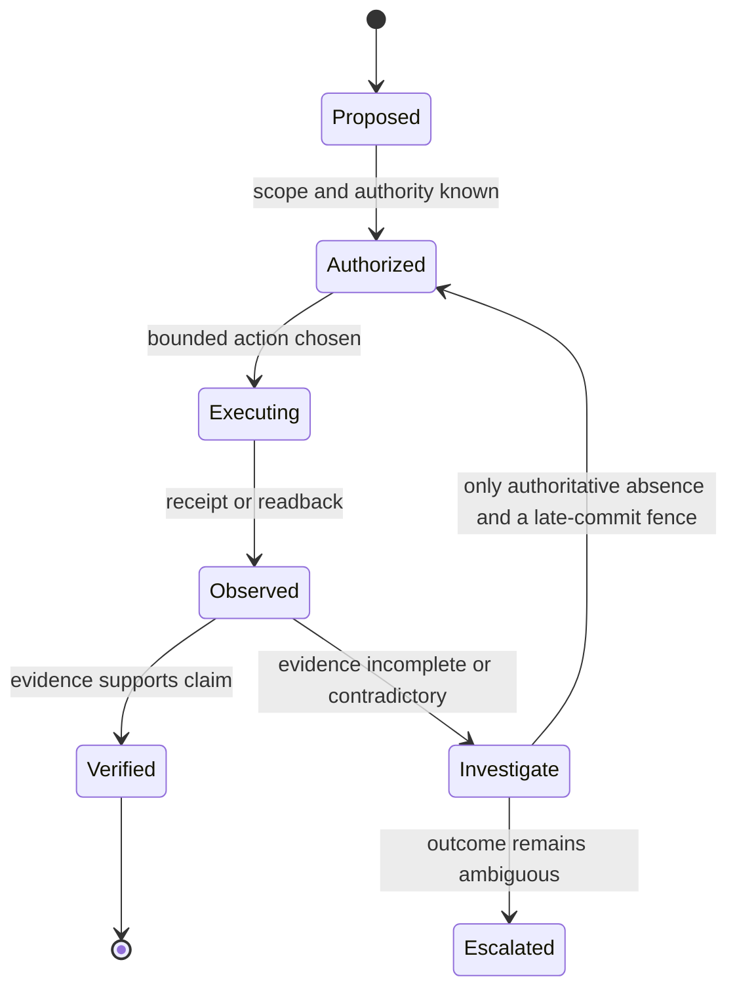

# Evidence and Control Loop

This addendum preserves the imported skill as its preimage while adding an explicit evidence boundary. It is a planning aid, not proof that a system, tool, or pattern is deployed or effective.

## Source-grounded cautions

- Agent loops benefit from explicit state, tool feedback, and termination conditions, but architecture alone does not establish task success. See [ReAct](https://arxiv.org/abs/2210.03629).
- A tool call is an effect attempt; reconciliation needs a stable action identity and a readback where a destination can duplicate, delay, or fail the effect. This is a systems-design inference, not a result claimed by ReAct.
- Decomposition and evaluation should expose assumptions and observable success criteria. Task-specific benchmarks are necessary before making performance claims; see [SWE-bench](https://arxiv.org/abs/2310.06770).

## Access limits

The linked papers are public preprints and describe their evaluated settings. They do not prove claims about a local runtime, private tool behavior, or an arbitrary agent configuration.
