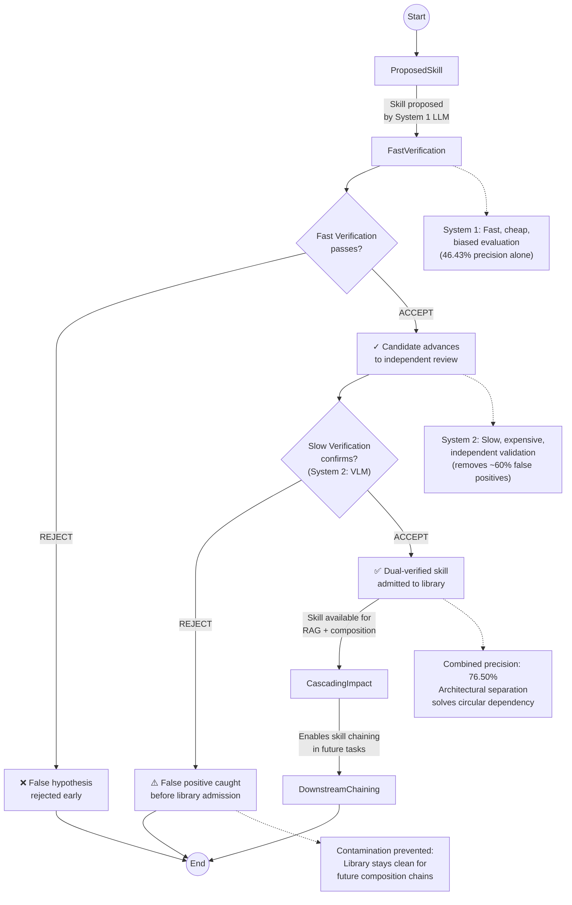

# Skill Library State Transitions & Contamination Risk

```mermaid
flowchart TD
    Start((Start)) --> ProposedSkill

    ProposedSkill -->|Skill proposed<br/>by System 1 LLM| FastVerification

    FastVerification --> FastDecision{"Fast Verification<br/>passes?"}

    FastDecision -->|REJECT| Discarded["❌ False hypothesis<br/>rejected early"]
    Discarded --> End((End))

    FastDecision -->|ACCEPT| SlowVerification["✓ Candidate advances<br/>to independent review"]

    SlowVerification --> SlowDecision{"Slow Verification<br/>confirms?<br/>(System 2: VLM)"}

    SlowDecision -->|REJECT| Quarantine["⚠️ False positive caught<br/>before library admission"]
    Quarantine --> End((End))

    SlowDecision -->|ACCEPT| AdmitLibrary["✅ Dual-verified skill<br/>admitted to library"]

    AdmitLibrary -->|Skill available for<br/>RAG + composition| CascadingImpact

    CascadingImpact -->|Enables skill chaining<br/>in future tasks| DownstreamChaining

    DownstreamChaining --> End((End))

Annotation1["System 1: Fast, cheap,<br/>biased evaluation<br/>(46.43% precision alone)"]
FastVerification -.-> Annotation1

Annotation2["System 2: Slow, expensive,<br/>independent validation<br/>(removes ~60% false positives)"]
SlowVerification -.-> Annotation2

Annotation3["Contamination prevented:<br/>Library stays clean for<br/>future composition chains"]
Quarantine -.-> Annotation3

Annotation4["Combined precision: 76.50%<br/>Architectural separation<br/>solves circular dependency"]
AdmitLibrary -.-> Annotation4
```
