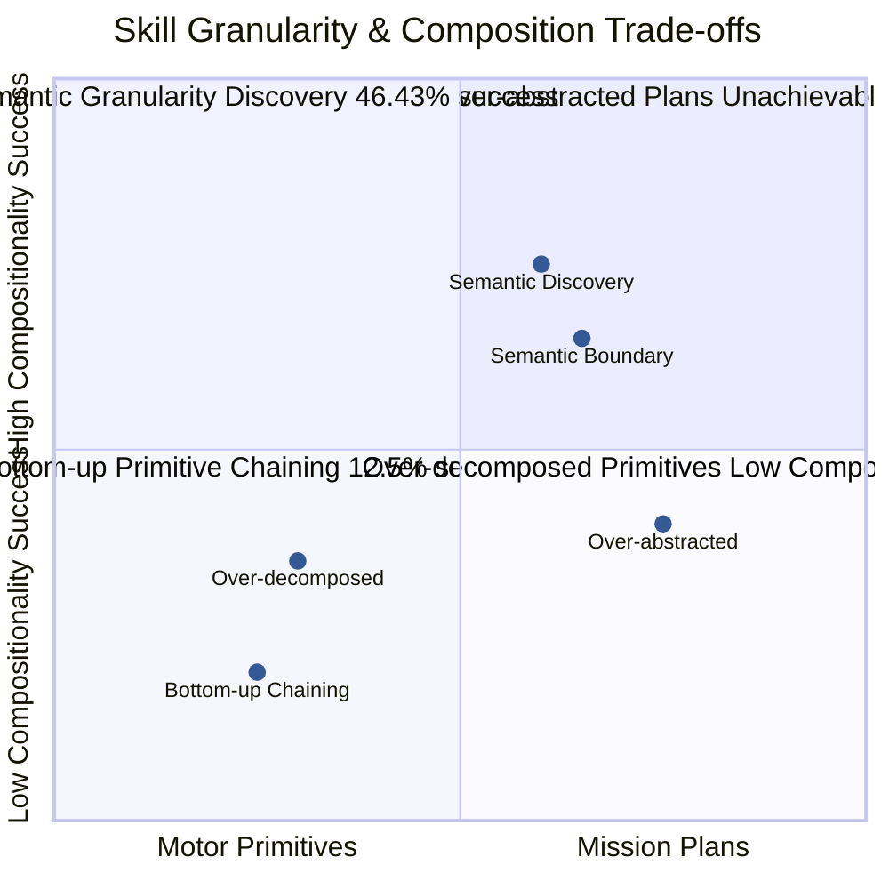

# Skill Granularity & Composition Trade-offs

```mermaid
quadrantChart
%%{init: {"themeVariables": {"quadrantPointFill": "#345995"}}}%%
    title Skill Granularity & Composition Trade-offs
    x-axis Motor Primitives --> Mission Plans
    y-axis Low Compositionality Success --> High Compositionality Success
    quadrant-1 Over-abstracted Plans  Unachievable
    quadrant-2 Semantic Granularity Discovery  46.43% success
    quadrant-3 Bottom-up Primitive Chaining  12.5% success
    quadrant-4 Over-decomposed Primitives  Low Composability
    Semantic Boundary: [0.65, 0.65]
    Bottom-up Chaining: [0.25, 0.2]
    Over-decomposed: [0.3, 0.35]
    Over-abstracted: [0.75, 0.4]
    Semantic Discovery: [0.6, 0.75]
```
