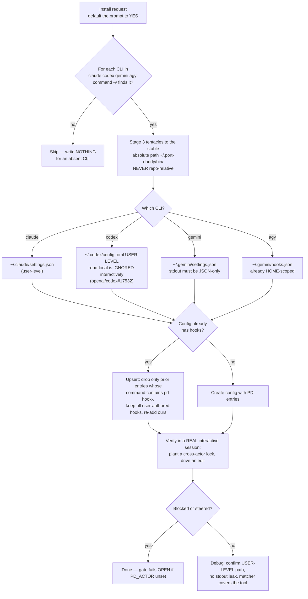

# Agentic Software Installation — Squid Tentacles for Interactive Sessions

Install Port Daddy's three coordination hook scripts ("tentacles") into the
native hook surface of agentic coding CLIs, so multi-agent locks and pheromones
fire **inside the vendor's own agent loop** during normal **interactive**
sessions — scoped to the projects you opt in.

Two hard rules this installer enforces (don't violate them):

- **Per-project, not machine-wide.** Claude/Gemini get hook config written into
  the repo (`<repo>/.claude/settings.json`, `<repo>/.gemini/settings.json`).
  Codex (repo-local hooks don't fire interactively, openai/codex#17532) and agy
  (home-scoped `~/.gemini/hooks.json`) must live at user level, so they are
  constrained at runtime by the gate below.
- **Inert unless the daemon is running.** Every hook command points at a GATE
  WRAPPER, never the tentacle directly. The wrapper no-ops (allow, no context
  injection) unless (a) the pd daemon is alive and (b) the cwd is inside a
  `.portdaddy/` project. So hooks do nothing in non-pd projects or when the
  daemon is down.

This is the **Giant Squid Harness** (pd-adr-092). Historically it injected hooks
only for **headless** spawned runs (`claude -p`, `gemini -p`, `codex exec`,
`agy -p`). Since **pd-adr-090** (this installer layer) the interactive surfaces
are wired too — using the SAME shape source of truth
(`lib/squid/hook-shape.ts`), so the headless and interactive injectors can never
drift. Normal use is just `pd hooks install` in your repo (or `pd init`).

## When to Use

Use for:
- "Install port daddy hooks" / "make coordination hooks fire in interactive sessions"
- Auto-detecting which agent CLIs (`claude`, `codex`, `gemini`, `agy`) are present and wiring only those
- Turning headless-only squid coverage into machine-wide interactive coverage

NOT for:
- Generic software / package installation (`brew install`, `npm i`, etc.)
- MCP server setup — delegate to `pd mcp install` / the `port-daddy` skill
- Authoring a NEW skill — delegate to `skill-architect` / `skill-creator`
- Editing the tentacle logic itself — owned by the Giant Squid Harness program

---

## Install Decision Flow



---

## The Three Tentacles

Each tentacle maps to one vendor hook class. They are vendor-agnostic `sh`
scripts that read the lock/pheromone matrix (`~/.port-daddy/matrix.env`). **You
do not write or modify these scripts** — they are owned by the Giant Squid
Harness program; this skill only *installs* them.

| Tentacle | Hook class | Job | Posture |
|----------|-----------|-----|---------|
| `pd-hook-prompt` | UserPromptSubmit / BeforeAgent | Reads the matrix, emits steering alerts + pheromone traces to **stdout** (CLI prepends to model context). | Advisory. Always `exit 0`. |
| `pd-hook-pre-tool` | PreToolUse / BeforeTool | **Enforced gate.** Reads tool-event JSON from **stdin**, extracts file targets (incl. paths inside Codex `apply_patch` bodies via `*** Update File:` / `*** Add File:` / `*** Delete File:` / `*** Move to:` markers), computes canonical `PD_LOCK_<path>` keys, greps the matrix; if a path is locked by a **different** actor than `$PD_ACTOR`, it **BLOCKS**. | Fails **OPEN** on parse error or unset actor. |
| `pd-hook-post-tool` | PostToolUse / AfterTool | Appends `PD_PHEROMONE_<subject>_<ts>` to the matrix per touched path (flock-guarded atomic append). | Always `exit 0`. |

### Block dialects (pre-tool only)

The gate emits one of two block contracts depending on the **stdin shape** it sees:

- **snake_case stdin** (Claude / Gemini / Codex-hooks): write a message to **stderr** and `exit 2`.
- **camelCase stdin** (Codex *app-server* / Antigravity): `exit 0` with stdout JSON:
  ```json
  {"hookSpecificOutput":{"decision":"block","permissionDecision":"deny","permissionDecisionReason":"<why>"}}
  ```
  (Antigravity uses the simpler `{"hookSpecificOutput":{"decision":"block","message":"<why>"}}` form.)

The tentacle auto-detects which dialect to emit by sniffing for `"tool_name"`
(snake) vs `"toolName"` (camel) in the event. Source: `bin/pd-hook-pre-tool` in
the Port Daddy repo (Giant Squid Harness program).

---

## Install Runbook (detect → stage → wire → verify)

All examples are runnable `sh`. Run them in order.

### 1. Detect installed CLIs

Configure only the CLIs that are actually present. Default the prompt to YES.

```sh
for cli in claude codex gemini agy; do
  if command -v "$cli" >/dev/null 2>&1; then
    echo "detected: $cli -> $(command -v "$cli")"
  fi
done
```

### 2. Stage the tentacles at a stable absolute path

Interactive sessions run from arbitrary cwds and read user-level config, so
hooks **must** point at a stable absolute path. Port Daddy's established home
for shims is `~/.port-daddy/bin/` (already holds the `git` shim).

**Preferred path — let `pd` do it.** `pd hooks install` (and the silent step in
`pd init` / the staging step in `pd setup`) stages the tentacles + the runtime
gate to `~/.port-daddy/bin/` and wires each detected CLI **for the current
project** (claude/gemini project config; codex/agy gated user config). If the
tentacles are not present on the current build it prints guidance and writes
nothing — it never wires a hook at a missing path:

```sh
pd hooks install        # detect + stage + wire THIS project (daemon-gated)
pd hooks list           # show detection + wiring status
```

**Manual fallback** (no `pd hooks` verb available — e.g. an older build). The
tentacles ship with the Giant Squid Harness inside the Port Daddy checkout's
`bin/`. Fail loud with the canonical location rather than a bare
`install: No such file`:

```sh
PD_BIN="$HOME/.port-daddy/bin"
mkdir -p "$PD_BIN"
# REPO is your port-daddy checkout root (the dir containing bin/pd-hook-*).
REPO="${REPO:-$HOME/coding/port-daddy}"
for t in prompt pre-tool post-tool; do
  src="$REPO/bin/pd-hook-$t"
  [ -x "$src" ] || { echo "tentacle source missing: $src — set REPO to your port-daddy checkout, or update Port Daddy so the Giant Squid Harness ships bin/pd-hook-*"; exit 1; }
  install -m 0755 "$src" "$PD_BIN/pd-hook-$t"
done
ls -l "$PD_BIN"/pd-hook-*
```

After this, every CLI's hook config points at the GATE WRAPPERS (which delegate
to the real tentacles under `~/.port-daddy/bin/squid/` only when the daemon is up
and the cwd is a pd project):
- `~/.port-daddy/bin/pd-hook-prompt`
- `~/.port-daddy/bin/pd-hook-pre-tool`
- `~/.port-daddy/bin/pd-hook-post-tool`

### 3. Wire each detected CLI (per project, gated)

Claude and Gemini are wired with **project** config inside the repo
(`<repo>/.claude/settings.json`, `<repo>/.gemini/settings.json`). Codex (repo-
local hooks don't fire interactively, openai/codex#17532) and agy (home-scoped)
are written at user level, but the runtime gate confines them to pd projects.
Each wire step is an **idempotent upsert**: merge into existing config, preserve
non-PD hooks, dedupe PD entries by the `pd-hook-` command path (the PD marker).

Per-CLI exact shapes and gotchas live in the reference files — read the one for
each detected CLI before writing its config:

- Claude Code → `references/claude.md`
- Codex CLI → `references/codex.md` (contains the **critical openai/codex#17532 warning**)
- Gemini CLI → `references/gemini.md`
- Antigravity `agy` → `references/agy.md`

### 4. Verify the hook fires interactively

The only honest verification is to observe a block in a real interactive
session. Quick smoke test: stage a fake lock owned by another actor, then drive
the CLI to edit that path. (Use `~/coding/tmp` for scratch paths — never `/tmp`,
which macOS purges.)

```sh
# Plant a lock owned by a DIFFERENT actor than this session.
MATRIX="${PD_MATRIX_FILE:-$HOME/.port-daddy/matrix.env}"
SMOKE="$HOME/coding/tmp/pd-smoke.txt"
mkdir -p "$(dirname "$MATRIX")" "$(dirname "$SMOKE")"
echo "PD_LOCK_${SMOKE}=other-agent" >> "$MATRIX"

# Direct invocation of the gate with a snake_case event (Claude/Gemini/Codex-hooks):
printf '{"tool_name":"Write","tool_input":{"file_path":"%s"}}' "$SMOKE" \
  | PD_ACTOR=me "$HOME/.port-daddy/bin/pd-hook-pre-tool"; echo "exit=$?"
# Expect: a stderr block message and exit=2 (snake dialect).

# camelCase (Codex app-server / Antigravity) deny-JSON contract:
printf '{"toolName":"write","toolInput":{"file_path":"%s"}}' "$SMOKE" \
  | PD_ACTOR=me "$HOME/.port-daddy/bin/pd-hook-pre-tool"; echo "exit=$?"
# Expect: stdout JSON with permissionDecision:"deny" and exit=0.
```
(The Giant Squid Harness ships its own selftest with the tentacles; run
`pd hooks list` to confirm wiring status without hand-driving the gate.)
Then confirm in a live interactive session of each CLI that the same edit is
blocked or steered. Claude Code interactive firing is VERIFIED.

---

## Per-CLI Matrix

| CLI | Interactive config file | User-level path (global) | Events (prompt / pre / post) | Block dialect | Gotcha |
|-----|------------------------|--------------------------|------------------------------|---------------|--------|
| **claude** | `.claude/settings.json` (project) | `~/.claude/settings.json` | `UserPromptSubmit` / `PreToolUse` / `PostToolUse` | stderr + `exit 2` | Tool events need a `matcher` regex over tool names (`Edit\|Write\|MultiEdit\|NotebookEdit`). VERIFIED interactive. |
| **codex** | `.codex/config.toml` (repo) or sibling `hooks.json` | `~/.codex/config.toml` | `UserPromptSubmit` / `PreToolUse` / `PostToolUse` | stderr + `exit 2` (hooks) **or** deny-JSON (app-server) | **repo-local hooks do NOT fire interactively — openai/codex#17532. Must use `~/.codex/config.toml`.** Headless `codex exec` needs `--dangerously-bypass-hook-trust`; interactive uses in-TUI trust. |
| **gemini** | `.gemini/settings.json` (project) | `~/.gemini/settings.json` | `BeforeAgent` / `BeforeTool` / `AfterTool` | stderr + `exit 2` | A hook script must print **nothing to stdout except the final JSON** (all logs → stderr). Tool events use **regex** matchers; lifecycle events use **exact-string** matchers. Tier-deprecated — prefer `agy`. |
| **agy** (Antigravity ~v1.0.12) | `~/.gemini/hooks.json` | `~/.gemini/hooks.json` (already HOME-scoped) | Claude-named events | deny-JSON (`hookSpecificOutput.decision:block`) | Ships a Claude-shaped JSON hook engine but auto-loads from `~/.gemini/hooks.json` — already global, no separate user/project split. Live replacement for tier-dead `gemini`. |

Sources, inline:
- Claude Code hooks: https://code.claude.com/docs/en/hooks
- Codex hooks: https://developers.openai.com/codex/hooks
- Codex interactive-hook bug: https://github.com/openai/codex/issues/17532
- Gemini CLI hooks: https://geminicli.com/docs/hooks/ and https://geminicli.com/docs/hooks/reference/
- pd-adr-090 (this installer layer, interactive surfaces wired) and the Giant Squid Harness program (the tentacle scripts) in the Port Daddy repo.

---

## Environment the tentacles read

- `PD_ACTOR` — this session's identity, used for self-vs-other lock checks. Interactive sessions may not set it; the tentacles **fail open** so an unset actor degrades gracefully (advisory, never destructively blocks the user's own session).
- `PD_MATRIX_FILE` — path to the lock/pheromone matrix; defaults to `~/.port-daddy/matrix.env`.
- `PD_HOME` — defaults to `~/.port-daddy`.

---

## Idempotency Rules (apply to every wire step)

1. **Detect before write** — only touch config for CLIs that `command -v` finds.
2. **Merge, don't clobber** — read existing config, preserve all non-PD hooks.
3. **Dedupe by marker** — a PD hook entry is identified by its command path containing `pd-hook-` (or `.port-daddy/bin/`). Re-running install replaces the PD entry in place; it never appends a duplicate.
4. **Absolute paths only** — never a relative or `$HOME`-unexpanded command path; interactive cwd is arbitrary.
5. **Back up before edit** — copy the config to a sibling `.bak` (under the config dir or `~/coding/tmp/`, never `/tmp`) before rewriting.

---

## Anti-Patterns (Shibboleths)

The knowledge here separates an agent that *thinks it installed coordination*
from one that *actually wired the interactive surface*.

### Anti-Pattern: "Interactive sessions don't need tentacles" (TIMELINE)

**Stale-map thinking**: "The squid harness only spawns headless `-p` / `exec`
runs, so hooks only matter for unattended voyages — interactive sessions are the
human's problem."

**Reality**: That was true *before pd-adr-090*. The interactive surfaces are now
wired too — the whole point of this skill. An agent still reasoning "interactive
sessions don't need tentacles" is reading a pre-pd-adr-090 map and will ship a
machine where two humans-in-the-loop clobber each other's files all day.

**Timeline**:
- Pre-pd-adr-090: harness injected hooks for headless spawns only.
- pd-adr-090: interactive surfaces declared in-scope.
- Giant Squid Harness program: the three tentacle scripts + user-level wiring.

**Why LLMs get this wrong**: training and older repo docs describe the
headless-only era; the model pattern-matches "hooks = CI/unattended."

### Anti-Pattern: Wiring only `gemini`, skipping `agy` (FRAMEWORK-EVOLUTION)

**Outdated**: configure `~/.gemini/settings.json` for the `gemini` CLI and call
it done.

**Current**: `gemini` is **tier-deprecated** — it throws `IneligibleTierError`
at runtime, so hooks you wire there may never execute. `agy` (Antigravity
~v1.0.12) is its live replacement and auto-loads home-scoped
`~/.gemini/hooks.json`. Skipping `agy` = using the old vendor map.

**Detection**: if `command -v agy` succeeds and you wrote no `~/.gemini/hooks.json`,
you used the dead vendor. Wire `agy` whenever it is present; keep `gemini` only
as a fallback if it is the sole Gemini-family CLI on the box.

**Why LLMs get this wrong**: `gemini` is the famous name; `agy` is new and
under-represented in training data.

### Anti-Pattern: Any plain text to stdout from a Gemini hook (NOVICE)

**Novice**: drops a `echo "running pd-hook..."` or leaves `set -x` on in a
Gemini-bound hook for "visibility."

**Expert**: Gemini requires stdout be **ONLY** the final JSON object. Any stray
stdout line corrupts the hook protocol and the hook is silently rejected — so
the gate you "installed" never blocks anything. **ALL** logging goes to stderr.

**Detection**: run the hook standalone and pipe stdout through `jq .`; if it
errors on non-JSON, the hook is broken for Gemini.

### Anti-Pattern: A fail-CLOSED gate keyed on `PD_ACTOR` (NOVICE)

**Novice**: assumes `PD_ACTOR` is always set in an interactive session and builds
a gate that, when it can't identify the actor, **denies** the tool call "to be
safe."

**Expert**: interactive sessions frequently have **no** `PD_ACTOR`. A
fail-closed gate would lock the human out of their own editor. The tentacles
**fail OPEN**: an unset actor degrades to advisory, never destructive. Verify
this — feed the gate an event with `PD_ACTOR` unset and confirm it does *not*
block.

**Why this matters**: a coordination tool that bricks the human's session gets
ripped out within the hour, taking all coordination with it.

---

## Worked Examples (Expert vs Novice)

### Example 1: Codex interactive caveat — user-level vs repo-local

**Novice**: puts `[[hooks.PreToolUse]]` in the repo-local `.codex/config.toml`,
tests with a headless `codex exec` run (the hook fires), declares victory, ships.

**Expert**: knows **openai/codex#17532** — repo-local hooks are silently ignored
in *interactive* sessions. So the expert writes the blocks to the **user-level**
`~/.codex/config.toml` and verifies inside a real interactive `codex` TUI
(approving the hook once in the trust prompt), not just `codex exec`.

**What the novice missed**: headless `exec` and interactive load different
config surfaces. A green `codex exec` proves nothing about interactive coverage.

### Example 2: Tentacle path — absolute vs repo-relative

**Novice**: points the Claude hook command at `./bin/pd-hook-pre-tool`. It works
in the demo repo, then breaks the moment `claude` runs from another cwd or from
user-level config, because the relative path no longer resolves.

**Expert**: stages the three tentacles to the stable absolute path
`~/.port-daddy/bin/pd-hook-{prompt,pre-tool,post-tool}` (the same convention as
the Port Daddy `git` shim) and references those absolute, `$HOME`-expanded paths
in every CLI config.

**Decision rule**: if a hook command could be evaluated from an arbitrary cwd
(it always can, in interactive sessions) → use the absolute `~/.port-daddy/bin/`
path, never repo-relative.

### Example 3: Idempotent merge — upsert vs clobber

**Novice**: overwrites the `hooks` block in `~/.claude/settings.json` wholesale,
clobbering the user's pre-existing audit hook on `PreToolUse`.

**Expert**: upserts. Per event, drops *only* prior entries whose command
contains `pd-hook-`, keeps every user-authored hook, then appends ours.
Re-running the install yields exactly **one** PD entry per event and leaves the
user's audit hook intact.

**Decision rule**: if config already exists → upsert (preserve + dedupe by the
`pd-hook-` marker / sentinel fence), never overwrite.

---

## Quality Gates

Run these checks after install. All are measurable; each is phrased as a test
you can actually execute against the machine state.

- Test: only CLIs found by `command -v` are configured — no config file is created or modified for an absent CLI.
- Test: running the install twice produces exactly **one** Port Daddy entry per event (idempotent upsert); `jq` over each event array finds a single `pd-hook-` command.
- Test: a pre-existing non-PD hook on the same event **survives** the install (plant a dummy audit hook first, confirm it remains afterward).
- Test: every written hook `command` is an **absolute** path under `~/.port-daddy/bin/` (no relative paths, no literal `$HOME`/`~` left unexpanded).
- Test: Codex hooks are written to `~/.codex/config.toml` (user-level), **never** only repo-local `.codex/config.toml` (openai/codex#17532).
- Test: the `pd-hook-pre-tool` gate fed an event with `PD_ACTOR` unset does **not** block (fails OPEN).
- Test: a Gemini-bound hook emits stdout that parses as JSON with `jq .` (no stray plaintext leak).
- Test: in a real interactive session of each detected CLI, an edit to a path locked by another actor is blocked or steered (the only honest end-to-end check).

---

## NOT-FOR Boundaries

**This skill should NOT be used for**:
- Generic software / package installation (`brew install`, `npm i`, language toolchains).
- MCP server setup or registration.
- Authoring, auditing, or improving Agent Skills.
- Writing or modifying the tentacle scripts (`pd-hook-prompt` / `pd-hook-pre-tool` / `pd-hook-post-tool`) themselves.

**Delegate to these skills/programs instead**:
- For MCP server install/registration → `pd mcp install` / the `port-daddy` skill.
- For authoring or improving a skill → `skill-architect` / `skill-creator`.
- For changing tentacle behavior → the Giant Squid Harness program; this skill only *installs* the scripts, it does not own them.
