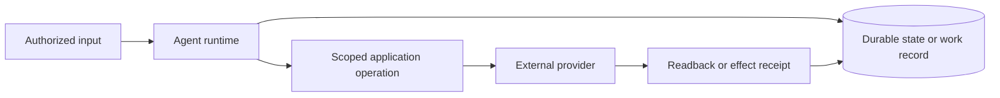
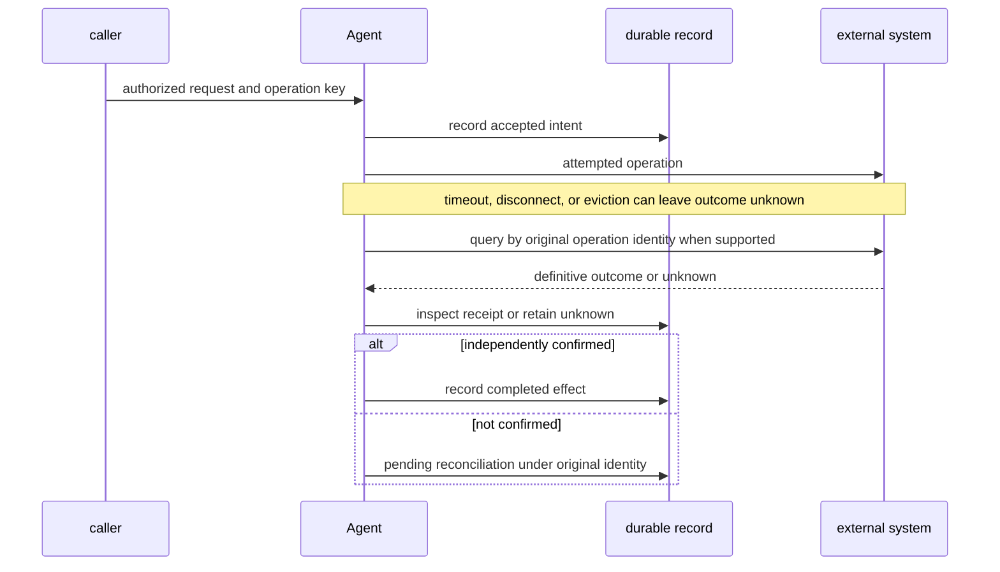

# Cloudflare Agents SDK

Prefer the installed package and current [Cloudflare Agents documentation](https://developers.cloudflare.com/agents/) over remembered signatures. This bundle was reconciled on 2026-09-24; examples are illustrative and were not package-typechecked or deployed.

## Runtime and effect boundary

Cloudflare Agents provides Durable Object-backed identity, local SQLite state, connections, scheduling, and durable execution primitives. The application must configure principal authentication and resource authorization, make provider retries safe, and verify external outcomes separately from transcript/event persistence. Durable Object instance identity does not establish user authority.

## Pick a primitive

| Need | Start here | Required application boundary |
| --- | --- | --- |
| Stateful real-time instance | state, routing, client SDK | authenticate and authorize instance access |
| Browser command | callable methods | validate input, idempotency, outcome status |
| Scheduled/queued callback | state scheduling, queues | duplicate, retry, and late-delivery behavior |
| Recovery from DO eviction | durable execution | complete checkpoint and recovery/compensation policy |
| Long-running multi-step work or approval | Workflows | bind request/action/approval and repeated progress |
| Chat/server turn | streaming chat, server-driven messages | transcript persistence differs from effect completion |
| External webhook/push | webhooks/push | verify source, dedupe, current consent, effect receipt |

## Navigation

### Core runtime
- [Configuration](references/configuration.md): Wrangler bindings, exports, Vite, types, environments.
- [State and scheduling](references/state-scheduling.md): state validation, synchronization, SQL, schedules.
- [Routing](references/routing.md): public/private route boundary and Agent lookup.
- [Callable methods](references/callable.md): WebSocket RPC, streaming, commands.
- [Client SDK](references/client-sdk.md): browser Agent access and state.

### Durable/background execution
- [Queues and retries](references/queue-retries.md): FIFO queue, retry classification, unknown result handling.
- [Fibers](references/durable-execution.md): checkpoints, recovery, startFiber, cooperative cancellation.
- [Workflows](references/workflows.md): durable steps, external waits, approval and progress.
- [Observability](references/observability.md): diagnostics, Tail Workers, correlation.

### Channels and harnesses
- [Streaming chat](references/streaming-chat.md) and [server-driven messages](references/server-driven-messages.md): persisted chat turns and client state.
- [Human approval](references/human-in-the-loop.md): Workflow, Code Mode, MCP, and browser boundaries.
- [Webhooks and push](references/webhooks-push.md): verified ingress and subscription delivery.
- [Think](references/think.md): harness-owned chat/tool loop.
- [MCP](references/mcp.md), [email](references/email.md), [voice](references/voice.md), [Code Mode](references/codemode.md), and [browser](references/browse-the-web.md): integration-specific references.

## Source and validation limit

The diagrams show a design boundary, not a runtime trace. Each reference names the official sources and the date it was checked; [evidence scope](references/evidence-scope.md) describes the validation boundary. No installation, typecheck, Worker, Durable Object, Cloudflare service, provider, approval, notification, or browser action was run.
