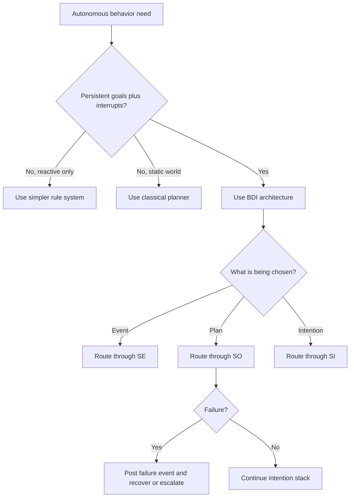

# AgentSpeak(L) And BDI Agent Architecture

Use this skill when autonomous entities must react to events, preserve longer-horizon commitments, and make policy choices without burying rationality inside plan bodies.

## When to Use

- An agent must respond to urgent events without abandoning ongoing work.
- You need explicit separation between beliefs, goals, committed intentions, and policy.
- A plan library should reuse the same triggering event across multiple contexts.
- Multi-agent coordination should emerge through messages and beliefs rather than a central dispatcher.
- The system needs a defensible explanation of why a specific event, plan, or intention was chosen next.

## NOT for Boundaries

This skill is not the primary fit for:
- Purely reactive event-action systems with no persistent goals.
- Static planning problems where the world does not change during execution.
- Hard real-time controllers that need guaranteed deadlines instead of deliberative scheduling.
- Data transformation or workflow pipelines with no autonomous decision-making.

## Core Mental Models

### The BDI Trinity

| Structure | Role | Computational form |
| --- | --- | --- |
| **Beliefs** | World model | Queryable facts updated through perception and messages |
| **Desires** | Motivating conditions | Events or goals that trigger plan search |
| **Intentions** | Active commitments | Partially executed plan stacks that consume resources |

Goals are not intentions. An agent may want something without having committed to pursue it yet.

### Context-Sensitive Plans

Plans are event-triggered, context-guarded recipes. The same event can map to different plans depending on current beliefs. Intelligence lives in selecting the right plan for the current context, not in writing one giant universal procedure.

### Interruptible Commitment

Intentions are concurrent and suspendable. That is what gives BDI systems both responsiveness and persistence. A system with only one active intention is not really exploiting the architecture.

### Selection Functions Hold Policy

Event selection, plan selection, and intention scheduling are the explicit policy loci. If urgency, fairness, or risk tolerance lives inside plan bodies, the design boundary is wrong.

### Formalize Upward

Rao's practical lesson is to formalize from a working operational system upward, not to start with an elegant theory and approximate downward into code.

## Decision Points

See the compact routing model in [diagrams/01_flowchart_decision-points.md](diagrams/01_flowchart_decision-points.md).

### 1. Decide Whether BDI Is the Right Architecture

- Use a simpler reactive system when no persistent commitments are needed.
- Use a classical planner when the environment is stable and interrupts are negligible.
- Use BDI when the environment changes during execution and the agent must keep some commitments alive while handling new events.

### 2. Decide Which Selection Function Owns the Question

| Situation | Function | Main concern |
| --- | --- | --- |
| A new event arrives | `SE` | urgency, priority, fairness |
| Multiple plans fit an event | `SO` | context guards, plan history, risk |
| Several intentions are active | `SI` | preemption, latency, resource use |

### 3. Decide How to Handle Failure

- If a failure-handling plan exists, post a failure event and recover through the plan library.
- If alternatives exist for the same triggering event, backtrack and let `SO` try the next applicable plan.
- If no alternative exists, propagate failure up the intention stack rather than crashing the whole agent.

## Failure Modes

### 1. Plan Thrashing

**Symptoms:** the same event cycles through different plans without progress.  
**Detection rule:** one event is processed repeatedly with alternating plan choices and no net state change.  
**Recovery:** strengthen context guards and make `SO` ordering explicit.

### 2. Stale-Belief Paralysis

**Symptoms:** plans fail because the world changed after selection.  
**Detection rule:** failures cluster around invalidated context assumptions rather than bad plan logic.  
**Recovery:** add belief freshness checks and suspend intentions whose guards no longer hold.

### 3. Infinite Intention Loops

**Symptoms:** subgoals recreate the same higher-level intention indefinitely.  
**Detection rule:** intention depth or count grows monotonically without corresponding achievements.  
**Recovery:** add achievement checks, recursion limits, and intention subsumption.

### 4. Policy In Plans

**Symptoms:** priority and risk logic appears inside plan bodies.  
**Detection rule:** plans contain decision code that should live in `SE`, `SO`, or `SI`.  
**Recovery:** move policy to selection functions and keep plans context-sensitive but policy-neutral.

### 5. Single-Intention Bottleneck

**Symptoms:** urgent work waits for long-running tasks to finish.  
**Detection rule:** the agent effectively runs one intention at a time.  
**Recovery:** allow concurrent intentions with explicit scheduling and preemption rules.

## Worked Examples

### Example 1: Multi-Agent Delivery

Two agents receive the same delivery goal. One lacks carrying capacity and posts a failure event. The other passes its context guard, commits to the delivery intention, and broadcasts that commitment. Coordination emerges through belief updates and plan applicability rather than hardcoded agent-role assumptions.

### Example 2: Security Alert Interrupt

An agent processing a long analytics batch receives an intrusion alert. `SE` prioritizes the alert, `SO` selects the containment plan, and `SI` preempts the batch intention long enough to isolate the system and notify operators. The batch then resumes from its suspension point instead of restarting or disappearing.

## Quality Gates

- [ ] The architecture has explicit `SE`, `SO`, and `SI` policies.
- [ ] Plans use context guards rather than policy conditionals inside the body.
- [ ] Intention failure posts events and supports recovery or escalation.
- [ ] Belief updates can invalidate or suspend active intentions safely.
- [ ] The system exposes enough intention and event state to explain why it acted.

## Reference Files

- `diagrams/01_flowchart_decision-points.md` — Decision tree routing autonomous behavior through event selection (SE), plan selection (SO), and intention scheduling (SI). **Read when** designing the control flow for a new BDI agent or debugging why a specific choice was made.

- `references/agent-vs-logic-programs-key-distinctions.md` — Explains why AgentSpeak(L) plans differ from Prolog rules despite syntactic similarity (commitment, failure recovery, context-checking). **Read when** migrating from logic programming or clarifying plan semantics.

- `references/agentspeak-and-multi-agent-coordination.md` — Shows how single-agent BDI architecture becomes a building block for multi-agent systems without central control. **Read when** designing coordination between independent agents via beliefs and messages.

- `references/bdi-architecture-for-agent-orchestration.md` — Translates Rao's formal BDI model into design principles for orchestration systems managing state, routing tasks, and coordinating action. **Read when** architecting a task scheduler or workflow engine.

- `references/bdi-mental-architecture-for-agent-systems.md` — Justifies why agents need exactly three distinct structures (beliefs, desires, intentions) and what each computes. **Read when** deciding whether to separate goals from commitments or merge them.

- `references/belief-grounding-and-context-checking.md` — Details how plan contexts anchor agent behavior to current world state and prevent stale plan execution. **Read when** implementing context guards or debugging plans that execute in wrong situations.

- `references/belief-management-and-world-modeling.md` — Defines the belief base as the agent's epistemic foundation and how it grounds plan selection and test goals. **Read when** designing the world model or belief update protocol.

- `references/bridging-theory-practice-gap-in-agent-systems.md` — Identifies the historical gap between formal agent theory and working implementations that Rao's paper closes. **Read when** justifying why formal semantics matter for practical systems.

- `references/closing-theory-practice-gap-in-agent-systems.md` — Explains Rao's approach: start from working systems (dMARS/PRS), then formalize to avoid over-specification. **Read when** deciding how much formalism to invest in your agent design.

- `references/context-sensitive-plans-as-agent-knowledge.md` — Defines plans as context-sensitive, event-triggered recipes encoding both applicability conditions and action sequences. **Read when** writing or reviewing plan libraries.

- `references/event-driven-reactivity-in-bdi-systems.md` — Describes the four fundamental event types (+b, -b, +!, -!) and how they drive agent reactivity without abandoning goals. **Read when** designing the event queue or handling belief updates.

- `references/failure-modes-in-bdi-systems.md` — Catalogs failures the architecture prevents (context-blind execution, plan thrashing, stale beliefs) and those it does not. **Read when** assessing robustness or designing recovery policies.

- `references/intention-management-and-goal-decomposition.md` — Distinguishes goals (desires) from intentions (committed action stacks) and explains why the separation matters. **Read when** deciding whether to adopt a goal or commit to a plan.

- `references/intention-stacks-and-hierarchical-decomposition.md` — Explains how intention stacks preserve causal history and enable hierarchical plan decomposition. **Read when** implementing plan recursion or debugging intention state.

- `references/multi-agent-coordination-without-central-control.md` — Shows how BDI agents coordinate through shared beliefs and messages without a central dispatcher. **Read when** designing decentralized multi-agent protocols.

- `references/operational-semantics-as-interpreter-specification.md` — Justifies why operational semantics (not axiomatic or denotational) is the right formalism for agent system specification. **Read when** implementing an agent interpreter or verifying correctness.

- `references/plans-as-context-sensitive-event-triggered-recipes.md` — Defines the plan data structure and its components (trigger, context, body). **Read when** formalizing plan syntax or designing a plan library schema.

- `references/proof-theory-and-verifiable-agent-behavior.md` — Explains how labeled transition systems enable verification that an agent system behaves as specified. **Read when** proving correctness properties or auditing agent decisions.

- `references/selection-functions-as-agent-policy.md` — Separates plan library (what the agent knows) from selection functions (how it decides), making policy replaceable. **Read when** tuning agent strategy or swapping decision-making algorithms.

- `references/selection-functions-as-policy-locus.md` — Details the three selection functions (SE, SO, SI) and their role in event, plan, and intention choice. **Read when** implementing or customizing agent decision logic.

## Anti-Patterns

- Conflating goals with intentions and then being surprised when commitment handling becomes opaque.
- Writing monolithic plans that destroy interruptibility and reuse.
- Treating the event queue as an implementation detail instead of the main interface with the environment.
- Hardcoding coordination by letting agents depend on each other's internals instead of shared beliefs or messages.
