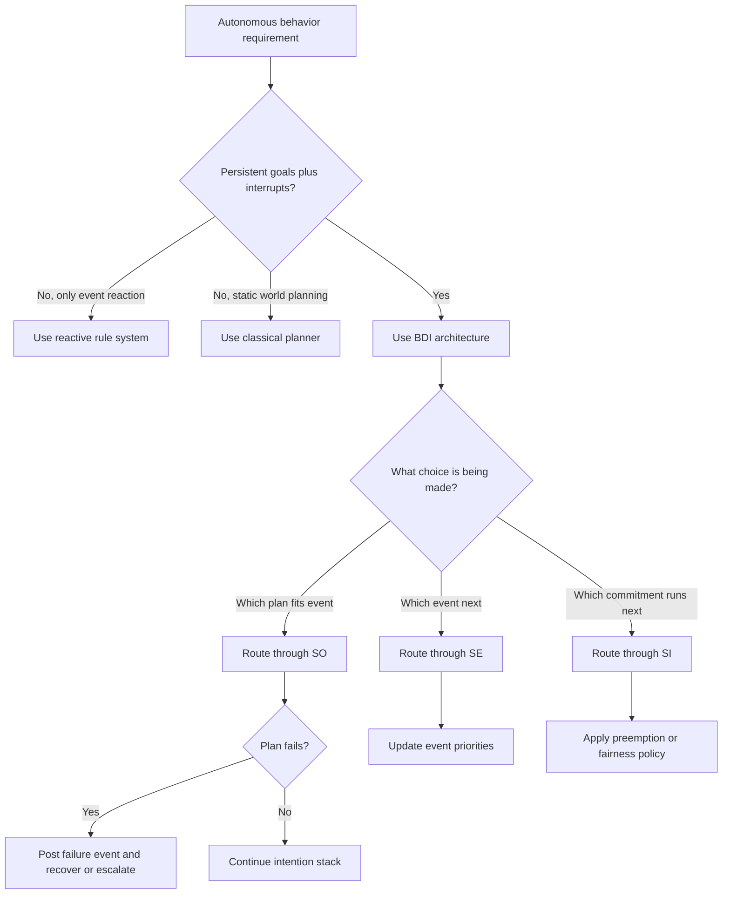

# BDI Architecture Routing

```mermaid
flowchart TD
  A[Autonomous behavior requirement] --> B{Persistent goals plus interrupts?}
  B -->|No, only event reaction| C[Use reactive rule system]
  B -->|No, static world planning| D[Use classical planner]
  B -->|Yes| E[Use BDI architecture]
  E --> F{What choice is being made?}
  F -->|Which event next| G[Route through SE]
  F -->|Which plan fits event| H[Route through SO]
  F -->|Which commitment runs next| I[Route through SI]
  H --> J{Plan fails?}
  J -->|Yes| K[Post failure event and recover or escalate]
  J -->|No| L[Continue intention stack]
  G --> M[Update event priorities]
  I --> N[Apply preemption or fairness policy]
```
