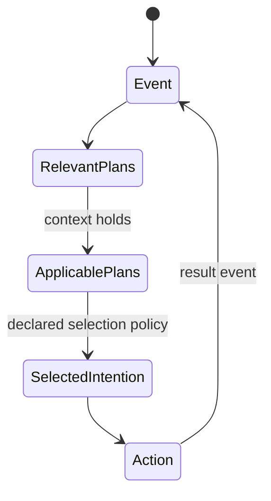

# AgentSpeak interpreter transition cycle

```mermaid
stateDiagram-v2
  [*] --> Event
  Event --> RelevantPlans
  RelevantPlans --> ApplicablePlans: context holds
  ApplicablePlans --> SelectedIntention: declared selection policy
  SelectedIntention --> Action
  Action --> Event: result event
```
