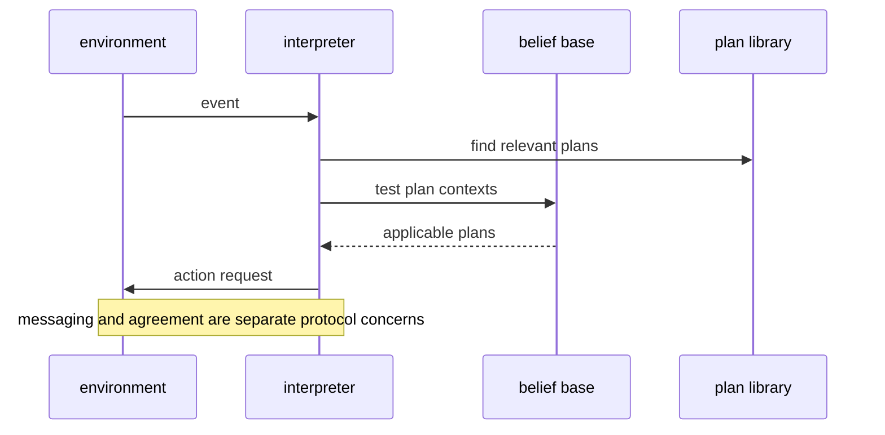

# Interpreter and environment adapter

```mermaid
sequenceDiagram
  participant E as environment
  participant I as interpreter
  participant B as belief base
  participant P as plan library
  E->>I: event
  I->>P: find relevant plans
  I->>B: test plan contexts
  B-->>I: applicable plans
  I->>E: action request
  Note over I,E: messaging and agreement are separate protocol concerns
```
