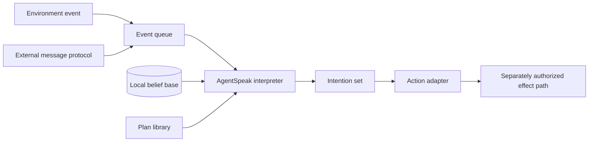

# BDI interpreter and system boundary

```mermaid
flowchart LR
  E[Environment event] --> Q[Event queue]
  Q --> I[AgentSpeak interpreter]
  B[(Local belief base)] --> I
  P[Plan library] --> I
  I --> N[Intention set]
  N --> A[Action adapter]
  M[External message protocol] --> Q
  A --> R[Separately authorized effect path]
```
