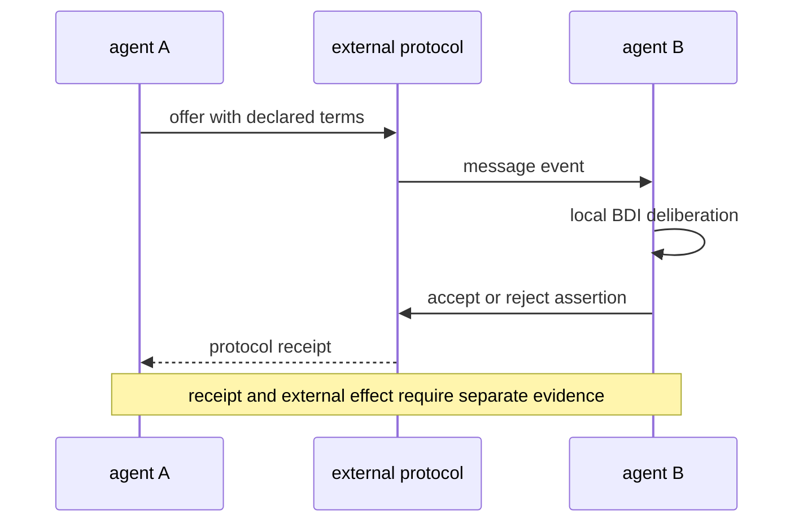

# Local deliberation does not settle a distributed commitment

```mermaid
sequenceDiagram
  participant A as agent A
  participant P as external protocol
  participant B as agent B
  A->>P: offer with declared terms
  P->>B: message event
  B->>B: local BDI deliberation
  B->>P: accept or reject assertion
  P-->>A: protocol receipt
  Note over A,B: receipt and external effect require separate evidence
```
