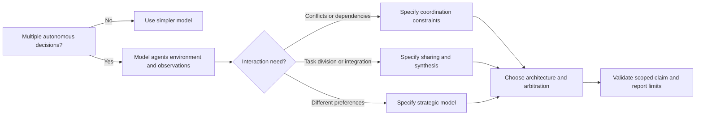
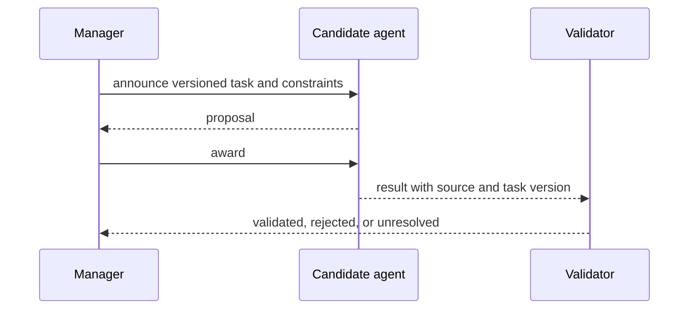

# Introduction to multi-agent systems: a design method

Use this skill when a design involves multiple autonomous decision-makers, incomplete information, interdependent tasks, or strategic resource allocation. It is a source-bounded design map based on Wooldridge’s second-edition author contents and accessible author-hosted lecture slides. The full book and Wiley body were not accessed; constructed examples are identified as such.

Do not use it as an endorsement of multi-agent architecture when ordinary services or a single controller suffice. Do not infer runtime correctness, performance, truthful reporting, or deployment safety from these conceptual methods.

## Design in this order

1. **Define the system and decision.** Name the agents, their control/authority, objective, success condition, deadline, and effects.
2. **Characterize the environment.** Record relevant states, transitions, observations, dynamics, and model gaps. See [environment worksheet](references/environment-characterization-drives-architecture.md).
3. **State interaction needs.** Separate interference prevention, task sharing, result sharing, synchronization, and strategic agreement. Choose a protocol only after identifying the need.
4. **Represent information and intention.** Keep each agent’s observation/knowledge distinct from global state; say when goals continue, change, or end.
5. **Choose architecture and arbitration.** If reactive and deliberative proposals coexist, define priority, validity, veto, and fallback.
6. **Analyze incentives when relevant.** Specify preferences, feasible outcomes, information, disagreement options, and the mechanism. A protocol does not establish truthful participation.
7. **Validate a scoped claim.** A worksheet or finite model supports a claim about its assumptions. Tests support only the exercised implementation paths; neither alone proves production behavior.

## Select a method by the question

- Need to understand what agents can observe? Use environment and possible-world worksheets.
- Need to assign work and integrate results? Use task sharing and Contract Net; define the task/result contract and failure behavior.
- Need to decide how long to pursue a goal? Use commitment states and explicit authorization/evidence.
- Need competing reactive/planning proposals? Define layers and their arbitration contract.
- Need an agreement among agents with different preferences? Define utilities/feasible outcomes before using bargaining or auction analysis.

The sequence diagram shows one illustrative path in which the candidate proposes and is awarded the task; rejection/no-bid paths are covered in the coordination reference. The linked references provide the methods and limits. [Reference index](references/INDEX.md).

## Worked contrast: acknowledgment is not effect evidence

Suppose agent A sends “commit job J” to agent B. The sender’s log proves that A recorded a send event. It does not alone prove B received the message, acknowledged it, or committed J. Model those as separate propositions and observations. If the next action depends on commit, obtain evidence appropriate to that effect and its authority. See [epistemic logic](references/grounded-epistemic-logic-for-distributed-agents.md).

## Quality gates

Before accepting a design:

- State which conclusions are source-derived and which are constructed local choices.
- Separate cooperative assumptions from strategic incentives.
- Name hard constraints separately from ranking preferences.
- Keep unknown observations distinct from false facts and from cancellation.
- Test no eligible proposal, late/duplicate messages, partial result, changed task version, and conflicting result when those cases apply.
- Verify that action preconditions still hold at the effect boundary.
- Identify whether evidence is conceptual, finite-model, local-test, hosted, or deployed.

## Source boundary

The official [second-edition contents](https://www.cs.ox.ac.uk/people/michael.wooldridge/pubs/imas/Contents.html) is a topic map. The linked author slide decks provide primary teaching material for the particular chapter methods named in each reference. They are not a substitute for the full textbook, and this skill does not claim access to its complete chapter text.
