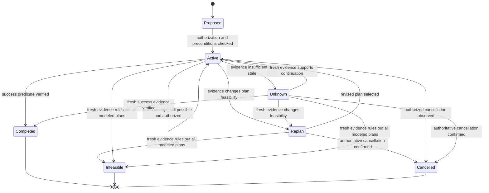
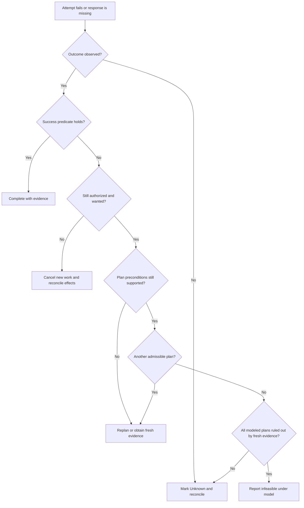

# Intentions, persistence, and reconsideration

This reference treats commitment as a question of what evidence justifies pursuing, revising, suspending, or dropping a goal. The author’s chapter 17 slides summarize intention properties and Cohen–Levesque’s account; the state model below is a constructed design aid.

## Reconsideration dilemma

Too little reconsideration can leave an agent pursuing a goal already satisfied, impossible, or no longer wanted. Too much can consume time otherwise used to act. Policy depends on task, deliberation cost, and how quickly relevant conditions change. No universal interval or volatility threshold is supplied.

Separate:
- Achieved: evidence shows the success condition holds.
- Infeasible under current model: evidence/rules show no permitted plan can succeed.
- No longer authorized or wanted: an appropriately authorized actor cancels or changes the objective.

Timeout, missing message, or one failed attempt can mean unknown, not impossible or cancelled.

## Intention record

| Field | Purpose |
|---|---|
| Goal and success predicate | What counts as achievement |
| Authorizing source | Who requested/approved it and within what scope |
| Preconditions and current evidence | What must hold; source and freshness |
| Current plan/action | What is being attempted |
| Attempts and observations | Distinguish failure from no observation |
| Cancellation/expiry | Who may cancel and under what expiry |
| External effects | What may already have changed; reconciliation path |
| Decision | Continue, replan, suspend, cancel, or report unknown |

This is an engineering pattern, not a formal implementation of BDI or the full Cohen–Levesque logic.

## Commitment policies

BDI discussions distinguish policies by when an agent reconsiders an intention:

- Blind: retain until achieved. Unsuitable when goals can become impossible or irrelevant.
- Single-minded: reconsider when achieved or believed impossible.
- Open-minded: also reconsider when motivating goal is no longer held.

These policies have different assumptions. They are not a calibrated numeric continuum and do not specify inspection frequency or sufficient evidence.

In the diagram and procedure, “Infeasible” is scoped to an explicit model and fresh evidence; a timeout alone goes to Unknown. “Impossible” is scoped to an explicit model and evidence. If effects may have occurred, cancellation stops new work and triggers reconciliation; it does not undo an external side effect.

## Failed-attempt decision path

This flow converts the former ASCII decision tree into an explicit evidence path. Each answer is local to the stated model and task contract.

## Decision procedure after a failed attempt

1. Was outcome observed? If not, mark unknown and reconcile before a possibly duplicative effect.
2. Did success predicate become true? If yes, complete with evidence.
3. Is the goal still authorized and wanted? Check scoped cancellation/expiry authority, not silence.
4. Are plan preconditions still supported? If not, replan or seek fresh evidence.
5. Is another plan available? Compare under stated objective and resource bounds.
6. Is the goal infeasible under the explicit model? If demonstrated, terminate that goal as Infeasible under the model and report the evidence; otherwise preserve uncertainty.
7. Compare another attempt cost with reconsideration cost using task-specific evidence.

This deliberately is not “retry N times.” Retry and escalation rules depend on idempotency, rate limits, and effect semantics.

## Constructed case: approval workflow

A request is approved for processing but the approver is temporarily unavailable. Proposed means authorization unverified; Active means approval and inputs are current; Unknown follows a wait timeout with no response; fresh authoritative query may restore Active; authorized cancellation before an irreversible step yields Cancelled; Completed requires transaction receipt matching request ID and amount.

If a transaction request times out after dispatch, do not restart it solely because no response arrived. Reconcile by idempotency key or authoritative status path. This is a constructed workflow, not a result reported by Wooldridge.

## Belief and intention

The author’s lecture summarizes intention properties: intentions guide problem-solving, constrain conflicting intentions, prompt tracking and sometimes retry after failure, and are not necessarily extended to every believed side effect. It distinguishes intending an outcome from knowing it will happen. In design, record a plan/possibility rationale and uncertainty; guaranteed success is not required before action.

A belief model is only as good as observations and update rules. Intending p is not evidence that p is true, that a plan is feasible, or that an effect happened.

The author lecture’s summary of intention properties also highlights: intentions pose problems that consume reasoning resources; filter conflicting intentions; track progress and can motivate an alternative after failure; are believed possible; need not be believed certain; may under some conditions be expected to succeed; and do not imply intending every believed side effect. These are conceptual constraints on a formal account, not an operational retry or authorization policy. Preserve conflicts between goals instead of assuming a planner can adopt every goal at once.

## Formal source scope

Wooldridge’s author lecture 17 outlines Cohen–Levesque’s multi-modal account with belief, goal, and action/event constructs over possible histories. It presents persistent goals as maintained while beliefs and temporal conditions support continued pursuit. This skill does not reproduce a purported executable equation.

- Wooldridge, [chapter 17 author lecture slides](https://www.cs.ox.ac.uk/people/michael.wooldridge/pubs/imas/distrib/pdf-slides/lect17.pdf), full 77-page deck read; supports high-level intention properties and belief/goal/action vocabulary.
- Cohen & Levesque, [“Intention Is Choice with Commitment” (1990) DOI record and abstract](https://www.sciencedirect.com/science/article/pii/0004370290900555) opened. Full publisher body not accessed.
- Removed: Kinny–Georgeff percentages, fixed volatility bands, “optimal reconsideration iff intention changes” equation, HomER interpretation, and 180-skill policy.

