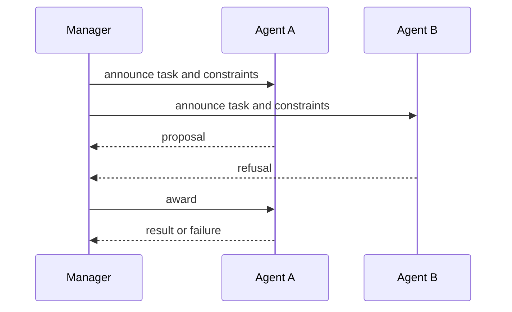

# Coordination: identify the problem and specify the protocol

This reference separates preventing conflicting actions, sharing complementary work or results, synchronizing dependencies, and reaching agreement where interests differ. Wooldridge’s author-hosted lecture 8 grounds task/result sharing and Contract Net. Examples below are constructed.

## Decide what coordination must accomplish

Name the requirement before choosing a protocol:

- Avoid interference: actions must not conflict or duplicate a scarce resource.
- Enable task sharing: divide, assign, perform, and combine work.
- Enable result sharing: exchange intermediate facts or partial solutions.
- Synchronize dependencies: wait for a prerequisite or jointly produced condition.
- Resolve strategic conflict: parties have different preferences and need an agreement.

These are distinct problems. Separate benevolent participants designed for a shared objective from self-interested participants. A cooperative protocol alone does not make strategic reports truthful.

## Task sharing and result sharing

Chapter 8 lecture slides describe cooperative problem solving in three stages:

1. Problem decomposition: divide into subproblems; decide who knows the structure and who performs the split. Decomposition can be hierarchical.
2. Subproblem solution: assigned agents work; they may exchange information or synchronize.
3. Answer synthesis: combine results, potentially at multiple abstraction levels.

Task sharing distributes task components. Result sharing distributes information and partial results. Assignment without integration can leave an incomplete answer; result exchange without task boundaries can duplicate effort or produce incompatible outputs.

### Constructed example: incident report

A manager splits a report into timeline extraction, service-impact analysis, and mitigation review. It announces each subtask with input schema, evidence cutoff, quality requirements, deadline, and output format. Contractors return partial results tagged with evidence and uncertainty. Synthesis checks coverage, resolves conflicts, and reports gaps. This illustrates decomposition and synthesis; it is not an empirical result or a source case study.

## Contract Net task allocation

Contract Net is task sharing, not a proof of truthful bidding or optimal allocation. The author’s slides give five stages:

1. Recognition: agent identifies work it wants or needs help with.
2. Announcement: broadcast task specification, constraints such as deadline/quality, and bid-submission conditions.
3. Bidding: recipients decide if capable and willing to propose.
4. Awarding: manager selects a proposal and communicates accept/reject.
5. Expediting: contractor performs; the relationship may lead to subcontracting.

A usable message contract should name task ID/version, description, eligibility, inputs, quality/deadline, bid deadline, proposal fields, award, result/failure, and cancellation/recovery rules. These are practical extensions, not a quotation of a particular standard. The diagram is one illustrative trace with one proposal and one refusal, not a complete protocol specification.

### Constructed allocation example

A task requires a licensed parser and completion within 20 minutes. A lacks the tool and is ineligible. B estimates 12 minutes and cost 4 units; C estimates 8 minutes and cost 7. The manager’s local rule is “meet deadline, then minimize cost,” so it selects B. Numbers/objective are invented. If cost, confidence, and latency trade off, state the rule before evaluating proposals.

Lecture 8 gives contractor marginal cost:
mu_i(tau(ts) | tau_it) = c_i(tau(ts) union tau_it) - c_i(tau_it),
where c_i is contractor i’s cost model, tau_it its scheduled tasks, and tau(ts) the announced set. This is incremental modeled cost; it need not be money, truthful bid, or total system cost.

### Failure and recovery cases

- No eligible proposal: revise task, find another pool, or report unmet work.
- Late proposal: apply announced deadline and record exclusion.
- Awarded agent fails/times out: record failure against task version and invoke explicit reassignment/abort.
- Partial result: accept only if contract permits; mark missing work.
- Task changes after award: version task and negotiate whether award remains valid.
- Conflicting results: preserve provenance, apply declared reconciliation, or escalate.

The five stages do not specify retries, durable contracts, security, or complete failure recovery.

## Result-sharing patterns and inconsistency

The author slides contrast shared blackboards and subscribe/notify. A blackboard gives multiple problem solvers a shared structure for partial results; its shared coordination point and access discipline are explicit trade-offs. In subscribe/notify, a consumer registers interest and receives a notification when relevant information arises; producers need a way to know who is interested. These are alternative information-sharing patterns, not guarantees of consistency or scalability.

When agents disagree, first classify the inconsistency: different beliefs can reflect different observations/noise; different goals can reflect genuinely different objectives. Chapter 8 slides outline three responses: prevent a selected inconsistency by design, resolve it through discussion, or tolerate it with graceful degradation. Which is appropriate depends on the consequence of disagreement. A manager's view in task assignment does not make every other view false.

Positive coordination can also be requested explicitly or recognized without a request. The slides give examples of action equality (another agent already plans the same work), consequence (one planned action achieves a goal another agent has), and favor (one action makes another agent's goal easier). These relations can reveal duplicate or helpful work; they are not permission to alter another agent's plan without an agreed protocol.

Social laws constrain actions in specified states. In a finite model, represent a law as restrictions on allowed actions and check that important focal states remain mutually reachable. This exposes a safety/efficiency trade-off: a restrictive law can prevent collision while excluding useful routes. State space and assumptions must be explicit; no general safety claim follows from the label “social law.”

## Failure patterns to test

These are constructed failure fixtures, not empirical claims:

| Pattern | Minimal setup | What to verify |
|---|---|---|
| Duplicate work / clobbering | Two agents read version 4 and both write a replacement | Version conflict is detected; neither result is silently treated as based on the other |
| Circular wait | A waits for B’s output while B waits for A’s output | Dependency cycle is found or surfaced as a blocked state, not an infinite “working” status |
| Inconsistent beliefs | A has a fresh observation while B has a stale one | Their evidence/version remains distinct until reconciliation; disagreement is not erased by majority vote |
| Resource conflict | Two agents need the same exclusive resource | Reservation, ordering, or safe failure follows a declared rule |

Coordination does not remove these failures automatically. Make each test’s expected behavior and evidence source explicit.

## Plan interaction and joint commitment

A plan-based coordination approach can analyze effects between agents' planned actions, identify problematic interactions, and resolve a conflict with an ordering or mutual-exclusion constraint. This is a model-level process: list preconditions/effects, analyze interactions, decide whether each interaction is problematic, then add a constraint and re-check reachability. Keep centralized planning, distributed planning for a shared plan, and agents planning locally with awareness of other plans distinct; decentralization changes what information and coordination work are required.

Joint persistent-goal accounts add a group commitment and shared motivation. In the lecture summary, the group maintains the goal while it is possible and motivated; an agent that detects achievement, impossibility, or loss of motivation communicates so others can update. Do not conflate mutual belief with common knowledge, nor treat this formal account as an implementation acknowledgement protocol. See [epistemic logic](grounded-epistemic-logic-for-distributed-agents.md) for the communication boundary.

## Result integration and partial plans

For each result preserve origin, task version, timestamp/freshness, assumptions, and uncertainty. Test by removing one result and checking whether synthesis still claims full coverage; inject a conflict and ensure it is not blindly averaged. If plan dependencies exist, record them (for example, B requires A’s validated schema). A plan or shared intention is not evidence that a dependency was satisfied; verify output/version at the dependent action.

## Limits and sources

Removed as unsupported: coordination always necessary; centralization universally fails; explicit coordination inherently guarantees safety; implicit coordination automatically reduces load; task allocation should always be auction-based; messages establish common knowledge.

- Wooldridge, [chapter 8 author lecture slides](https://www.cs.ox.ac.uk/people/michael.wooldridge/pubs/imas/distrib/pdf-slides/lect08.pdf), full 50-page deck read. Covers decomposition, solution and synthesis; task/result sharing; Contract Net stages, marginal cost, implementation issues.
- Wooldridge, [2e contents](https://www.cs.ox.ac.uk/people/michael.wooldridge/pubs/imas/Contents.html), topic map.
- Smith, “The Contract Net Protocol” (1980), [paper PDF](https://cse-robotics.engr.tamu.edu/dshell/cs631/papers/smith80contract.pdf), full 10-page copy opened. Historical scope: cooperative task sharing among loosely coupled asynchronous nodes with message communication and no shared memory. No incentive-compatibility or modern transport guarantees inferred.
- Full Wooldridge book/Wiley body was not accessed.

