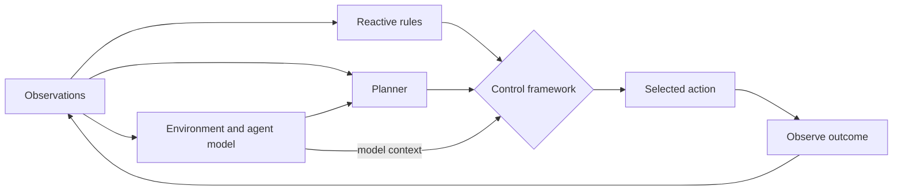
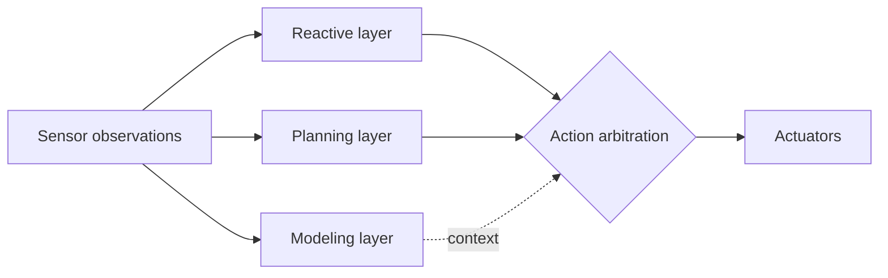
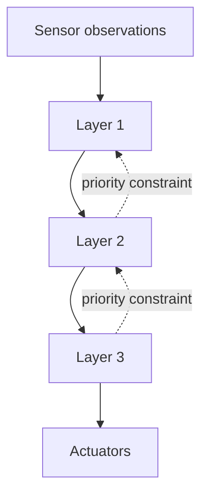
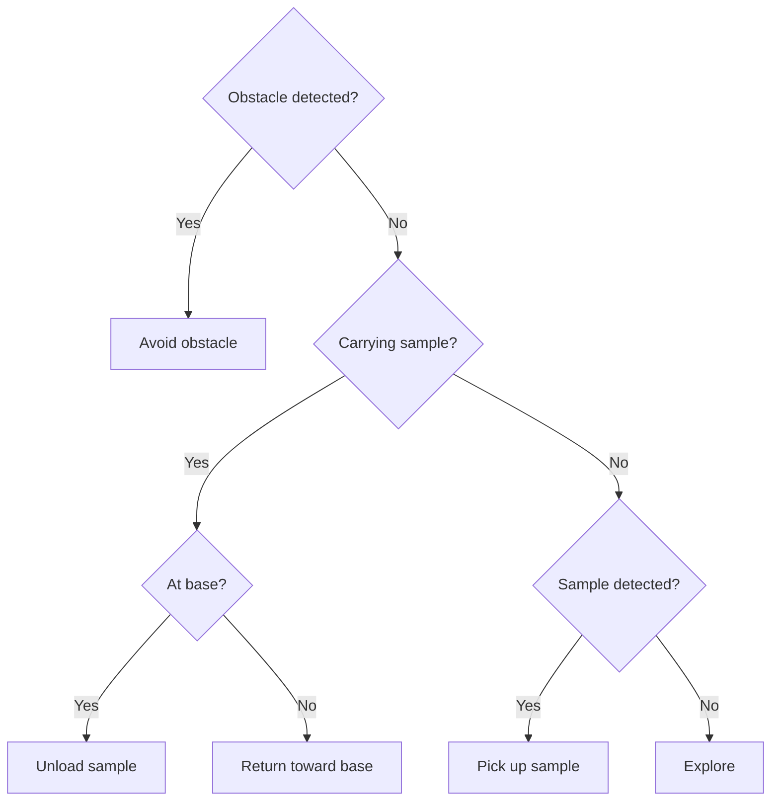

# Hybrid agent architectures: separate layers and arbitration

Author-hosted chapter 5 slides describe reactive agents, layered designs, and TouringMachines. This reference retains those patterns and adds a constructed review method; it does not claim one arrangement is universally best or real-time safe.

## Why combine reactive and deliberative behavior?

Reactive mappings respond to current observations but may not represent long-term goals or plans. Deliberative planners represent goals and alternatives, but plans may become stale while the world changes. Hybrid designs allocate responsibilities and define how concurrent recommendations are reconciled. Consider sensing/action latency, plan invalidation, deadlines, and safe fallback.

## Layering patterns

**Horizontal layering:** multiple layers access some or all sensors and may propose actions. State who may act, how proposals are prioritized, and whether a layer can override another.

**Vertical layering:** processing is organized as a pipeline, passing information between layers. Specify where sensing enters and where action leaves.

These are structural categories, not performance guarantees. Original broad complexity formulas and universal failure modes are removed.

## TouringMachines example

Author lecture 5 presents three layers:
- Reactive layer: situation-action rules respond to current conditions.
- Planning layer: selects and revises courses of action toward goals.
- Modeling layer: reasons about environment and other agents.

A control framework mediates proposals using control rules/censors. This illustrates explicit arbitration; the exact rule set, priority, and correctness argument belong to the system design.

## Reactive and layered examples

The chapter 5 slides give a subsumption-style Mars sample-collection example as prioritized situation/action rules: avoid an obstacle; when carrying a sample, return toward base; at base, unload; when detecting a sample, collect it; otherwise explore. The example shows how lower-level behavior can take precedence over higher-level activity. The lecture describes a simulated domain; this reference makes no near-optimal performance claim and does not carry over the prior draft’s “radioactive crumbs” or trust-decay account.

In a hybrid layered design, the reactive component may have precedence over the deliberative component, but the precedence rule must be stated. TouringMachines is a different example: reactive, planning, and modeling layers submit behavior mediated by a control framework. Do not treat the two examples as interchangeable; one illustrates behavior hierarchy, the other explicit mediation.

### Horizontal and vertical control sketches

These Mermaid drawings replace two ASCII architecture sketches in the previous reference. The generic layer labels are intentionally not claims about a named published system; input access and suppressor policy must be chosen by the designer.

### Prioritized sample-collection rule sketch

The chapter 5 lecture gives a situation/action hierarchy. This flowchart converts its rule priority into a visible decision path: obstacle handling first, then carrying/unloading, carrying/returning, collecting an observed sample, and otherwise exploring.

## Arbitration contract

| Contract field | Review question |
|---|---|
| Inputs | Which observations, beliefs, or plans are available? |
| Proposal | What action or constraint can a layer produce? |
| Validity | How long does proposal remain valid? |
| Priority | What resolves incompatible proposals? |
| Veto | Is veto permitted, under which verified condition? |
| Fallback | What if no proposal is valid? |
| Outcome | What observation updates model and plan? |

Represent safety rule separately from preference. A plan layer must not override a safety constraint unless the authority model explicitly permits it.

## Constructed example: payment workflow

Planner proposes “submit payment.” A reactive check observes expired authorization. The controller blocks submission and returns a reason; planner can request fresh authorization or stop. This illustrates arbitration, not security proof. Production needs independent authorization at the effect boundary, freshness and identity checks, audit evidence, and bypass tests.

## Review procedure

1. Draw sensor/state inputs, layer boundaries, proposals, arbitration, and actuators.
2. Name observations permitting every transition.
3. Add competing proposals and specify outcome.
4. Test stale observations, missing output, planning timeout, contradictory rules, and action failure.
5. Check preconditions immediately before effect.
6. State whether evidence validates a model, local implementation, or deployment.

An anytime planner or resource-bounded deliberator is an additional design choice; its label provides no deadline guarantee.

## Sources and disposition

- Wooldridge, [chapter 5 author lecture slides](https://www.cs.ox.ac.uk/people/michael.wooldridge/pubs/imas/distrib/pdf-slides/lect05.pdf), full 18-page deck read; supports horizontal/vertical layering and TouringMachines layers/mediator.
- Wooldridge, [2e contents](https://www.cs.ox.ac.uk/people/michael.wooldridge/pubs/imas/Contents.html), lists Subsumption, TouringMachines, InteRRaP, 3T, and Stanley; not detailed source for their mechanisms.
- Full InteRRaP, Subsumption, meta-level optimality, 180-skill policy, and complexity claims are not asserted without primary body verification.

