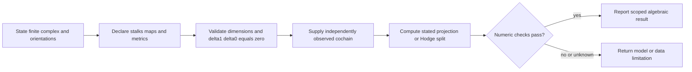
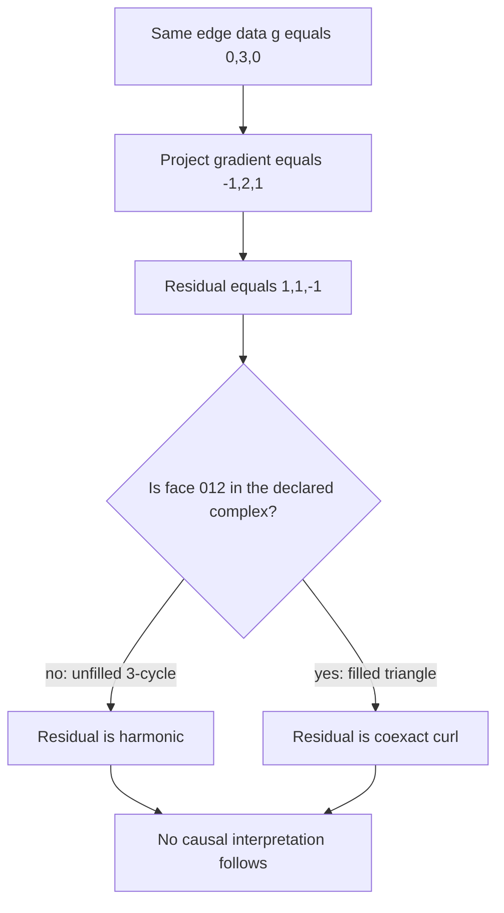

# Algebraic topology for agents: compute a declared model

Use topology only after declaring a finite complex, orientations, coefficient spaces, restriction maps, inner products, independently observed cochain, and the question being asked. A residual is evidence about compatibility with that specified model. It does not establish a cause, a responsible party, or permission for an external effect.

## Choose the model before the computation

| Need | Minimum declaration | Computation |
| --- | --- | --- |
| Scalar graph residual | oriented incidence `D`, real scalar edge cochains, Euclidean norm | `Pi = I - D D^+`, then `Pi g` |
| Filled-triangle split | `delta0`, `delta1`, face orientation, Euclidean bases | gradient, harmonic, coexact components |
| Cellular-sheaf cochains | every stalk, restriction map, composition rule, degree metrics | mapped coboundaries and metric adjoints |
| Weighted calculation | symmetric positive-definite `W0,W1,W2` | use metric adjoints, not bare transposes |

The finite-dimensional cellular-sheaf definitions and Hodge decomposition below are grounded in the targeted sections of Hansen and Ghrist (2019). The targeted source read covered Definitions 2.4–2.5, §2.2.2, §§3.1–3.2 and Theorem 3.1 on 2026-09-24, not the entire paper. See [source boundary and fixtures](references/source-boundary-and-validated-fixtures.md).

## Conditional formulas that remain useful

### Constant scalar connected graph

For an oriented unweighted incidence matrix `D: R^V -> R^E`, Euclidean edge norm, and an independently observed `g in R^E`, the least-squares residual is `rho = Pi g` with

$$\Pi = I - D D^+.$$

This uses the Moore–Penrose pseudoinverse. `D^T D` is singular on a connected graph because constants are in the kernel; a grounded solve removes one vertex coordinate, while `D^+` keeps the minimum-norm gauge convention.

On a connected tree with constant scalar coefficients, `rank(D)=|E|`, hence `Pi=0` for every edge vector in this particular measurement model. It says the scalar residual cannot distinguish any edge vector from a vertex-potential difference. It does not say a tree, supervisor, or any other monitor cannot detect other kinds of error. An arbitrary sheaf on a tree need not have vanishing `H1`: for one edge with scalar stalks and both vertex-to-edge restriction maps zero, `delta0=0` and `H1=R`.

### Unweighted scalar single-edge sensitivity

If `g` was otherwise exact and is perturbed by `s` on edge `e`, then, only for the same unweighted scalar incidence model and Euclidean edge norm,

$$\|\Pi(s e_e)\|_2 = |s|\sqrt{1-R_{\mathrm{eff}}(e)}, \qquad R_{\mathrm{eff}}(e)=b_e^T L^+b_e, \quad L=D^T D.$$

Here `L^+` is the full Laplacian pseudoinverse. A grounded inverse may be used internally to solve a gauge-fixed system, but it is not substituted into this formula without a derivation. Weighted graphs and nonconstant sheaves require their own model and derivation.

## Three worked calculations

### 1. Filled triangle: independently observed edge values

Use edges `(01,12,02)` and face `[012]`:

$$\delta_0=\begin{bmatrix}-1&1&0\\0&-1&1\\-1&0&1\end{bmatrix},\qquad
\delta_1=\begin{bmatrix}1&1&-1\end{bmatrix},\qquad \delta_1\delta_0=0.$$

For independently observed `g=(0,3,0)`, the Euclidean projection gives `grad=(-1,2,1)` and `rho=(1,1,-1)`. With the face present, `rho=delta1^T(1)` is coexact curl and the harmonic component is zero. This says only that the data have a face-circulation component in this declared complex.

### 2. Same data on the unfilled 3-cycle

Keep the vertices, oriented edges, `g`, and `delta0`, but declare no face, so `C2=0` and `delta1` has no rows. The same `rho=(1,1,-1)` lies in `ker(delta0^T)` and is harmonic. The data did not change; the interpretation changed because the model supplied a face. This is a model-dependence check.

### 3. Path, triangle, and a scalar sensitivity check

For the path `0-1-2`, `D` has rank two and every two-edge scalar cochain is a gradient, so `Pi=0`. For the unfilled triangle, `rank(D)=2` in a three-dimensional edge space and the residual space is one-dimensional. On the unweighted triangle, `R_eff(e)=2/3`, so a perturbation of magnitude `s` has residual norm `|s|/sqrt(3)`. These are rank and projection facts under the stated scalar model, not a detection claim about an external system.

## Numerical safeguards

- Verify dimensions, finite inputs, and `delta1 @ delta0` before solving.
- Use an explicit tolerance for floating-point reconstruction and orthogonality; no result is exact merely because it prints rounded values.
- A descriptive harmonic residual-energy fraction is `||h||² / (||h||² + ||c||²)` after Hodge splitting. Return `None` when the denominator is within tolerance of zero. It has no validated diagnostic threshold and does not locate a cause.
- Use transformed cochain coordinates whenever an edge orientation flips. Comparing a flipped operator to untransformed data changes the model.

Run [the executable triangle fixture](examples/triadic-cochain-solve.py) for its finite algebra checks, then load [the Hodge derivation](references/hodge-decomposition-derivation.md) or [the sheaf primer](references/simplicial-sheaf-primer.md) for the assumptions.

## Quality gates

- [ ] Complex, orientations, dimensions, coefficient spaces, and independently observed data are stated.
- [ ] For a sheaf, all face restrictions and their compositions are checked.
- [ ] Every metric used for an adjoint is symmetric positive definite.
- [ ] Chain condition, reconstruction, orthogonality, and tolerance handling have a fixture.
- [ ] The report separates algebraic compatibility from causal, authorization, and effect claims.
