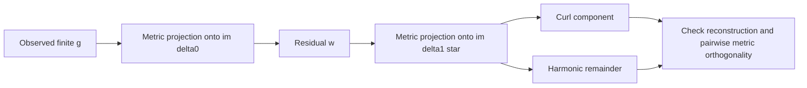

# Hodge decomposition with stated metrics

## Finite-dimensional assumption

Let `delta0` map `C0` to `C1` and `delta1` map `C1` to `C2`, with `delta1 delta0=0`, in a finite-dimensional cochain complex. The cochain-space Mermaid diagram is in the [primer](simplicial-sheaf-primer.md). Choose symmetric positive-definite matrices `W0,W1,W2` defining inner products `<a,b>_Wk=a^T Wk b`. For a matrix `A:Ck -> C{k+1}`, its metric adjoint is

$$A^* = W_k^{-1} A^T W_{k+1}.$$

The familiar transpose formulas in the executable fixture are valid only because it explicitly uses Euclidean bases `W0=W1=W2=I`. Positive-semidefinite weights do not define the same inner-product argument without further quotient or restriction work.

## Orthogonal splitting

Define

$$L_1=\delta_0\delta_0^*+\delta_1^*\delta_1,\qquad
\mathcal{H}^1=\ker(\delta_1)\cap \ker(\delta_0^*)=\ker(L_1).$$

Then the finite-dimensional Hodge decomposition is

$$C^1=\operatorname{im}(\delta_0)\oplus\mathcal{H}^1\oplus \operatorname{im}(\delta_1^*),$$

orthogonally in the declared `W1` metric. Here the harmonic space $\mathcal{H}^1$ represents the cohomology quotient `ker(delta1)/im(delta0)` isomorphically; the metric selects harmonic representatives, rather than defining the quotient itself. For an observed `g`, solve least-squares problems in that same metric to obtain

$$g=\operatorname{grad}+h+\operatorname{curl},\quad \operatorname{grad}=\delta_0x,\quad \operatorname{curl}=\delta_1^*\psi.$$

Normal equations may be singular because of gauge freedom. Use a pseudoinverse or explicitly ground a coordinate; do not apply an ordinary inverse to a singular graph Laplacian.

## Filled versus unfilled triangle

For `g=(0,3,0)` and the oriented `delta0` in the entrypoint, the gradient is `(-1,2,1)` and residual is `(1,1,-1)`.

- **Unfilled 3-cycle:** `C2=0`, so there is no coexact subspace. The residual is harmonic.
- **Filled triangle:** `delta1=(1,1,-1)`, so the residual is `delta1^T(1)` and is curl; the harmonic component is zero.

The numeric observation is unchanged. The classification changes when the analyst adds a face to the complex. Neither label identifies an external cause.

## Descriptive energy fraction

After a declared Hodge split, define only if its denominator is nonzero within the chosen numerical tolerance:

$$q_h(g)=\frac{\|h\|_{W_1}^2}{\|h\|_{W_1}^2+\|\operatorname{curl}\|_{W_1}^2}.$$

`q_h` describes the relative energy of two algebraic components of the residual. It is undefined for zero residual and has no source-validated universal threshold, diagnosis, or localization meaning.

## Scalar graph rank and resistance scope

For an unweighted, connected, constant-scalar graph with incidence matrix `D`, the Euclidean residual projection is `Pi=I-DD+`. A tree has `rank(D)=|E|`, hence `Pi=0`. An unfilled three-cycle has a one-dimensional residual space. If `s e_e` perturbs an otherwise exact cochain, the same model gives

$$\|\Pi(s e_e)\|_2=|s|\sqrt{1-R_{\mathrm{eff}}(e)},\qquad R_{\mathrm{eff}}(e)=b_e^T(D^TD)^+b_e.$$

This statement does not transfer automatically to weighted or sheaf models. In particular, its effective resistance uses the full Laplacian pseudoinverse, not a grounded inverse substituted into the formula.
