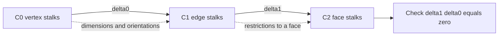
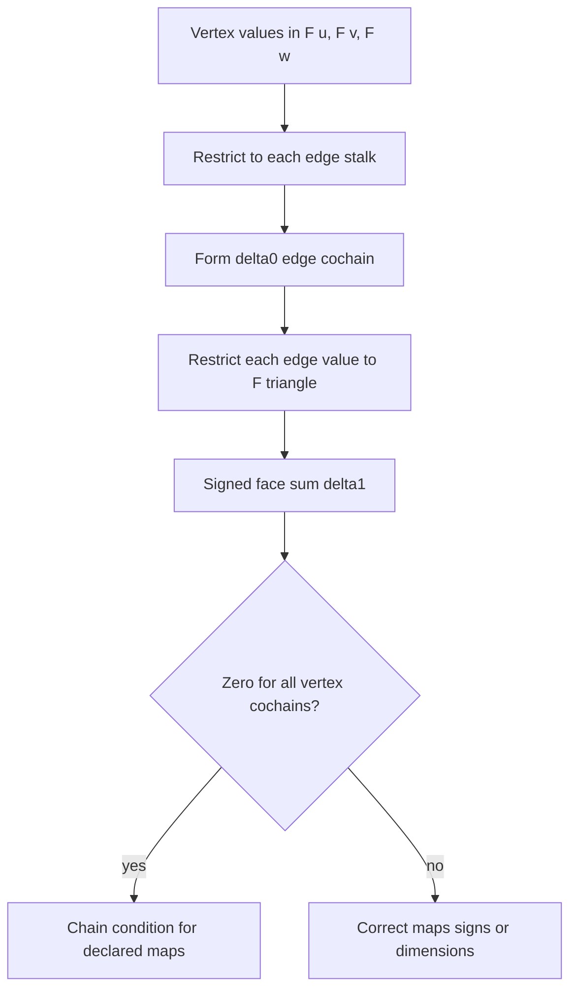

# Simplicial complexes and cellular sheaves

## Source scope

This reference uses the targeted body read of Hansen and Ghrist, *Toward a Spectral Theory of Cellular Sheaves*, arXiv:1808.01513v2 (2019), DOI `10.1007/s41468-019-00038-7`: Definitions 2.4–2.5, §2.2.2, and the Hodge sections named in [the source ledger](source-boundary-and-validated-fixtures.md). It is not a claim about an agent platform, fault cause, or effect authority.

## Finite oriented simplicial model

Use the nonempty-simplex convention: an abstract simplicial complex `X` is a collection of finite **nonempty** subsets of a vertex set such that each nonempty subset of a simplex is also in `X`. The empty set is omitted throughout, so closure is over nonempty faces only.

Orient each simplex. For the triangle `[0,1,2]`, select oriented edges `(01,12,02)` and write its signed boundary as `(12) - (02) + (01)`. That convention yields the scalar matrices

$$\delta_0=\begin{bmatrix}-1&1&0\\0&-1&1\\-1&0&1\end{bmatrix},\quad \delta_1=\begin{bmatrix}1&1&-1\end{bmatrix},\quad \delta_1\delta_0=0.$$

Changing an edge orientation changes both its matrix coordinate and the coordinate of its observed cochain. It does not change the underlying geometric edge.

## Cellular sheaf data

A cellular sheaf `F` assigns a vector space `F(sigma)` to each cell and a linear restriction map

$$\rho_{\sigma,\tau}:F(\sigma)\rightarrow F(\tau)$$

for each face inclusion `sigma <= tau`, satisfying identity and composition:

$$\rho_{\tau,\upsilon}\rho_{\sigma,\tau}=\rho_{\sigma,\upsilon}.$$

The degree-k cochain space is the direct sum of k-cell stalks. For an oriented face `tau=[u,v,w]` with oriented edges `(uv,vw,uw)`, the general coboundary is

$$ (\delta_1g)_\tau = \rho_{uv,\tau}g_{uv}+\rho_{vw,\tau}g_{vw}-\rho_{uw,\tau}g_{uw}. $$

Each summand is in `F(tau)`. Bare addition of heterogeneous edge coordinates is therefore invalid unless compatible constant coefficients and identity identifications have been declared. The maps and signs must make `delta1 delta0=0`; dimension compatibility and composition are testable inputs, not inferred metadata.

## A tree is not a universal special case

For a connected ordinary scalar graph, a tree has no first cycle space. This alone does not settle cellular-sheaf cohomology. On a one-edge complex, take scalar vertex and edge stalks but set both vertex-to-edge restriction maps to zero. Then `delta0=0`, so the edge cochain space survives as `H1=R`. Any tree conclusion must state the coefficient system and maps.

## Observation boundary

A derived value `g=delta0 x` is exact by construction, so it cannot by itself test a hypothesis that an independently measured `g` is incompatible with the model. An observed residual may arise from data, units, timing, orientation, maps, or the model. The algebra supplies a compatibility calculation, not an attribution or authorization decision.
