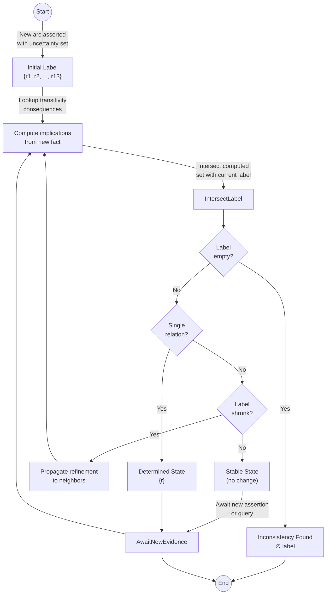

# Temporal Relation Label Evolution Under Evidence

```mermaid
flowchart TD
    Start((Start)) -->|New arc asserted<br/>with uncertainty set| InitialDisjunction

    InitialDisjunction["Initial Label<br/>{r1, r2, ..., r13}"]

    InitialDisjunction -->|Lookup transitivity<br/>consequences| PropagateConstraints

    PropagateConstraints["Compute implications<br/>from new fact"]

    PropagateConstraints -->|Intersect computed<br/>set with current label| IntersectLabel

    IntersectLabel --> CheckEmpty{"Label<br/>empty?"}

    CheckEmpty -->|Yes| InconsistencyDetected["Inconsistency Found<br/>∅ label"]
    CheckEmpty -->|No| CheckSingleton{"Single<br/>relation?"}

    CheckSingleton -->|Yes| DeterminedRelation["Determined State<br/>{r}"]
    CheckSingleton -->|No| CheckShrinkage{"Label<br/>shrunk?"}

    CheckShrinkage -->|Yes| PropagateRefinement["Propagate refinement<br/>to neighbors"]
    PropagateRefinement --> PropagateConstraints

    CheckShrinkage -->|No| Stable["Stable State<br/>(no change)"]

    Stable -->|Await new assertion<br/>or query| AwaitNewEvidence
    AwaitNewEvidence --> PropagateConstraints

    DeterminedRelation --> AwaitNewEvidence

    InconsistencyDetected --> End((End))
    AwaitNewEvidence --> End((End))
```
